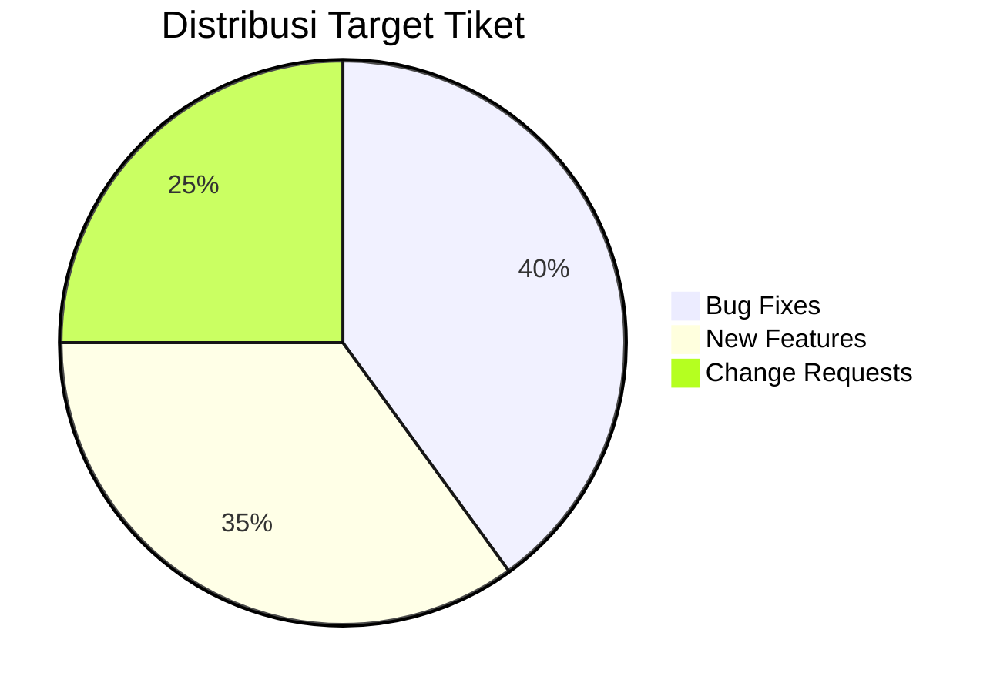
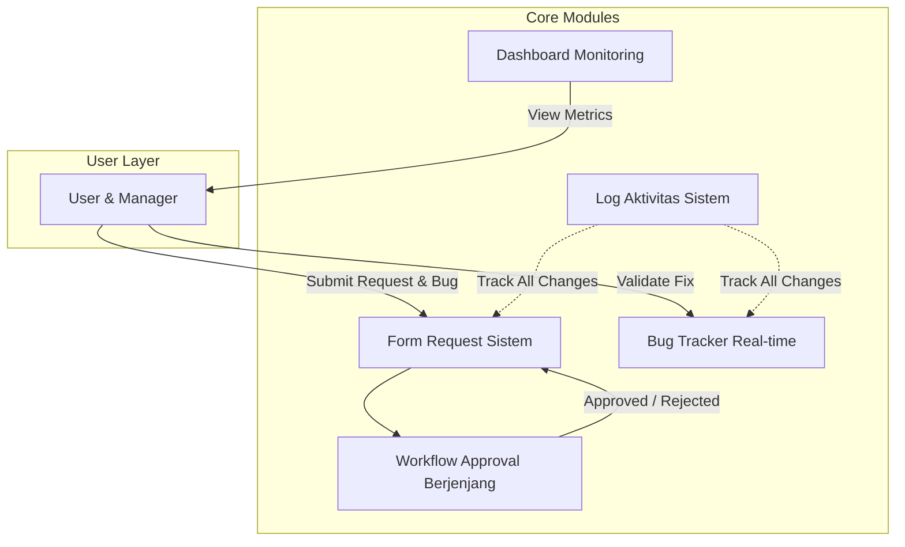
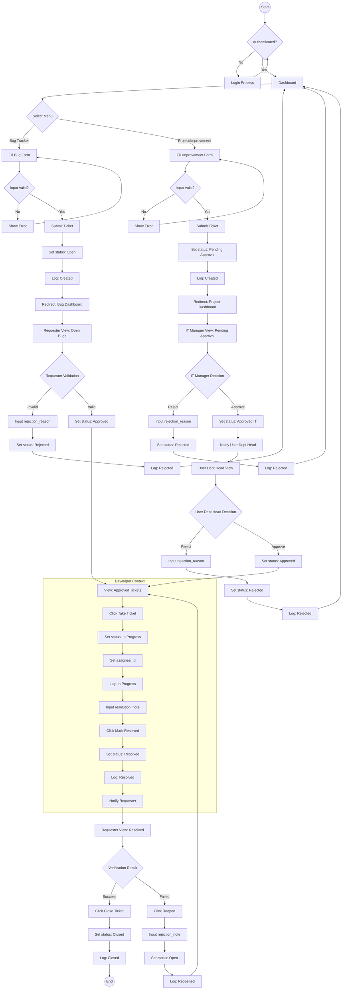
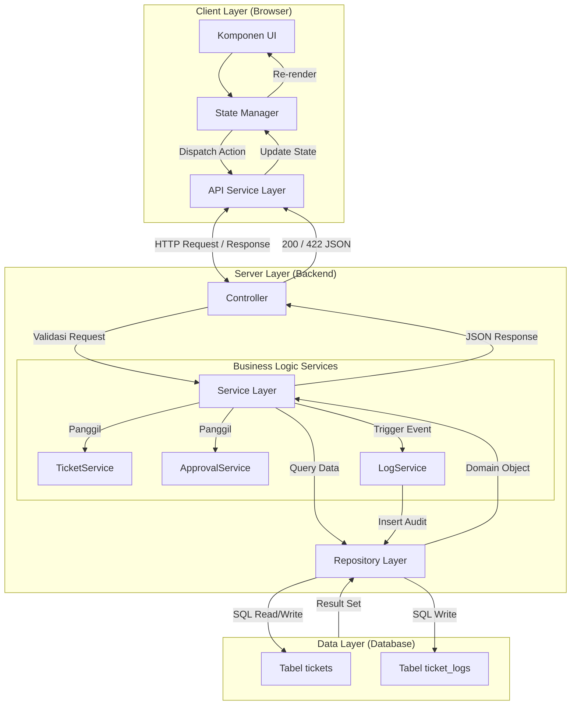
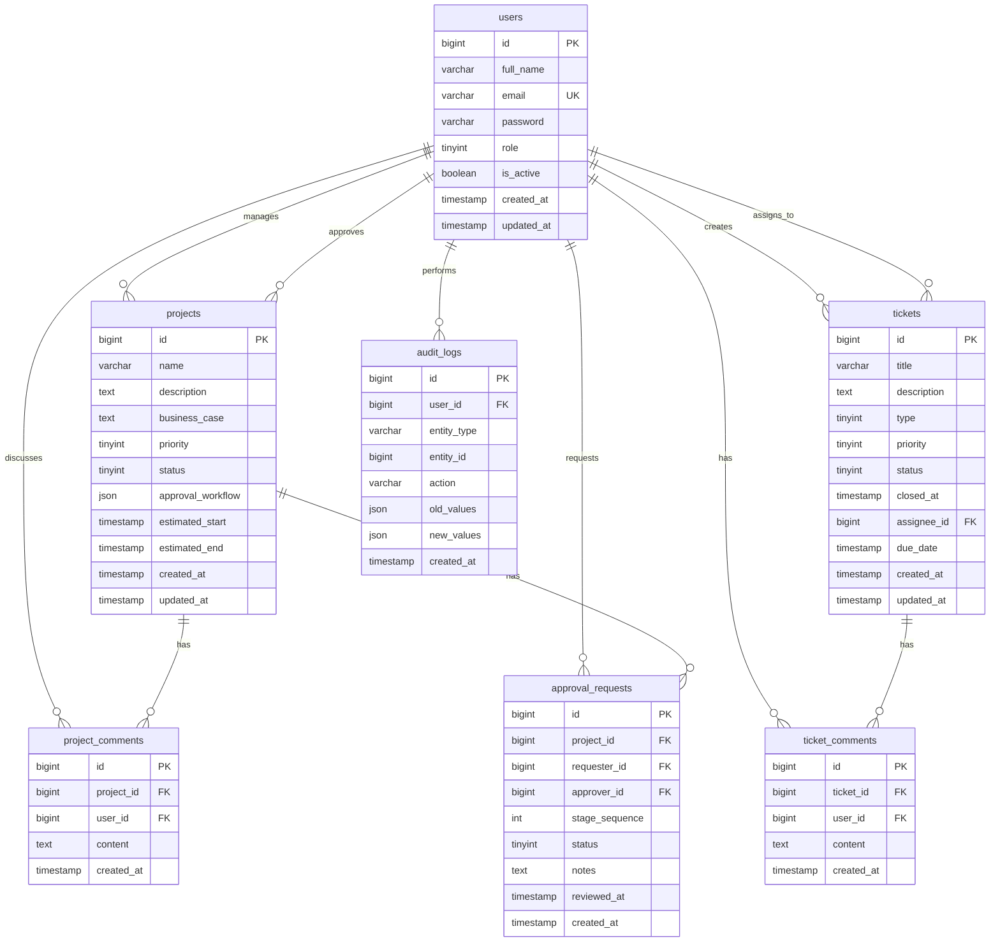
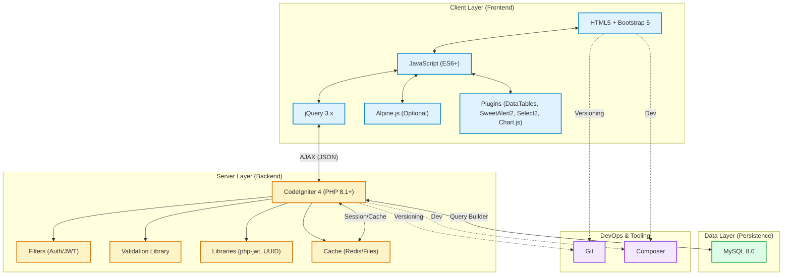

---
You are an expert software developer. Your task is to implement the application
described in this document from scratch, following the PRD and coding rules below.
Read the entire document before writing any code.
---

# Project Management

## Project Brief

**Name:** Project Management

**Description:**
Project Name: Project Management

Target Audience:
Manager Departemen, Staf Pengembang

Problem Statement:
Proses Approval Manual, Tracking Bug yang Rumit, Permintaan Fitur Tidak Terstruktur, Manajemen Change Request, Kesulitan Prioritas Tiket

Key Features:
Formulir Request Sistem, Workflow Approval Berjenjang, Bug Tracker Real-time, Dashboard Monitoring, Log Aktivitas Sistem

Platform:
Web Application, Responsive Design

Similar Apps:
Jira Software

UX Styling Preference:
Clean Layout, Professional UI, Minimalis

Initial Vision:
Aplikasi yang akan digunakan oleh user untuk request sistem baru, melakukan penambahan, perubahan, terhadap sistem yang sudah ada (dengan approval manager), bug tracker (approval user jika sudah done). 

**Stack:** (see Tech Stack section below)

**Generated:** 01 July 2026

---

## PRD

### Product Brief

### Value Proposition
Aplikasi **Project Management** ini dirancang untuk mengatasi hambatan operasional yang disebabkan oleh proses persetujuan manual dan pelacakan isu yang tidak terstruktur. Seringkali, permintaan fitur baru dan pelaporan bug terjebak dalam komunikasi yang tidak jelas, menyebabkan keterlambatan pengembangan dan prioritas tugas yang membingungkan. Aplikasi ini penting karena mengubah alur kerja yang bersifat *ad-hoc* menjadi sistem yang terstandarisasi dan transparan. Dengan pusat kendali tunggal, manajemen permintaan sistem (Change Request) dan pelacakan error (Bug Tracker) menjadi terintegrasi, memastikan setiap perubahan mendapatkan persetujuan yang tepat dan setiap masalah diselesaikan dengan prioritas yang benar.

### User Personas

1.  **Budi, Manajer Operasional**
    *   **Peran:** Penanggung jawab persetujuan dan pemantauan proyek.
    *   **Kebutuhan:** Membutuhkan visibilitas penuh terhadap semua permintaan fitur dan bug yang masuk. Menginginkan kemudahan untuk menyetujui atau menolak proposal perubahan sistem (Change Request) tanpa harus mencari melalui tumpukan email atau file fisik. Fokus pada efisiensi sumber daya dan kepatuhan terhadap prioritas bisnis.

2.  **Siska, Staf Pengembang (Developer)**
    *   **Peran:** Pelaksana pengembangan fitur dan perbaikan sistem.
    *   **Kebutuhan:** Membutuhkan deskripsi tugas yang jelas dan terstruktur untuk meminimalkan revisi akibat miss-komunikasi. Menginginkan sistem pelacakan bug real-time agar bisa merespon insiden dengan cepat. Membutuhkan mekanisme *sign-off* atau konfirmasi dari user saat bug telah diperbaiki untuk memastikan kepuasan pengguna akhir.

### Key Benefits

1.  **Alur Persetujuan yang Transparan & Terkontrol:** Menghilangkan ketergantungan pada komunikasi manual. Setiap permintaan fitur atau perubahan sistem melewati jenjang persetujuan otomatis yang tercatat, memastikan hanya inisiatif yang valid yang masuk ke tahap pengembangan.
2.  **Pelacakan Isu yang Terpusat (Single Source of Truth):** Menggabungkan permintaan fitur, change request, dan laporan bug dalam satu platform. Ini menghilangkan kebingungan status tiket dan memastikan prioritas kerja tim pengembang selalu selaras dengan urgensi bisnis.
3.  **Akuntabilitas & Kejelasan Status:** Dengan log aktivitas sistem dan status real-time, semua pihak (manajer dan staf) mengetahui posisi tepatnya sebuah tiket—apakah sedang menunggu persetujuan, sedang dikerjakan, atau siap diuji—mengurangi pertanyaan berulang "sudah sampai mana?".
4.  **Peningkatan Kualitas Output Sistem:** Fitur konfirmasi user setelah perbaikan bug (*bug done approval*) memastikan bahwa masalah benar-benar terselesaikan sebelum tiket ditutup, meningkatkan kepuasan pengguna dan kualitas produk secara keseluruhan.

### Success Metrics

1.  **Efisiensi Siklus Persetujuan:** Mengurangi waktu rata-rata dari pengajuan request sampai disetujui oleh Manajer dari 7 hari menjadi maksimal 2 hari.
2.  **Penurunan Miss-Communication:** Mengurangi tingkat revisi tugas pengembangan sebesar 40% karena ketidakjelasan spesifikasi awal (berkat formulir request terstruktur).
3.  **Respon Time Insiden:** Mencapai *Mean Time to Resolution* (MTTR) untuk bug kritis di bawah 4 jam melalui pelacakan real-time.
4.  **Adopsi Sistem:** Mencapai tingkat penggunaan aktif (Active User Rate) sebesar 95% dari target user di bulan pertama peluncuran.



### Overview

Aplikasi ini dirancang untuk mentransformasi manajemen proyek perangkat lunak dari proses manual menjadi sistem yang terstruktur dan terpusat. Solusi ini memberikan nilai utama dengan mengotomatisasi alur persetujuan (approval) berjenjang untuk setiap permintaan fitur dan perubahan sistem, serta menyediakan pelacakan bug real-time yang transparan antara pengembang dan user. Dengan standardisasi alur kerja ini, departemen manajemen dan pengembang dapat memprioritaskan tiket secara efektif, mengurangi mis komunikasi, dan mempercepat siklus hidup pengembangan aplikasi.

Berikut adalah ruang lingkup fungsionalitas utama yang akan dikerjakan:

### In-Scope
1.  **Workflow Approval Berjenjang**: Otomatisasi rute persetujuan request fitur dan perubahan sistem dari staf ke manager.
2.  **Manajemen Tiket Terpusat**: Pembuatan, pengelompokan, dan prioritisasi tiket (Feature, Change Request, Bug).
3.  **Bug Tracking & Validation**: Pelacakan status perbaikan bug real-time, termasuk tahap validasi oleh user sebelum tiket ditutup.
4.  **Dashboard Monitoring**: Visualisasi metrik proyek untuk memantau performa tim dan progres tiket.
5.  **Log Aktivitas**: Pencatatan riwayat audit lengkap untuk setiap aksi yang dilakukan dalam sistem.

### Out-of-Scope
-   Manajemen sumber daya tim (timesheet, alokasi jam kerja individu).
-   Integrasi CI/CD otomatis atau *deployment pipeline*.
-   Kolaborasi real-time (seperti chatting atau komentar instan pada tiket di luar status update).
-   Manajemen keuangan atau anggaran proyek.

### Success Metrics
-   **Efisiensi Approval**: Pengurangan waktu rata-rata dari pengajuan tiket hingga persetujuan manager (target: < 2 hari kerja).
-   **Visibility Issue**: Peningkatan ketepatan deteksi dan penyelesaian bug melalui pelacakan status real-time.
-   **Adoption Rate**: Persentase penggunaan sistem formulir request dibandingkan metode manual (target: 100% migrasi dalam 3 bulan).



### Core Features

### Manajemen Tiket & Formulir Request
- **Objectives**: Menyediakan mekanisme terpusat untuk pencatatan permintaan fitur, change request, dan pelaporan bug. Memastikan setiap entri data terstandarisasi dengan prioritas dan kategori yang jelas sebelum masuk ke alur approval.
- **Business Logic**:
  - User dapat membuat tiket baru dengan tipe: *Feature Request*, *Change Request*, atau *Bug*.
  - Sistem mencatat data pencipta (*created_by*), waktu pembuatan (*created_at*), dan status awal (*Open*).
  - Tiket dikategorikan berdasarkan *project_id* (jika ada) dan modul sistem yang terdampak.
  - Penentuan prioritas (*Low, Medium, High, Critical*) dilakukan saat pembuatan dan dapat dikoreksi oleh Manager.
  - Status tiket bertransisi sesuai alur: *Open* -> *In Progress* -> *Resolved* -> *Closed* (Lihat logika spesifik di fitur Approval dan Bug Tracker).
- **Validation & Error Handling**:
  - **Judul**: Wajib diisi, minimal 5 karakter, maksimal 255 karakter.
  - **Deskripsi**: Wajib diisi, mendukung format teks panjang.
  - **Tipe Tiket**: Harus salah satu dari nilai enum yang valid.
  - **Prioritas**: Default ke 'Medium' jika tidak dipilih.
  - **Error**: Mengembalikan pesan `{ "errors": { "title": ["Judul minimal 5 karakter"] } }` jika validasi gagal.
- **Acceptance Criteria**:
  - User berhasil membuat tiket dengan data valid.
  - Sistem menolak pembuatan tiket jika judul atau deskripsi kosong.
  - Tiket yang baru dibuat otomatis muncul di daftar tiket dengan status *Open*.
  - Detail tiket menampilkan riwayat perubahan status dan informasi pembuat.

### Workflow Approval Berjenjang
- **Objectives**: Mengotomatisasi proses persetujuan permintaan fitur dan perubahan sistem dari level staf ke manager untuk memastikan kelayakan teknis dan bisnis sebelum dikerjakan.
- **Business Logic**:
  - Tiket dengan tipe *Feature Request* atau *Change Request* secara otomatis masuk ke status *Pending Approval* setelah dibuat.
  - Mekanisme notifikasi (dalam log sistem) menandai Manager bahwa ada tiket yang membutuhkan persetujuan.
  - Manager memiliki otoritas untuk melakukan aksi: *Approve* atau *Reject*.
  - Jika *Approve*: Status tiket berubah menjadi *Approved* dan berpindah ke *Open* (siap dikerjakan developer).
  - Jika *Reject*: Status tiket berubah menjadi *Rejected*. Manager wajib mengisi alasan penolakan (*rejection_reason*) yang akan tercatat di log.
  - Tiket yang *Rejected* dapat dikirim ulang oleh Staf dengan revisi data, yang akan mereset status kembali ke *Pending Approval*.
- **Validation & Error Handling**:
  - **Aksi Approval**: Hanya role *Manager* yang dapat melakukan aksi ini.
  - **Alasan Penolakan**: Wajib diisi jika aksi yang dipilih adalah *Reject*.
  - **State Error**: Sistem mencegah persetujuan pada tiket yang sudah *Approved* atau sedang *In Progress*.
  - **Error**: Mengembalikan `{ "errors": { "rejection_reason": ["Wajib diisi saat menolak"] } }` atau error akses tidak diizinkan.
- **Acceptance Criteria**:
  - Manager dapat melihat daftar tiket yang berstatus *Pending Approval*.
  - Persetujuan berhasil mengubah status tiket menjadi *Approved*.
  - Penolakan berhasil mengubah status tiket menjadi *Rejected* dan menyimpan alasan.
  - Staf dapat melihat alasan penolakan dan mengedit ulang tiket.

### Bug Tracker & Validasi
- **Objectives**: Memfasilitasi pelacakan perbaikan bug transparan, memastikan bug benar-benar terselesaikan melalui mekanisme validasi oleh user sebelum tiket ditutup.
- **Business Logic**:
  - User melaporkan bug (Tipe: *Bug*). Status awal: *Open*.
  - Developer mengambil alih tiket -> status *In Progress*.
  - Developer menandai perbaikan selesai -> status *Resolved* (wajib isi catatan perbaikan/solusi).
  - Sistem memberi sinyal kepada User pelapor untuk validasi.
  - User melakukan validasi:
    - Jika valid (bug hilang): User mengubah status ke *Closed*. Tiket selesai.
    - Jika belum valid (bug masih ada): User mengubah status kembali ke *Open* (atau *Reopened*) dengan catatan tambahan alasan kegagalan validasi. Tiket kembali ke antrian Developer.
- **Validation & Error Handling**:
  - **Role Aksi**:
    - Status *In Progress* dan *Resolved* hanya bisa diubah oleh Developer.
    - Status *Closed* dan transisi *Resolved -> Open* hanya bisa dilakukan oleh User (pelapor) atau Manager.
  - **Kelengkapan Data**: Catatan solusi wajib diisi saat mengubah status ke *Resolved*.
  - **Error**: Mencegah transisi status yang tidak sesuai role (misal Developer memaksa *Closed* tanpa validasi User).
- **Acceptance Criteria**:
  - Tiket bug melalui siklus hidup lengkap: Open -> In Progress -> Resolved -> Closed/Reopened.
  - Developer tidak dapat menutup tiket bug secara langsung; harus melalui status *Resolved*.
  - User dapat menutup tiket setelah memverifikasi perbaikan.
  - Sistem mencatat siapa yang melakukan validasi dan kapan.

### Dashboard Monitoring
- **Objectives**: Memberikan visualisasi metrik real-time kepada Manager dan Developer untuk memantau kesehatan proyek, beban kerja, dan performa tim.
- **Business Logic**:
  - **Agregasi Data**: Dashboard menghitung total tiket berdasarkan status (*Open, In Progress, Resolved, Closed*) dan tipe (*Feature, Bug, Change Request*).
  - **Metrik Approval**: Menampilkan jumlah tiket *Pending Approval* dan rata-rata waktu approval (dari diajukan sampai disetujui).
  - **Metrik Bug**: Menampilkan jumlah bug *Resolved* vs *Closed* (untuk melihat bug yang belum divalidasi user).
  - **Filter Tanggal**: Default menampilkan data bulan berjalan (Current Month), dapat di-filter rentang tanggal spesifik.
- **Validation & Error Handling**:
  - **Empty State**: Jika belum ada data tiket di periode yang dipilih, tampilkan pesan "Belum ada data tiket periode ini" dan grafik kosong.
  - **Format Data**: Pastikan data numerik yang dikirim ke frontend tidak null (default 0).
  - **Error**: Jika query gagal (timeout), tampilkan pesan "Gagal memuat data dashboard" pada komponen kartu tanpa mengganggu keseluruhan halaman.
- **Acceptance Criteria**:
  - Manager melihat ringkasan statistik tiket saat membuka aplikasi.
  - Kartu metrik menampilkan angka yang akurat sesuai database real-time.
  - Grafik atau chart (jika ada) merender dengan benar berdasarkan data agregasi.
  - Filter tanggal berfungsi dan mengupdate data dashboard secara dinamis.

### Log Aktivitas Sistem
- **Objectives**: Menyediakan jejak audit (audit trail) yang tidak dapat dihapus untuk setiap aksi yang terjadi pada tiket, meningkatkan akuntabilitas dan transparansi.
- **Business Logic**:
  - Sistem otomatis mencatat log setiap kali ada perubahan status, update data deskripsi/judul, atau aksi approval pada tiket.
  - Struktur log: menyimpan *user_id* (pelaku aksi), *action* (jenis aksi: Created, Updated, Approved, Rejected, Status Changed), *timestamp*, dan *description* (detail perubahan, misal: "Status berubah dari Open ke In Progress").
  - Log ditampilkan secara kronologis (terbaru di atas) pada halaman detail tiket.
  - Log ini bersifat *append-only* (hanya tambah, tidak bisa dihapus atau diedit oleh user manapun, termasuk admin).
- **Validation & Error Handling**:
  - **Integritas**: Penulisan log ditangani oleh sisi backend (system-triggered), bukan input manual user, untuk mencegah manipulasi data.
  - **Error**: Jika gagal mencatat log, transaksi data utama (misal update status) harus dibatalkan (rollback) untuk menjaga konsistensi data.
- **Acceptance Criteria**:
  - Setiap perubahan pada tiket tercatat di tabel log.
  - Riwayat aktivitas pada halaman detail tiket menampilkan urutan kejadian yang benar.
  - User dapat melihat "siapa mengubah apa dan kapan" untuk setiap tiket.

### User Flow

### User Flow

#### 1. High-Level Flow Diagram



#### 2. Detailed User Steps

##### 2.1. Pembuatan Tiket (Terpisah berdasarkan Konteks)
1.  **Navigasi**: User memilih menu spesifik di sidebar:
    -   **Bug Tracker**: Untuk pelaporan error sistem.
    -   **Project/Improvement**: Untuk pengajuan fitur baru atau perubahan proses.
2.  **Input Data**: User mengisi formulir sesuai menu yang dipilih dengan field:
    -   `title` (string, wajib, min 5 karakter).
    -   `description` (text, wajib).
    -   `priority` (enum: Low, Medium, High).
    -   *Catatan: Field `type` diatur otomatis berdasarkan menu yang dipilih.*
3.  **Validasi Client-Side**: Sistem mengecek kelengkapan input.
    -   *Jika Invalid*: Tampilkan pesan error spesifik di bawah field.
4.  **Submit**: User menekan tombol "Submit".
5.  **Proses Backend**:
    -   **Jika Menu Bug Tracker**: Set `status` = "Open" (Menunggu validasi/approval dari User Requester).
    -   **Jika Menu Improvement**: Set `status` = "Pending Approval" (Menunggu persetujuan berjenjang).
    -   Catat log aktivitas ke tabel `ticket_logs`.
6.  **Feedback**: Redirect ke halaman daftar (Dashboard) yang relevan dengan pesan sukses (Toast/Notification).

##### 2.2. Approval Tiket Improvement (Kepala Departemen IT & User)
1.  **Filter IT Manager**: IT Manager memfilter daftar pada menu "Project/Improvement" dengan `status` = "Pending Approval".
2.  **Review IT**: IT Manager membuka detail tiket untuk menilai teknis dan dampaknya.
3.  **Keputusan IT**: IT Manager memilih "Approve" atau "Reject".
    -   *Skenario Reject*: Input `rejection_reason` wajib. Status berubah menjadi "Rejected". Log dicatat.
    -   *Skenario Approve*: Status berubah menjadi "Approved" (Tahap 1). Notifikasi dikirim ke Kepala Departemen User terkait.
4.  **Review User Dept Head**: Kepala Departemen User (Requester) memfilter tiket dengan status "Approved (IT)".
5.  **Keputusan User**: User Dept Head memilih "Approve" atau "Reject".
    -   *Skenario Reject*: Input `rejection_reason` wajib. Status berubah menjadi "Rejected".
    -   *Skenario Approve*: Status berubah menjadi "Approved". Tiket masuk ke antrian Developer.

##### 2.3. Approval Tiket Bug (User Requester)
1.  **Filter User**: User Requester memfilter daftar pada menu "Bug Tracker" dengan `status` = "Open".
2.  **Review**: User Requester membuka detail tiket Bug untuk mengonfirmasi apakah ini valid bug atau kesalahan penggunaan.
3.  **Keputusan**: User Requester memilih "Approve" (Valid) atau "Reject" (Invalid).
    -   *Skenario Reject*: Input `rejection_reason` wajib (misal: "Bukan bug, kesalahan config user"). Status berubah menjadi "Rejected".
    -   *Skenario Approve*: Status berubah menjadi "Approved". Tiket masuk ke antrian Developer.

##### 2.4. Eksekusi & Resolusi (Developer/Staf)
1.  **Inisiasi**: Developer memilih tiket dengan `status` = "Approved" dari dashboard (baik dari menu Bug maupun Improvement).
2.  **Ambil Tiket**: Developer menekan tombol "Take Ticket".
    -   Status berubah menjadi "In Progress".
    -   `assignee_id` diisi dengan ID Developer.
3.  **Pengerjaan**: Developer mengerjakan solusi sesuai deskripsi tiket. Lihat [Core Features] section untuk business logic detail.
4.  **Penyelesaian**: Developer mengisi `resolution_note` dan menekan tombol "Mark as Resolved".
    -   Status berubah menjadi "Resolved".
    -   Log aktivitas dicatat.
    -   Notifikasi dikirim ke User pelapor/requester.

##### 2.5. Validasi & Penutupan (User/Requester)
1.  **Verifikasi**: User mengakses tiket berstatus "Resolved" dan melakukan uji coba (test) pada sistem.
2.  **Feedback**: Memberikan penilaian terhadap hasil perbaikan/implementasi.
    -   **Skenario Sukses**:
        -   User menekan tombol "Close Ticket".
        -   Status berubah menjadi "Closed". Proses berakhir.
    -   **Skenario Gagal (Reopen)**:
        -   User menekan tombol "Reopen" dan mengisi `rejection_note` (alasan kenapa solusi tidak sesuai).
        -   Status berubah menjadi "Open" (atau "Reopened").
        -   Tiket kembali muncul di antrian Developer untuk diproses ulang.

### Page Specifications

### 1. Halaman Dashboard Monitoring
**Tujuan**: Menampilkan ringkasan metrik real-time dan statistik untuk monitoring kesehatan sistem dan aktivitas pengguna.
- **Routing Path**: `/dashboard`
- **Komponen Utama**:
  - Filter rentang tanggal (Date Range Picker).
  - Kartu Metrik Statistik (Total Tiket, Resolved, Closed, Open).
  - Tabel Aktivitas Terbaru (Log terakhir).
  - Komponen Navigasi Sidebar.
- **Data dari Controller/Props**:
  - `stats` (object): Berisi agregasi count per status tiket.
  - `recent_logs` (array): Daftar log aktivitas terakhir.
  - `start_date` (string), `end_date` (string): Rentang tanggal filter aktif.
- **Aksi User**:
  - Ubah rentang tanggal → `GET /api/dashboard?start_date={start_date}&end_date={end_date}` → refresh data `stats` dan `recent_logs`.
  - Klik baris log → redirect ke halaman Detail Diskusi terkait (`/tickets/{id}`).
- **State Management**:
  - **Loading State**: Skeleton loader pada kartu metrik dan tabel saat mengambil data.
  - **Error State**: Tampilkan pesan error "Gagal memuat data dashboard" pada container metrik.
  - **Empty State**: Tampilkan pesan "Belum ada data periode ini" jika `stats` kosong.
- **Component Reuse**:
  - `Sidebar` (Global).
  - `Card` (Generic wrapper).
  - `TableLog` (Reusable untuk log).

---

### 2. Halaman Forum Diskusi (Ticket List)
**Tujuan**: Menampilkan daftar thread diskusi dengan tampilan forum untuk manajemen antrian kerja.
- **Routing Path**: `/tickets`
- **Komponen Utama**:
  - Filter Bar (Status, Tipe, Prioritas, Assignee).
  - Search Input (Pencarian judul thread).
  - Thread List View (Tampilan Kartu/Row dengan Avatar User, Judul, Snippet Isi, Status, Count Komentar, Timestamp).
  - Tombol "Buat Thread Baru".
  - Pagination Control.
- **Data dari Controller/Props**:
  - `tickets` (array): List objek tiket (`id`, `title`, `status`, `priority`, `type`, `created_at`, `comment_count`, `creator_name`, `creator_avatar`).
  - `filters` (object): Parameter filter saat ini.
  - `pagination` (object): Info `current_page`, `total_pages`, `per_page`.
- **Aksi User**:
  - Ubah filter/status → `GET /api/tickets?status={status}&type={type}` → refresh list.
  - Klik thread → redirect ke `/tickets/{id}`.
  - Klik "Buat Thread Baru" → redirect ke `/tickets/create`.
  - Klik halaman pagination → `GET /api/tickets?page={page}`.
- **State Management**:
  - **Loading State**: Skeleton card pada list saat fetch data.
  - **Error State**: Tampilan alert error di bagian atas list jika gagal load (Format: `{ "errors": { "field": ["message"] } }`).
  - **Empty State**: Ilustrasi + teks "Tidak ada diskusi ditemukan" jika array `tickets` kosong.
- **Component Reuse**:
  - `Sidebar` (Global).
  - `BadgeStatus` (Global).
  - `ThreadCard` (Komponen khusus tampilan forum).

---

### 3. Halaman Buat Thread Baru (Create Ticket)
**Tujuan**: Menyediakan formulir untuk memulai diskusi baru (Bug, Feature, atau Change Request).
- **Routing Path**: `/tickets/create`
- **Komponen Utama**:
  - Breadcrumb Navigasi.
  - Form Input Thread (Title, Description/Body, Priority, Type).
  - Tombol "Posting" dan "Cancel".
  - Notifikasi Validasi Form.
- **Data dari Controller/Props**:
  - `projects` (array): Daftar project yang tersedia (untuk dropdown `project_id`).
  - `users` (array): Daftar user (opsional untuk mentions).
- **Aksi User**:
  - Klik "Cancel" → Redirect ke `/tickets`.
  - Klik "Posting" → Validasi input.
    - Jika Valid → `POST /api/tickets` (Body: `title`, `description`, `priority`, `type`, `project_id`) → Redirect ke `/tickets/{id}`.
    - Jika Invalid → Tampilkan error response `{ "errors": { "field": ["message"] } }` di bawah field terkait.
- **State Management**:
  - **Loading State**: Tombol submit disabled + spinner saat proses POST.
  - **Error State**: Tampilkan alert validasi di atas form jika response 422 (Format: `{ "errors": { "field": ["message"] } }`).
- **Component Reuse**:
  - `Sidebar` (Global).
  - `FormInput` (Generic).
  - `RichTextEditor` (Generic untuk body diskusi).

---

### 4. Halaman Detail Diskusi (Ticket Detail)
**Tujuan**: Menampilkan thread diskusi lengkap, kolom komentar balasan, dan kontrol aksi sesuai role.
- **Routing Path**: `/tickets/{id}`
- **Komponen Utama**:
  - Header Thread (Title, ID, Status Badge, Priority Badge, Info Creator).
  - Body Isi Thread (Deskripsi awal issue/feature).
  - Kolom Diskusi/Komentar:
    - List Komentar (Nested atau Flat, Avatar User, Body, Timestamp).
    - Form Reply (Input Text/Textarea untuk komentar baru).
  - Panel Aksi Samping atau Atas (Dinamis berdasarkan Role dan Status):
    - **Developer**: Dropdown "Take Ticket", "Mark Resolved".
    - **Manager/User Approver**: Tombol "Request Closure Approval" (jika status Resolved), "Approve Closure", "Reject Closure" (jika status Pending Approval).
    - **Input tambahan saat pilih aksi** (misal: `resolution_note` atau `rejection_reason`).
  - Sidebar Info (Metadata: Created At, Project, Participants).
- **Data dari Controller/Props**:
  - `ticket` (object): Data lengkap tiket.
  - `comments` (array): Daftar komentar (`id`, `user_id`, `body`, `created_at`).
  - `auth_user` (object): Data user sedang login untuk cek permission.
- **Aksi User**:
  - **Post Komentar**: Submit Form Reply → `POST /api/tickets/{id}/comments` (Body: `body`) → Refresh list `comments`.
  - **Developer**: Pilih "Take Ticket" → `POST /api/tickets/{id}/take` → Update status ke *In Progress*, set `assignee_id`.
  - **Developer**: Pilih "Mark Resolved" + Isi note → `POST /api/tickets/{id}/resolve` → Update status ke *Resolved*.
  - **Developer/Creator**: Pilih "Request Closure" → `POST /api/tickets/{id}/request-closure` → Update status ke *Pending Approval*.
  - **Approver**: Pilih "Approve Closure" → `POST /api/tickets/{id}/approve-closure` → Update status ke *Closed*.
  - **Approver**: Pilih "Reject Closure" + Input reason → `POST /api/tickets/{id}/reject-closure` (Body: `rejection_reason`) → Kembalikan status ke *Resolved*.
- **State Management**:
  - **Loading State**: Skeleton pada konten utama dan thread komentar saat initial load.
  - **Error State**: Pesan "Diskusi tidak ditemukan" jika 404.
  - **Action Loading**: Spinner kecil pada tombol aksi dropdown saat request API diproses.
- **Component Reuse**:
  - `Sidebar` (Global).
  - `BadgeStatus` (Global).
  - `CommentThread` (Generic untuk list komentar).
  - `UserInfo` (Avatar + Nama).

---

### 5. Halaman Approval Center (Khusus Approver)
**Tujuan**: Memusatkan daftar thread yang membutuhkan persetujuan penutupan (Closure Approval).
- **Routing Path**: `/approvals`
- **Komponen Utama**:
  - Statistik Cepat (Jumlah Pending Closure Approval).
  - Thread List Pending (Hanya menampilkan tiket dengan status `Pending Approval`).
  - Quick Action Buttons (Approve/Reject) langsung di dalam kartu thread (opsional) atau via detail.
- **Data dari Controller/Props**:
  - `pending_tickets` (array): List tiket yang statusnya menunggu approval penutupan.
- **Aksi User**:
  - Klik "View Details" → Redirect ke `/tickets/{id}`.
  - (Opsional) Inline Action → Klik icon Reject → Modal Input → `POST /api/tickets/{id}/reject-closure`.
- **State Management**:
  - **Loading State**: Skeleton card pada list.
  - **Empty State**: Pesan "Tidak ada thread yang menunggu persetujuan penutupan".
- **Component Reuse**:
  - `Sidebar` (Global).
  - `ThreadCard` (Reusable komponen forum).
  - `BadgeStatus` (Global).

---

### 6. Halaman Daftar Improvement (Improvement List)
**Tujuan**: Menampilkan daftar proposal project atau improvement yang membutuhkan inisiatif baru.
- **Routing Path**: `/improvements`
- **Komponen Utama**:
  - Filter Bar (Status `Draft`, `Pending Dept Head`, `Pending IT Manager`, `Approved`, `Rejected`).
  - Search Input (Pencarian judul improvement).
  - Tabel Data Improvement (`name`, `status`, `department_id`, `created_at`).
  - Tombol "Ajukan Improvement Baru".
  - Pagination Control.
- **Data dari Controller/Props**:
  - `improvements` (array): List objek improvement (`id`, `name`, `status`, `department_id`, `estimated_budget`, `created_at`).
  - `filters` (object): Parameter filter saat ini.
  - `pagination` (object): Info `current_page`, `total_pages`, `per_page`.
- **Aksi User**:
  - Ubah filter/status → `GET /api/improvements?status={status}` → refresh tabel.
  - Klik baris improvement → redirect ke `/improvements/{id}`.
  - Klik "Ajukan Improvement Baru" → redirect ke `/improvements/create`.
- **State Management**:
  - **Loading State**: Spinner pada tabel body saat fetch data.
  - **Error State**: Tampilan error row di tabel jika gagal load (Format: `{ "errors": { "field": ["message"] } }`).
  - **Empty State**: Ilustrasi + teks "Tidak ada proposal improvement ditemukan" jika array `improvements` kosong.
- **Component Reuse**:
  - `Sidebar` (Global).
  - `BadgeStatus` (Global).
  - `Table` (Generic).

---

### 7. Halaman Buat Improvement (Create Improvement)
**Tujuan**: Formulir pengajuan project baru atau improvement yang membutuhkan persetujuan berlapis.
- **Routing Path**: `/improvements/create`
- **Komponen Utama**:
  - Breadcrumb Navigasi.
  - Form Input Improvement (`name`, `description`, `department_id`, `estimated_budget`, `target_date`).
  - Upload File Lampiran (Opsional: PDF/Doc).
  - Tombol "Submit" dan "Cancel".
  - Notifikasi Validasi Form.
- **Data dari Controller/Props**:
  - `departments` (array): Daftar departemen yang tersedia.
- **Aksi User**:
  - Klik "Cancel" → Redirect ke `/improvements`.
  - Klik "Submit" → Validasi input.
    - Jika Valid → `POST /api/improvements` (Body: `name`, `description`, `department_id`, `estimated_budget`, `target_date`) → Set status ke `Pending Dept Head` → Redirect ke `/improvements/{id}`.
    - Jika Invalid → Tampilkan error response `{ "errors": { "field": ["message"] } }` di bawah field terkait.
- **State Management**:
  - **Loading State**: Tombol submit disabled + spinner saat proses POST.
  - **Error State**: Tampilkan alert validasi di atas form jika response 422 (Format: `{ "errors": { "field": ["message"] } }`).
- **Component Reuse**:
  - `Sidebar` (Global).
  - `FormInput` (Generic).
  - `TextArea` (Generic).

---

### 8. Halaman Detail Improvement (Improvement Detail)
**Tujuan**: Menampilkan detail proposal improvement dan alur persetujuan (Dept Head & IT Manager).
- **Routing Path**: `/improvements/{id}`
- **Komponen Utama**:
  - Header Informasi (`name`, `status`, `department_id`, `estimated_budget`).
  - Section Deskripsi dan Detail Metadata (`created_by`, `created_at`, `target_date`).
  - Tab Navigasi (Detail, Approval History).
  - Section Approval Progress (Stepper visual):
    1. Draft
    2. Pending Dept Head Approval
    3. Pending IT Manager Approval
    4. Approved/Rejected
  - Panel Aksi (Dinamis berdasarkan Role dan Status):
    - **Dept Head**: Jika status `Pending Dept Head` → Tombol "Approve" & "Reject".
    - **IT Manager**: Jika status `Pending IT Manager` → Tombol "Approve" & "Reject".
    - **Requester**: Jika status `Rejected` → Tombol "Edit & Resubmit".
  - Form Approval (Modal/Inline):
    - Input `note` (Alasan approve/reject).
- **Data dari Controller/Props**:
  - `improvement` (object): Data lengkap improvement.
  - `approval_history` (array): Riwayat approval (`approver_id`, `status`, `note`, `timestamp`).
  - `auth_user` (object): Data user sedang login.
- **Aksi User**:
  - **Dept Head**: Klik "Approve" → `POST /api/improvements/{id}/approve-dept` (Body: `note`) → Update status ke `Pending IT Manager`.
  - **Dept Head**: Klik "Reject" → `POST /api/improvements/{id}/reject` (Body: `note`) → Update status ke `Rejected`.
  - **IT Manager**: Klik "Approve" → `POST /api/improvements/{id}/approve-it` (Body: `note`) → Update status ke `Approved`.
  - **IT Manager**: Klik "Reject" → `POST /api/improvements/{id}/reject` (Body: `note`) → Update status ke `Rejected`.
- **State Management**:
  - **Loading State**: Skeleton pada konten utama saat initial load.
  - **Error State**: Pesan "Improvement tidak ditemukan" jika 404.
  - **Action Loading**: Spinner pada tombol aksi spesifik saat request API diproses.
- **Component Reuse**:
  - `Sidebar` (Global).
  - `BadgeStatus` (Global).
  - `Stepper` (Generic untuk progress approval).
  - `Timeline` (Generic untuk log).
  - `ModalKonfirmasi` (Global).

### Architecture

### 1. Pola Arsitektur High-Level
Aplikasi menggunakan pola **Model-View-Controller (MVC)** yang dipisahkan secara jelas antara Client-side (Single Page Application) dan Server-side (RESTful API). Pendekatan ini memastikan skalabilitas, kemudahan maintenance, dan pemisahan tanggung jawab yang jelas.

**Komponen Utama:**
- **Frontend**: Berjalan di browser, mengelola state UI, routing, dan interaksi user. Mengkonsumsi API secara asynchronous.
- **Backend**: Menangani business logic, validasi data otoritatif, manajemen database, dan keamanan.
- **Database**: Penyimpanan persisten untuk data relasional (tiket, user, log).
- **Logging Service**: Layanan terpisah untuk menangani audit trail agar tidak mengganggu performa transaksi utama.

### 2. Backend Structure (Server-Side)
Backend diorganisir dalam modul berlapis untuk memfasilitasi fitur *Workflow Approval* dan *Bug Tracker*.

*   **Controllers Layer (Entry Point)**:
    *   Menangani HTTP Request/Response.
    *   Validasi input dasar (format data, tipe data).
    *   Delegasi logika ke Service Layer.
    *   Mengembalikan respons JSON standar (sukses atau error validasi).

*   **Service Layer (Business Logic)**:
    *   **TicketService**: Mengelola logika pembuatan tiket, update status, dan validasi transisi status (State Machine). Contoh: Memastikan tiket tidak bisa pindah dari *Open* ke *Resolved* tanpa melewati *In Progress*.
    *   **ApprovalService**: Mengatur logika approval berjenjang, pengecekan role (Manager vs Staff), dan notifikasi sistem.
    *   **LogService**: Mencatat setiap aksi ke tabel `ticket_logs`. Secara otomatis dipanggil setelah terjadi perubahan data pada tiket (termasuk *created_by*, *timestamp*, dan *description*).
    *   **DashboardService**: Mengagregasi data untuk metrik real-time (penghitungan total tiket per status, rata-rata waktu approval).

*   **Repository Layer (Data Access)**:
    *   Abstraksi interaksi database. Menggunakan Eloquent ORM (Laravel) atau sejenisnya.
    *   Menyediakan method seperti `findPendingApprovals()`, `getStatisticsByDateRange()`.

### 3. Frontend Structure (Client-Side)
Frontend menggunakan arsitektur berbasis komponen dengan state management terpusat (Contoh: Redux atau Context API).

*   **State Management**:
    *   Menyimpan data global: `auth_user`, `current_ticket`, `dashboard_stats`.
    *   Menangani state UI sementara: `is_loading`, `error_messages`.

*   **Service/API Layer**:
    *   Membungkus panggilan HTTP (axios/fetch).
    *   Menangani *interceptors* untuk menyertakan token otentikasi (JWT/Session).
    *   Menormalisasi format error API (`{ "errors": { ... } }`) agar mudah dikonsumsi oleh komponen UI.

*   **UI Components**:
    *   **Layout Components**: Sidebar, Topbar.
    *   **Feature Components**: `TicketForm`, `ApprovalPanel`, `BugTrackerList`, `DashboardCards`.
    *   **Shared Components**: `Button`, `Modal`, `BadgeStatus`, `RichTextEditor`.

### 4. API Design Pattern
API mengikuti prinsip **RESTful** dengan struktur URL yang konsisten dan penggunaan HTTP verbs yang semantik.

**Konvensi Response:**
*   **Success (2xx)**:
    ```json
    {
      "data": { "id": 1, "title": "Fix Login Bug", "status": "Open" },
      "message": "Ticket berhasil dibuat"
    }
    ```
*   **Error (4xx)**:
    ```json
    {
      "errors": {
        "title": ["Judul minimal 5 karakter"],
        "priority": ["Prioritas wajib dipilih"]
      }
    }
    ```

**Struktur Endpoint (Contoh Pola):**
*   `GET /api/tickets` : Mengambil daftar tiket (mendukung filter `?status=Open`).
*   `POST /api/tickets` : Membuat tiket baru.
*   `GET /api/tickets/{id}` : Detail tiket termasuk log.
*   `POST /api/tickets/{id}/approve` : Aksi approval.
*   `POST /api/tickets/{id}/reject` : Aksi rejection (body: `rejection_reason`).
*   `GET /api/dashboard` : Data agregasi statistik.

### 5. Alur Data (Data Flow)
Berikut adalah diagram alur data antar lapis saat pengguna membuat tiket atau melakukan approval.



**Keterangan Alur:**
1.  **Request**: User berinteraksi dengan UI, State memanggil API Service.
2.  **Processing**: Controller menerima request, melempar ke Service Layer.
3.  **Business Logic**: Service memproses logika (misal: cek role Manager untuk approval).
4.  **Audit Trail**: Setiap perubahan status memicu LogService untuk menulis ke `ticket_logs` (append-only).
5.  **Persistence**: Repository menyimpan data ke Database.
6.  **Response**: Data dikembalikan ke Client untuk update UI.

### Database Schema

## Database Schema

### Entity Relationships (ERD)



### Normalization & Index Strategy

**Entities Separation Strategy:**
1.  **Project Management:** Menggunakan pendekatan semi-structured data untuk workflow. Entitas `approval_stages` disatukan ke dalam tabel `projects` melalui kolom `approval_workflow` (JSON) untuk fleksibilitas definisi tahapan tanpa merubah skema tabel, sementara status eksekusi tetap terpisah di `approval_requests`.
2.  **Bug Tracker (Ticketing):** Skema tetap sederhana. Penambahan kolom `closed_at` di tabel `tickets` untuk memisahkan logika penutupan tiket dari status lifecycle umum, mendukung pelaporan SLA dan audit trail.
3.  **Status & Type Handling:** Menggunakan tipe data integer (`tinyint`/`int`) untuk kolom status, priority, role, dan type. Nilai integer merepresentasikan konstanta yang didefinisikan di level aplikasi untuk efisiensi storage dan performa indexing.

**Indexing:**
-   **Foreign Keys:** Semua kolom `*_id` di-index untuk performa JOIN.
-   **Filtering:** Index pada kolom integer `status`, `priority`, dan `role` untuk mempercepat query filtering di UI dashboard.
-   **Sorting:** Index pada `created_at` dan `closed_at` untuk tampilan terbaru dan pelaporan waktu.

### SQL DDL

```sql
SET NAMES utf8mb4;
SET FOREIGN_KEY_CHECKS = 0;

-- -------------------------------------------------------------
-- Table: users
-- Description: Menyimpan data pengguna aplikasi
-- -------------------------------------------------------------
CREATE TABLE `users` (
  `id` bigint unsigned NOT NULL AUTO_INCREMENT,
  `full_name` varchar(255) NOT NULL COMMENT 'Nama lengkap pengguna',
  `email` varchar(255) NOT NULL COMMENT 'Email unik untuk login',
  `password` varchar(255) NOT NULL COMMENT 'Password hash',
  `role` tinyint NOT NULL DEFAULT '1' COMMENT 'Role hak akses: 1=Staff, 2=Manager, 3=Admin',
  `is_active` tinyint(1) NOT NULL DEFAULT '1' COMMENT 'Status aktif pengguna: 0=Inactive, 1=Active',
  `created_at` timestamp NULL DEFAULT CURRENT_TIMESTAMP,
  `updated_at` timestamp NULL DEFAULT CURRENT_TIMESTAMP ON UPDATE CURRENT_TIMESTAMP,
  PRIMARY KEY (`id`),
  UNIQUE KEY `users_email_unique` (`email`),
  KEY `users_role_index` (`role`)
) ENGINE=InnoDB DEFAULT CHARSET=utf8mb4 COLLATE=utf8mb4_unicode_ci;

-- -------------------------------------------------------------
-- Table: projects (Merged Workflow Structure)
-- Description: Pengajuan Project/Improvement dengan workflow definisi inline
-- -------------------------------------------------------------
CREATE TABLE `projects` (
  `id` bigint unsigned NOT NULL AUTO_INCREMENT,
  `name` varchar(255) NOT NULL COMMENT 'Nama proyek/improvement',
  `description` text COMMENT 'Deskripsi teknis',
  `business_case` text COMMENT 'Justifikasi bisnis (ROI, dampak)',
  `priority` tinyint NOT NULL DEFAULT '1' COMMENT 'Prioritas bisnis: 1=Low, 2=Medium, 3=High, 4=Strategic',
  `status` tinyint NOT NULL DEFAULT '0' COMMENT 'Status pengajuan: 0=Draft, 1=Pending, 2=Approved, 3=Rejected, 4=On Hold, 5=Completed',
  `approval_workflow` json DEFAULT NULL COMMENT 'Definisi workflow approval: [{"sequence": 1, "role_required": 2}, ...]',
  `estimated_start` timestamp NULL DEFAULT NULL COMMENT 'Rencana mulai',
  `estimated_end` timestamp NULL DEFAULT NULL COMMENT 'Rencana selesai',
  `created_at` timestamp NULL DEFAULT CURRENT_TIMESTAMP,
  `updated_at` timestamp NULL DEFAULT CURRENT_TIMESTAMP ON UPDATE CURRENT_TIMESTAMP,
  PRIMARY KEY (`id`),
  KEY `projects_status_index` (`status`),
  KEY `projects_priority_index` (`priority`)
) ENGINE=InnoDB DEFAULT CHARSET=utf8mb4 COLLATE=utf8mb4_unicode_ci;

-- -------------------------------------------------------------
-- Table: approval_requests
-- Description: Tracking status persetujuan yang sedang berjalan
-- -------------------------------------------------------------
CREATE TABLE `approval_requests` (
  `id` bigint unsigned NOT NULL AUTO_INCREMENT,
  `project_id` bigint unsigned NOT NULL COMMENT 'Relasi ke project',
  `requester_id` bigint unsigned NOT NULL COMMENT 'User yang mengajukan',
  `approver_id` bigint unsigned DEFAULT NULL COMMENT 'User yang ditugaskan approve',
  `stage_sequence` int NOT NULL COMMENT 'Tahap approval saat ini (merujuk ke urutan di approval_workflow JSON)',
  `status` tinyint NOT NULL DEFAULT '0' COMMENT 'Status request: 0=Pending, 1=Approved, 2=Rejected, 3=Skipped',
  `notes` text COMMENT 'Catatan approver',
  `reviewed_at` timestamp NULL DEFAULT NULL COMMENT 'Waktu review',
  `created_at` timestamp NULL DEFAULT CURRENT_TIMESTAMP,
  PRIMARY KEY (`id`),
  KEY `approval_requests_project_id_index` (`project_id`),
  KEY `approval_requests_approver_id_index` (`approver_id`),
  KEY `approval_requests_requester_id_index` (`requester_id`),
  CONSTRAINT `approval_requests_project_id_foreign` FOREIGN KEY (`project_id`) REFERENCES `projects` (`id`) ON DELETE CASCADE,
  CONSTRAINT `approval_requests_approver_id_foreign` FOREIGN KEY (`approver_id`) REFERENCES `users` (`id`) ON DELETE SET NULL,
  CONSTRAINT `approval_requests_requester_id_foreign` FOREIGN KEY (`requester_id`) REFERENCES `users` (`id`) ON DELETE CASCADE
) ENGINE=InnoDB DEFAULT CHARSET=utf8mb4 COLLATE=utf8mb4_unicode_ci;

-- -------------------------------------------------------------
-- Table: project_comments
-- Description: Diskusi pada pengajuan project
-- -------------------------------------------------------------
CREATE TABLE `project_comments` (
  `id` bigint unsigned NOT NULL AUTO_INCREMENT,
  `project_id` bigint unsigned NOT NULL COMMENT 'Relasi ke project',
  `user_id` bigint unsigned NOT NULL COMMENT 'Pengirim komentar',
  `content` text NOT NULL COMMENT 'Isi komentar',
  `created_at` timestamp NULL DEFAULT CURRENT_TIMESTAMP,
  PRIMARY KEY (`id`),
  KEY `project_comments_project_id_index` (`project_id`),
  CONSTRAINT `project_comments_project_id_foreign` FOREIGN KEY (`project_id`) REFERENCES `projects` (`id`) ON DELETE CASCADE
) ENGINE=InnoDB DEFAULT CHARSET=utf8mb4 COLLATE=utf8mb4_unicode_ci;

-- -------------------------------------------------------------
-- Table: tickets (Added Closed Status Tracking)
-- Description: Bug tracker sederhana tanpa complex approval
-- -------------------------------------------------------------
CREATE TABLE `tickets` (
  `id` bigint unsigned NOT NULL AUTO_INCREMENT,
  `title` varchar(255) NOT NULL COMMENT 'Judul bug/issue',
  `description` text COMMENT 'Detail langkah reproduksi',
  `type` tinyint NOT NULL DEFAULT '0' COMMENT 'Tipe tiket: 0=Bug, 1=Issue, 2=Task',
  `priority` tinyint NOT NULL DEFAULT '1' COMMENT 'Prioritas: 0=Low, 1=Medium, 2=High, 3=Critical',
  `status` tinyint NOT NULL DEFAULT '0' COMMENT 'Status lifecycle bug: 0=Open, 1=In Progress, 2=Resolved, 3=Closed',
  `closed_at` timestamp NULL DEFAULT NULL COMMENT 'Waktu tiket ditutup (resolved/closed)',
  `assignee_id` bigint unsigned DEFAULT NULL COMMENT 'User yang menangani',
  `due_date` timestamp NULL DEFAULT NULL COMMENT 'Target SLA',
  `created_at` timestamp NULL DEFAULT CURRENT_TIMESTAMP,
  `updated_at` timestamp NULL DEFAULT CURRENT_TIMESTAMP ON UPDATE CURRENT_TIMESTAMP,
  PRIMARY KEY (`id`),
  KEY `tickets_status_index` (`status`),
  KEY `tickets_closed_at_index` (`closed_at`),
  KEY `tickets_assignee_id_index` (`assignee_id`),
  CONSTRAINT `tickets_assignee_id_foreign` FOREIGN KEY (`assignee_id`) REFERENCES `users` (`id`) ON DELETE SET NULL
) ENGINE=InnoDB DEFAULT CHARSET=utf8mb4 COLLATE=utf8mb4_unicode_ci;

-- -------------------------------------------------------------
-- Table: ticket_comments
-- Description: Diskusi teknis pada tiket bug
-- -------------------------------------------------------------
CREATE TABLE `ticket_comments` (
  `id` bigint unsigned NOT NULL AUTO_INCREMENT,
  `ticket_id` bigint unsigned NOT NULL COMMENT 'Relasi ke tickets',
  `user_id` bigint unsigned NOT NULL COMMENT 'Relasi ke users',
  `content` text NOT NULL COMMENT 'Isi komentar',
  `created_at` timestamp NULL DEFAULT CURRENT_TIMESTAMP,
  PRIMARY KEY (`id`),
  KEY `ticket_comments_ticket_id_index` (`ticket_id`),
  CONSTRAINT `ticket_comments_ticket_id_foreign` FOREIGN KEY (`ticket_id`) REFERENCES `tickets` (`id`) ON DELETE CASCADE
) ENGINE=InnoDB DEFAULT CHARSET=utf8mb4 COLLATE=utf8mb4_unicode_ci;

-- -------------------------------------------------------------
-- Table: audit_logs
-- Description: Log aktivitas sistem global
-- -------------------------------------------------------------
CREATE TABLE `audit_logs` (
  `id` bigint unsigned NOT NULL AUTO_INCREMENT,
  `user_id` bigint unsigned NOT NULL COMMENT 'Pelaku aksi',
  `entity_type` varchar(255) NOT NULL COMMENT 'Nama Model/Tablenya',
  `entity_id` bigint unsigned NOT NULL COMMENT 'ID data yang diubah',
  `action` varchar(50) NOT NULL COMMENT 'Tipe aksi: created/updated/deleted',
  `old_values` json DEFAULT NULL COMMENT 'Nilai sebelum perubahan',
  `new_values` json DEFAULT NULL COMMENT 'Nilai setelah perubahan',
  `created_at` timestamp NULL DEFAULT CURRENT_TIMESTAMP,
  PRIMARY KEY (`id`),
  KEY `audit_logs_user_id_index` (`user_id`),
  KEY `audit_logs_entity_index` (`entity_type`,`entity_id`),
  CONSTRAINT `audit_logs_user_id_foreign` FOREIGN KEY (`user_id`) REFERENCES `users` (`id`) ON DELETE CASCADE
) ENGINE=InnoDB DEFAULT CHARSET=utf8mb4 COLLATE=utf8mb4_unicode_ci;

SET FOREIGN_KEY_CHECKS = 1;
```

### Tech Stack

### Tech Stack

#### Backend
*   **Language**: PHP 8.1+
*   **Framework**: CodeIgniter 4.x
    *   **Alasan**: Framework ringan dengan performa tinggi, dukungan *native* untuk RESTful API, dan struktur modular yang sesuai untuk pengelolaan *Service Layer* dan *Controller*. Memiliki dukungan pustaka database yang kuat untuk menangani relasi dan transaksi.
*   **API Pattern**: RESTful API (CodeIgniter 4 RESTful Resource Controller)
*   **Libraries**:
    *   `firebase/php-jwt`: Untuk pembuatan dan validasi token otentikasi JWT.
    *   `ramsey/uuid`: Untuk pembuatan UUID primary key (jika diperlukan pengganti auto-increment).

#### Frontend
*   **Language**: JavaScript ES6+
*   **Framework**: Bootstrap 5.3+
    *   **Alasan**: Sistem *grid* dan komponen UI yang matang untuk membangun antarmuka yang responsif dan konsisten. Kompatibilitas yang luas memudahkan integrasi tanpa proses *build* yang kompleks.
*   **DOM Manipulation & AJAX**: jQuery 3.x
    *   **Fungsi**: Menangani interaksi DOM dan komunikasi data antara Frontend dan Backend menggunakan AJAX (`$.ajax`, `$.get`, `$.post`). Mempermudah selektor elemen dan manipulasi event listener.
*   **Interaction Logic**: Alpine.js 3.x (Opsional namun disarankan)
    *   **Fungsi**: Menangani interaksi dinamis di sisi klien (seperti modal, toggle, manipulasi DOM sederhana) tanpa overhead framework berat seperti React/Vue.
*   **Libraries**:
    *   `SweetAlert2`: Untuk penggantian *native alert* dan konfirmasi dialog yang lebih estetis.
    *   `DataTables` (jQuery plugin): Untuk fitur tabel interaktif (sorting, searching, pagination) di halaman daftar data.
    *   `Select2` (jQuery plugin): Untuk *dropdown* pencarian pada form input relasi (misal: pilih User, Project).
    *   `Moment.js` atau `Day.js`: Untuk formatting tanggal dan waktu di sisi client.
    *   `Chart.js`: Untuk visualisasi data pada dashboard (lihat **uiux_guidelines**).

### State Management & Data Fetching

*   **Data Fetching**: jQuery AJAX
    *   **Fungsi**: Mengonsumsi endpoint RESTful API dari backend. Komunikasi data dilakukan secara asinkron untuk mengupdate tampilan tanpa reload halaman. Manajemen *loading state*, *error state*, dan data parsing ditangani melalui callback *promise* atau *done/fail* handlers.
*   **State Management**: Vanilla JavaScript / Global Object Store
    *   **Fungsi**: Menyimpan data sementara (misalnya daftar tiket, form input) dan state UI sederhana (status sidebar, modal aktif) menggunakan variabel global atau *module pattern*.

### Database & Caching

*   **Database Engine**: MySQL 8.0+ / MariaDB 10.6+
    *   **Alasan**: Sistem *Relational Database Management System* (RDBMS) yang andal, mendukung transaksi ACID, dan kompatibel penuh dengan Query Builder CodeIgniter 4.
*   **Caching & Session**: Redis 6.x / File-based Cache
    *   **Fungsi**:
        *   Manajemen *session* user dan token otentikasi.
        *   Penyimpanan data cache yang sering diakses (misalnya daftar *Project*, *Status Ticket*) untuk mengurangi beban database.
        *   Opsional: Redis untuk antrian *background jobs* (jika diimplementasikan menggunakan library pihak ketiga di CI4).

### API & Authentication

*   **API Format**: JSON (RESTful)
*   **Authentication**: JWT (JSON Web Token) or API Key (via Filter/Middleware)
    *   **Implementasi**: Menggunakan CI4 Filters untuk intercept request dan validasi token pada *protected routes*.
*   **Input Validation**: CodeIgniter 4 Validation Library
    *   **Fungsi**: Validasi input server-side dengan pesan error yang dapat dikustomisasi (lihat format error di **api_endpoints**).

### DevOps & Development Tools

*   **Version Control**: Git (GitHub / GitLab)
*   **Local Server**: PHP Built-in Server / Apache / Nginx
*   **Code Quality**:
    *   Backend: PHP_CodeSniffer (PHPCS) untuk penegakan standar coding (PSR-12).
    *   Frontend: ESLint (jika menggunakan build tools) atau validasi manual.
*   **Debugging**: CodeIgniter 4 Debug Toolbar, Chrome DevTools.

---

### Tech Stack Architecture Diagram



### UI/UX Guidelines

### 1. Design Language Brief (GLOBAL)

#### 1. Overall Vibe
Tampilan antarmuka yang bersih, profesional, dan berorientasi pada efisiensi, dirancang untuk meminimalkan gangguan kognitif bagi Manager dan Developer dalam memproses volume tiket yang tinggi.

#### 2. Visual Style Keywords
Clean, Professional, Minimalist, Enterprise, High-Contrast, Data-Driven, Structured, Trustworthy, Scalable, Clarity-First, Functional, Modern SaaS.

#### 3. Color System
*   **Primary**: Deep Blue (`#0F4C81`) — Digunakan untuk header, primary button, dan elemen navigasi utama untuk memberikan kesan profesional dan stabil.
*   **Secondary**: Slate Grey (`#64748B`) — Digunakan untuk secondary button, icon non-aktif, dan teks meta.
*   **Background**: Light Cool Grey (`#F8FAFC`) — Warna dasar latar belakang aplikasi (body background) untuk mengurangi kelelahan mata dibandingkan putih murni.
*   **Surface/Card**: Pure White (`#FFFFFF`) — Latar belakang konten utama, kartu, dan tabel untuk menciptakan hierarki visual yang jelas.
*   **Semantic Colors**:
    *   *Success*: Emerald Green (`#10B981`) — Untuk status *Closed*, *Approved*, dan aksi sukses.
    *   *Warning*: Amber (`#F59E0B`) — Untuk status *Pending Approval*, *Open*, dan prioritas *Medium*.
    *   *Danger*: Rose Red (`#E11D48`) — Untuk status *Rejected*, prioritas *Critical*, dan error message.
    *   *Info*: Sky Blue (`#0EA5E9`) — Untuk status *In Progress*, *Resolved*, dan label informasi.
*   **Neutral Shades**: Skala abu-abu dari `#F1F5F9` (border/light background) hingga `#0F172A` (text primary).

#### 4. Typography System
Font yang digunakan adalah **Inter** (v3.0 ke atas). Inter dipilih karena keterbacaannya yang sangat tinggi pada layar digital (high legibility), kemampuannya menopang angka/tabular data, dan dukungan penuh terhadap *Variable Fonts* untuk performa rendering yang optimal. Font ini tersedia secara gratis melalui Google Fonts atau dapat di-*self-host*.

*   **Font Family Stack**:
    *   CSS: `font-family: 'Inter', system-ui, -apple-system, sans-serif;`
*   **Scale & Usage**:
    *   *H1 (Page Title)*: 28px, Bold (700), Line-height 1.2, Letter-spacing -0.02em. Digunakan sekali per halaman untuk identitas utama.
    *   *H2 (Section Header)*: 20px, Semibold (600), Line-height 1.3. Digunakan untuk memisahkan area konten besar.
    *   *H3 (Card/Widget Title)*: 16px, Semibold (600), Line-height 1.4. Digunakan untuk judul kartu atau modal.
    *   *Body (Main Content)*: 14px, Regular (400), Line-height 1.5. Ukuran standar untuk deskripsi dan isi konten.
    *   *Small (Caption/Meta)*: 12px, Regular (400), Line-height 1.4. Digunakan untuk timestamp, helper text, dan label sekunder.
    *   *Data/Numbers (Tabular)*: 14px, Medium (500) atau Regular, dengan fitur `font-variant-numeric: tabular-nums`. Ini memastikan angka (anggaran, ID, metrik) sejajar secara vertikal dalam tabel untuk keterbacaan data.
*   **Weight Logic**:
    *   Gunakan **Regular (400)** untuk teks narasi panjang.
    *   Gunakan **Semibold (600)** untuk label interaktif (button text, link) dan *Field Label*.
    *   Gunakan **Bold (700)** hanya untuk penekanan angka metrik atau penanda status krusial.

#### 5. Spacing & Grid
*   **Grid System**: 12-column grid system berbasis CSS Flexbox/Grid.
*   **Base Unit**: 4px (`0.25rem`).
*   **Spacing Scale**:
    *   *Micro (Internal Elements)*: 8px - 12px (padding dalam input, gap antar icon).
    *   *Macro (Components)*: 16px - 24px (margin antar kartu, padding section).
    *   *Layout (Sections)*: 32px - 48px (jarak antar container utama).
*   **Padding Pattern**: Card container menggunakan padding 24px, sel table menggunakan padding 12px (vertikal) dan 16px (horizontal).

#### 6. Interaction Style
*   **Hover Effects**: Perubahan warna background halus (subtle background tint) pada baris tabel dan kartu tiket (`background-color: #F1F5F9`).
*   **Transition**: Standard timing `200ms` dengan `ease-out` curve untuk interaksi UI.
*   **Animation**: Hanya animasi fungsional (misal: *fade-in* untuk skeleton loader, *slide-down* untuk notifikasi toast). Hindari animasi dekoratif yang berlebihan.
*   **Feedback**: Button menampilkan spinner saat loading; input field berubah warna border merah/hijau saat validasi error/sukses.

#### 7. Responsive Strategy
*   **Breakpoints**: Mobile (`< 768px`), Tablet (`768px - 1024px`), Desktop (`> 1024px`).
*   **Mobile-First**: Layout dirancang dari versi mobile (stack vertical) terlebih dahulu, kemudian diperluas untuk desktop.
*   **Layout Shift**: Sidebar navigasi berubah menjadi *Bottom Navigation Bar* atau *Hamburger Menu* pada mobile. Tabel data kompleks berubah menjadi *Card View* pada mobile.

#### 8. Reference Aesthetic
*   *Jira Software* (Modern View) — Struktur kanban board dan list view yang bersih.
*   *Linear* — Penggunaan whitespace, tipografi Inter yang tajam, dan border halus.
*   *Notion* — Tampilan teks yang bersih dan hierarki visual yang jelas.

---

### 2. Detail Styling Per Halaman

#### 1. Halaman Dashboard Monitoring
*   **Layout & Grid**:
    *   *Desktop*: Grid 3 kolom untuk kartu metrik di bagian atas (setara lebar), diikuti 1 kolom penuh untuk tabel log aktivitas. Sidebar tetap di kiri.
    *   *Mobile*: Stack vertical, kartu metrik 1 kolom.
*   **Warna Spesifik**:
    *   *Header*: Background putih dengan border bottom `#E2E8F0`. Text title `#0F172A`.
    *   *Card Metric*: Background putih, border radius 8px, border `#E2E8F0`. Angka statistic menggunakan warna *Primary* (`#0F4C81`) atau warna semantic sesuai konteks (misal bug count merah).
    *   *Table*: Zebra striping halus (alternating row background `#F8FAFC`).
*   **Typography Detail**:
    *   *Title Halaman*: H1 (28px, Bold).
    *   *Label Angka*: 32px, Bold (untuk memfokuskan perhatian pada angka).
    *   *Teks Filter*: 13px, Semibold.
*   **Komponen UI**:
    *   *Date Range Picker*: Input dengan icon kalender, border `#CBD5E1` yang berubah menjadi *Primary* saat fokus.
    *   *Tabel Log*: Kolom "User" menggunakan avatar bulat, "Action" menggunakan badge kecil (pill shape), "Timestamp" warna `#64748B`.
*   **State Visual**:
    *   *Loading*: Skeleton pulse (abu-abu muda `#E2E8F0`) menggantikan bentuk kartu dan baris tabel.
    *   *Error*: Alert box berwarna merah muda (`#FEF2F2`) dengan border kiri merah (`#E11D48`) dan teks error.
    *   *Empty*: Ilustrasi ikon grafik kosong di tengah kartu, teks "Belum ada data tiket periode ini" warna `#64748B`.

#### 2. Halaman Forum Diskusi (Ticket List)
*   **Layout & Grid**:
    *   *Layout*: Filter bar sticky di atas (horizontal scroll pada mobile), list thread di bawahnya.
    *   *Sidebar*: Navigasi kiri highlight menu aktif dengan background tint biru muda (`#EFF6FF`).
*   **Warna Spesifik**:
    *   *Thread Card*: Background putih, border `#E2E8F0`, shadow halus saat hover (`box-shadow: 0 4px 6px -1px rgba(0, 0, 0, 0.05)`).
    *   *Badge Status*:
        *   *Open*: Kuning (`#FEF3C7`), teks kuning gelap (`#92400E`).
        *   *In Progress*: Biru (`#DBEAFE`), teks biru gelap (`#1E40AF`).
        *   *Resolved*: Hijau (`#D1FAE5`), teks hijau gelap (`#065F46`).
    *   *Priority*: Badge dot (titik kecil) sebelum judul: Merah untuk Critical, Hijau untuk Low.
*   **Typography Detail**:
    *   *Thread Title*: 16px, Semibold, warna `#0F172A`. Hover: *Primary* color.
    *   *Snippet*: 14px, warna `#475569`, truncate 2 baris.
*   **Komponen UI**:
    *   *Search Input*: Icon search di dalam field (`absolute position`), rounded-full.
    *   *ThreadCard*: Avatar user di kiri, konten di tengah, meta info (tanggal/komentar) di kanan.
*   **State Visual**:
    *   *Empty*: Ikon dokumen kosong besar di tengah layar, tombol "Buat Thread Baru" menonjol di bawahnya.
    *   *Loading*: 3-4 kartu skeleton berjejer vertikal.

#### 3. Halaman Buat Thread Baru (Create Ticket)
*   **Layout & Grid**:
    *   *Container*: Centered max-width 800px (bukan full-screen) untuk fokus pengisian formulir.
*   **Warna Spesifik**:
    *   *Form Label*: 14px, Semibold, warna `#334155`.
    *   *Input Field*: Border `#CBD5E1`, rounded 6px, padding 12px. Focus border: *Primary* (`#0F4C81`).
    *   *Required Asterisk*: Warna merah (`#E11D48`).
*   **Typography Detail**:
    *   *Page Title*: H2 (20px, Semibold).
    *   *Helper Text*: 12px, warna `#64748B` di bawah input.
*   **Komponen UI**:
    *   *Rich Text Editor*: Toolbar minimalis (Bold, Italic, List), border standar, tinggi minimum 200px.
    *   *Radio Button (Priority)*: Pilihan dalam bentuk segmented control (kotak terhubung) bukan bulatan biasa untuk estetika modern.
*   **State Visual**:
    *   *Error*: Border input merah (`#FCA5A5`) + teks error merah kecil di bawah field. Alert validasi di atas form.
    *   *Loading*: Overlay transparan pada form area + spinner di tengah.

#### 4. Halaman Detail Diskusi (Ticket Detail)
*   **Layout & Grid**:
    *   *Desktop*: Layout 2 kolom. Kolom kiri (utama, lebar ~70%) berisi header, body, dan kolom komentar. Kolom kanan (sidebar, ~30%) berisi metadata tiket dan kontrol aksi.
    *   *Mobile*: Stack vertical. Sidebar pindah ke bawah komentar.
*   **Warna Spesifik**:
    *   *Header Area*: Background `#F8FAFC` dengan border bottom. Status badge ukuran besar (Large Badge).
    *   *Comment Box*: Background putih, border `#E2E8F0`. Balasan (reply) memiliki indentasi left 40px dan garis vertikal abu-abu tipis (`#E2E8F0`).
    *   *Action Panel*: Background abu-abu sangat muda (`#F1F5F9`), border radius 8px.
*   **Typography Detail**:
    *   *Ticket ID*: 12px, font monospace (atau tabular-nums Inter), warna `#64748B` (misal: `TCK-1024`).
    *   *Comment Body*: 14px, line-height 1.6.
*   **Komponen UI**:
    *   *Action Buttons*: Tombol "Take Ticket" dan "Mark Resolved" menggunakan style tombol outline untuk status sekunder, tombol "Close Ticket" menggunakan tombol solid *Success*.
    *   *Input Rejection*: Textarea yang muncul (auto-expand) saat tombol "Reject" diklik.
*   **State Visual**:
    *   *Empty (No Comments)*: Kotak dashed border abu-abu, teks "Belum ada diskusi".
    *   *Loading*: Skeleton paragraph pada deskripsi dan komentar.

#### 5. Halaman Approval Center
*   **Layout & Grid**:
    *   *Stats Header*: Satu baris penuh berisi kartu "Pending Approval" berwarna *Warning* (Background kuning muda).
    *   *List*: List view mirip Halaman Forum Diskusi, namun lebih ringkas (hanya kolom penting) dengan tombol aksi cepat (Quick Action) di ujung kanan.
*   **Warna Spesifik**:
    *   *Quick Action*: Icon Reject (X) merah, Icon Approve (Check) hijau. Background icon berbentuk lingkaran abu-abu muda (`#F1F5F9`).
*   **Typography Detail**:
    *   *Fokus*: Menonjolkan "Requestor Name" dan "Date Requested" agar approver tahu urgensi.
*   **Komponen UI**:
    *   *Inline Action*: Saat hover baris, muncul tombol kecil "Approve" / "Reject" tanpa perlu masuk ke detail (opsional, jika di-enable).

#### 6. Halaman Daftar Improvement
*   **Layout & Grid**:
    *   *Structure*: Filter bar di atas, Tabel data di bawah.
*   **Warna Spesifik**:
    *   *Table Header*: Background `#F8FAFC`, text `#475569`, font 13px, Uppercase, letter-spacing 0.05em.
    *   *Status Column*: Badge status dengan warna sesuai workflow (Draft: Abu, Pending: Kuning, Approved: Hijau, Rejected: Merah).
    *   *Budget Column*: Rata kanan (text-align: right), font monospace/tabular-nums untuk digit.
*   **Typography Detail**:
    *   *Table Cell*: 14px, padding vertical 16px.
*   **Komponen UI**:
    *   *Tabel*: Border bottom setiap baris (`1px solid #E2E8F0`).
    *   *Pagination*: Bentuk tombol persegi panjang, teks "Previous" dan "Next", nomor halaman dalam bentuk pill.
*   **State Visual**:
    *   *Empty*: Baris tunggal di tengah tabel dengan teks "Tidak ada proposal improvement ditemukan".

#### 7. Halaman Buat Improvement
*   **Layout & Grid**:
    *   *Container*: Centered max-width 900px. Grid 2 kolom untuk field data (misal: Nama dan Departemen sejajar).
*   **Warna Spesifik**:
    *   *Section Separator*: Garis putus-putus (`border-style: dashed`) dengan teks kecil "Informasi Umum", "Detail Anggaran" di tengahnya.
*   **Komponen UI**:
    *   *File Upload*: Area dropzone besar (border `#CBD5E1` dashed), icon cloud upload abu-abu, berubah border menjadi *Primary* saat drag-over.
*   **State Visual**:
    *   *Validation*: Field anggaran (`estimated_budget`) harus menampilkan format mata uang (Rp) di depan input.

#### 8. Halaman Detail Improvement
*   **Layout & Grid**:
    *   *Header*: Lebar penuh. Di bawah header, terdapat visualisasi "Approval Stepper".
    *   *Content*: Grid 2 kolom. Kiri: Detail data. Kanan: Panel Aktivitas/History.
*   **Warna Spesifik**:
    *   *Stepper*: Garis horizontal abu-abu (`#E2E8F0`). Node berwarna abu-abu jika belum tercapai, *Primary* jika aktif, *Success* hijau jika sudah lewat.
    *   *Timeline*: Garis vertikal di sebelah kiri log aktivitas. Titik (dot) berwarna *Info* biru.
*   **Komponen UI**:
    *   *Tab Navigasi*: Simple underline tab (garis bawah aktif warna *Primary*).
    *   *Modal Approval*: Overlay gelap (`rgba(15, 23, 42, 0.5)`), card putih

---

## Coding Rules: Backend

### `coding-standard/backend/controller/01-folder-structure.md`

# Standar Struktur Folder & Penamaan Controller

Dokumen ini menetapkan standar organisasi file dan konvensi penamaan untuk lapisan Controller dalam arsitektur API HRIS Self-Service.

## 1. Modularisasi Folder
Setiap sub-modul dalam sistem wajib dibagi ke dalam tiga kategori utama guna memisahkan tanggung jawab (Separation of Concerns):

| Folder | Tanggung Jawab | Contoh Aktivitas |
| :--- | :--- | :--- |
| **`Action/`** | Operasi Penulisan (Mutasi) | Create, Update, Delete, Post, Approval, Activate |
| **`Data/`** | Operasi Pengambilan (Spesifik) | Get Detail, Get Master Data pendukung Form |
| **`Report/`** | Penyajian Data (Bulk) | Get Lists, Monitoring, Dashboard, Export |

**Contoh Struktur:**
```text
app/Controllers/Hiring/
├── Request/
│   ├── Action/
│   │   └── Fpk.php
│   ├── Data/
│   │   └── MasterData.php
│   └── Report/
│       └── Lists.php
```

## 2. Konvensi Penamaan

### A. Nama File & Class
Wajib menggunakan **`PascalCase`** (UpperCamelCase).
- **Benar**: `PersonnelAction.php`, `JobCode.php`
- **Salah**: `personnelAction.php`, `job_code.php`

### B. Nama Method (Endpoint)
Wajib menggunakan **`snake_case`**. Nama method akan menjadi bagian dari URL, sehingga harus konsisten dengan standar REST API yang umumnya menggunakan lowercase dan underscore.
- **Benar**: `public function create_new_request()`
- **Salah**: `public function createNewRequest()`, `public function CreateNewRequest()`

## 3. Pewarisan (Inheritance)
Setiap controller **Wajib** mewarisi `App\Controllers\BaseApi`.
```php
namespace App\Controllers\Module\SubModule\Action;

use App\Controllers\BaseApi;

class MyController extends BaseApi {
    // ...
}
```

## 4. Larangan Instansiasi Model di `initController`
Dilarang keras melakukan instansiasi model secara massal di dalam method `initController` pada `BaseApi` atau controller manapun.
- **Standar**: Gunakan **Lazy Loading** (Load on Demand). Model hanya di-load saat dipanggil pertama kali.
- **Tujuan**: Mengurangi penggunaan memori dan mempercepat waktu respon API.

## 5. Pembatasan Model Map per Controller (Principle of Least Privilege)

`BaseApi` menyediakan mekanisme lazy-loading melalui property `$model_map`. Untuk menjaga keamanan dan maintainability, berlaku aturan berikut:

### A. Model Map Harus Didefinisikan di Masing-Masing Controller
Setiap controller **wajib** mendeklarasikan `$model_map` sendiri yang hanya berisi model yang dibutuhkan oleh controller tersebut. **Dilarang** mendaftarkan semua model di `BaseApi`.

```php
// SALAH — Semua model didaftarkan di BaseApi (God Object)
class BaseApi extends ResourceController {
    protected $model_map = [
        'adm_leave_act' => AdmLeaveAct_model::class,
        'ocha_jobcode_act' => OchaJobcodeAct_model::class,
        'devel_ninebox_data' => DevelNineboxData_model::class,
        // ... 140+ model lainnya
    ];
}

// BENAR — Model hanya didaftarkan di controller yang membutuhkan
class Approval extends BaseApi {
    protected array $model_map = [
        'adm_leave_act' => AdmLeaveAct_model::class,
        'adm_leave_data' => AdmLeaveData_model::class,
        'api' => Api_model::class,
        'notification' => Notification_model::class,
    ];
}
```

### B. Batasan Jumlah Model per Controller
- **Maksimal**: 10 model per controller.
- Jika controller membutuhkan lebih dari 10 model, pertimbangkan untuk **memecah controller** menjadi beberapa file yang lebih kecil (misal: pisahkan `Approval.php` dan `Submission.php`).

### C. Model Global (Boleh di BaseApi)
Hanya model yang benar-benar digunakan oleh **semua** controller yang boleh didaftarkan di `BaseApi`:
- `Api_model` (enkripsi/dekripsi)
- `MasterDataCheck_model` (validasi referensi)

### D. Keuntungan
- **Security**: Controller tidak bisa mengakses model yang bukan otoritasnya (mencegah IDOR internal).
- **Performance**: Hanya model yang dipakai yang di-load ke memori.
- **Maintainability**: Penambahan modul baru tidak perlu mengedit `BaseApi.php`.

### `coding-standard/backend/controller/02-input-parameter.md`

# Standar Penerimaan Parameter & Input

Dokumen ini mengatur cara Controller menerima, membersihkan, dan mengolah data yang dikirim oleh klien.

## 1. Pengambilan Input
Selalu gunakan properti request dari CodeIgniter atau helper yang tersedia di `BaseApi`.
- **Method**: Gunakan `$this->req->getVar()` untuk fleksibilitas (GET/POST) atau `$this->request->getPost()`.

## 2. Sanitasi Wajib
Setiap variabel input **Wajib** melewati proses sanitasi untuk mencegah serangan Cross-Site Scripting (XSS).
- **Standar**: Gunakan `$this->cleanInput()` yang memanggil `htmlspecialchars`.
```php
$post_data = $this->cleanInput($this->req->getVar());
```

## 3. Field Mapping Abstraction
Untuk keamanan dan fleksibilitas (mencegah kebocoran nama kolom database), gunakan properti `$field_map` untuk memetakan nama input dari UI ke kolom database.

**Contoh Implementasi:**
```php
private $field_map = [
    'input-pegawaiid' => 'pegawaiid',
    'input-jabatanid' => 'jabatanid',
    'createdby'       => 'createdby'
];

public function create() {
    $post_data = $this->cleanInput($this->req->getVar());
    
    // Gunakan helper get_parameter untuk mengambil hanya field yang terdaftar
    $parameter = $this->get_parameter($this->field_map, $post_data);
}
```

## 4. Keamanan ID (Enkripsi/Dekripsi)
Dilarang mengekspos ID integer asli (Primary Key) di URL atau Payload JSON Publik.
- **Input**: Setiap ID yang diterima (Token) wajib didekripsi menggunakan `$this->api->decryptId()`.
- **Output**: Setiap ID yang dikirim ke klien wajib dienkripsi menggunakan `$this->api->encryptId()` atau `$this->mass_encrypt()`.

**Contoh:**
```php
// Dekripsi ID dari token
$pegawai_id = $this->api->decryptId($post_data['token']);

if (!$pegawai_id) {
    return $this->JSONResponse('Token tidak valid', null, 412);
}
```

## 5. Validasi Tipe Data
Pastikan tipe data yang diterima sesuai dengan ekspektasi (misal: array, string, atau numeric) sebelum diproses lebih lanjut ke lapisan Model.

## 6. Larangan Penggunaan Superglobal Langsung
**Dilarang keras** mengakses `$_POST`, `$_GET`, `$_REQUEST`, atau `$GLOBALS` secara langsung di dalam Controller.

```php
// SALAH — Mengakses superglobal langsung
$description = $_POST['description'];
$tipe = $_POST['tipe'];

// BENAR — Melalui CI4 Request object + cleanInput()
$post_data = $this->cleanInput($this->req->getVar());
$description = $post_data['description'] ?? null;
```

**Alasan:**
- Superglobal tidak melewati sanitasi XSS.
- Tidak konsisten dengan arsitektur CI4.
- Menyulitkan testing (tidak bisa di-mock).

## 7. Penanganan Input Bertipe Array (Nested Data)
Jika request mengandung data array (misalnya: batch items), `cleanInput()` harus mampu melakukan sanitasi secara rekursif.

**Implementasi yang direkomendasikan di `BaseApi`:**
```php
protected function cleanInput(mixed $input): mixed
{
    if (empty($input)) {
        return is_array($input) ? [] : '';
    }

    if (is_array($input)) {
        return array_map([$this, 'cleanInput'], $input);
    }

    if (is_string($input)) {
        return htmlspecialchars($input, ENT_QUOTES, 'UTF-8');
    }

    // int, float, bool — kembalikan apa adanya
    return $input;
}
```

**Aturan tambahan:**
- Jika menerima file upload, **jangan** masukkan ke `cleanInput()`. Gunakan `$this->request->getFile()` secara terpisah.
- Untuk input JSON body, gunakan `$this->request->getJSON(true)` lalu sanitasi hasilnya.

## 8. Wajib Sanitasi di Setiap Endpoint
Setiap method controller yang menerima input **wajib** memanggil `cleanInput()`. Tidak ada pengecualian.

```php
// SALAH — Input tidak disanitasi
public function updateRtc()
{
    $data = $this->req->getVar();
    // langsung dipakai tanpa cleanInput()
}

// BENAR
public function updateRtc()
{
    $data = $this->cleanInput($this->req->getVar());
}
```

### `coding-standard/backend/controller/03-validation.md`

# Standar Validasi Data & Rules

Dokumen ini mengatur cara Controller memvalidasi integritas data sebelum dieksekusi oleh logic bisnis atau disimpan ke database.

## 1. Lokasi Logic Validasi
Logic validasi wajib diletakkan di dalam Controller (sebagai filter pertama) sebelum memanggil Model.
- Gunakan method `rules()` dalam class yang sama atau panggil *Validation Service*.

## 2. Struktur Method `rules()`
Method `rules()` harus mengembalikan array yang berisi aturan validasi CodeIgniter 4.

**Contoh Standar:**
```php
public function rules() {
    return [
        'input-pegawaiid' => [
            'rules'  => 'required|numeric',
            'errors' => [
                'required' => 'Pegawai wajib dipilih.',
                'numeric'  => 'Format Pegawai ID tidak valid.'
            ]
        ],
        'input-email' => [
            'rules'  => 'required|valid_email',
            'errors' => [
                'valid_email' => 'Format alamat email salah.'
            ]
        ]
    ];
}
```

## 3. Custom Database Validation
Untuk pengecekan keberadaan data di database (misal: cek `pegawaiid` aktif), gunakan *anonymous function* (Closure).

**Ketentuan:**
- Logic query database **Dilarang** ditulis di dalam Closure.
- Panggil method dari `MasterDataCheck_model` atau model pengecek lainnya.

**Contoh:**
```php
'input-pegawaiid' => [
    'rules' => [
        'required',
        function ($str, $data, &$error) {
            // Panggil model pengecek
            return $this->master_data_check->checkPegawaiId($str, $error);
        }
    ]
]
```

## 4. Alur Validasi di Method Action
Validasi harus dilakukan di awal method. Jika gagal, segera kembalikan response error.

**Template:**
```php
public function create() {
    $post_data = $this->cleanInput($this->req->getVar());
    $rules = $this->rules();

    if (!$this->validate($rules)) {
        return $this->JSONResponse(
            'Lengkapi data dengan benar', 
            $this->validator->getErrors(), 
            412 // Precondition Failed
        );
    }
    
    // Lanjut ke logic bisnis...
}
```

## 5. Pesan Error (User-Friendly)
Pesan error harus menggunakan bahasa yang mudah dipahami oleh pengguna akhir (bahasa Indonesia) dan deskriptif mengenai bagian mana yang salah.

## 6. Validasi WAJIB Sebelum Pemrosesan Data (Critical)
Validasi **harus** dijalankan **sebelum** data diproses, dimodifikasi, atau disiapkan untuk disimpan. Dilarang menyiapkan data terlebih dahulu baru memvalidasi setelahnya.

```php
// SALAH — Data diproses dulu, baru divalidasi
public function insertJobcode()
{
    $data = $this->request->getPost();

    // Data sudah disiapkan/dimodifikasi...
    $initial_dept = $this->data->getDepartemenById($data['departemenid']);
    $jobcode = $initial_divisi . "." . $initial_dept . "." . $sequence;
    $prepared_data = [
        'id' => $this->generate_uuid(),
        'jobcode' => $jobcode,
        // ...
    ];

    // Validasi dilakukan SETELAH data diproses — TERLAMBAT!
    if (!$this->validate($validationRules)) {
        return $this->JSONResponse('Error', $this->validator->getErrors(), 412);
    }

    $result = $this->model->insert($prepared_data);
}

// BENAR — Validasi di awal, baru proses data
public function insertJobcode()
{
    $data = $this->cleanInput($this->req->getVar());

    // Validasi DULU sebelum apapun
    if (!$this->validate($this->rules())) {
        return $this->JSONResponse('Lengkapi data dengan benar', $this->validator->getErrors(), 412);
    }

    // Baru setelah validasi lolos, proses data
    $initial_dept = $this->data->getDepartemenById($data['departemenid']);
    $prepared_data = [/* ... */];
    $result = $this->model->insert($prepared_data);
}
```

**Alasan:**
- Mencegah pemrosesan data yang tidak valid (waste of resource).
- Mencegah side-effect (misal: auto-increment number range terpakai padahal data gagal validasi).
- Memastikan flow kode selalu: **Input → Sanitasi → Validasi → Proses → Response**.

## 7. Validasi Batch/Array Items
Untuk endpoint yang menerima array of items (batch operation), setiap item wajib divalidasi secara individual sebelum diproses.

```php
// Contoh pola standar validasi batch
public function insertBatch()
{
    $data = $this->cleanInput($this->req->getVar());
    $items = $data['items'] ?? [];

    if (!is_array($items) || empty($items)) {
        return $this->JSONResponse('Error', 'Items harus diisi', 400);
    }

    $errors = [];
    foreach ($items as $key => $item) {
        $validation = \Config\Services::validation();
        if (!$validation->setRules($this->rules())->run((array) $item)) {
            $errors[$key] = $validation->getErrors();
        }
    }

    if (!empty($errors)) {
        return $this->JSONResponse('Lengkapi data dengan benar', $errors, 412);
    }

    // Lanjut proses batch...
}
```

### `coding-standard/backend/controller/04-error-handling.md`

# Standar Error Handling & Logging

Dokumen ini mengatur cara Controller menangani kesalahan (*Error/Exception*) agar sistem tetap stabil dan tidak membocorkan informasi sensitif.

## 1. Penggunaan Try-Catch
Setiap method dalam Controller yang melakukan operasi database atau logic kompleks **Wajib** dibungkus dalam blok `try-catch`.

**Ketentuan:**
- Gunakan `catch (\Throwable $th)` untuk menangkap segala jenis kesalahan, termasuk *Type Error* dan *Fatal Error*.

## 2. Pemisahan Response Berdasarkan Environment
Jangan pernah mengirimkan detail error sistem ke pengguna di environment **Production**.

**Standar Implementasi:**
```php
try {
    // ... logic ...
} catch (\Throwable $th) {
    // Log detail error ke file log server
    log_message('error', "[{endpoint}] Error: " . $th->getMessage() . " | Trace: " . $th->getTraceAsString());

    $errorMessage = (ENVIRONMENT === 'development') 
        ? $th->getMessage() 
        : 'Terjadi kendala teknis pada sistem. Silakan hubungi administrator.';

    return $this->JSONResponse('Sistem Error', $errorMessage, 500);
}
```

## 3. Pencatatan Log (Logging)
Pencatatan log sangat penting untuk proses debugging dan audit.
- Gunakan `log_message('error', ...)` untuk kesalahan sistem.
- Gunakan `log_message('info', ...)` untuk mencatat aktivitas penting (misal: "User A melakukan approval pada ID B").

## 4. HTTP Status Code Mapping
Gunakan status code yang sesuai agar klien (Frontend/Mobile) dapat merespon dengan benar:

| Code | Arti | Penggunaan di Controller |
| :--- | :--- | :--- |
| **200** | OK | Berhasil (Query data, Update data). |
| **201** | Created | Berhasil membuat data baru. |
| **400** | Bad Request | Gagal karena input user tidak masuk akal. |
| **401** | Unauthorized | Token kadaluarsa atau tidak ada akses API. |
| **403** | Forbidden | User tidak punya otoritas (misal: IDOR check gagal). |
| **404** | Not Found | Data yang dicari setelah dekripsi ID tidak ada. |
| **412** | Precondition Failed | Gagal pada tahap Validasi `rules()`. |
| **500** | Internal Error | Database down atau bug pada kode. |

## 5. Penggunaan Exit/Die
Dilarang menggunakan `die()` atau `exit()` di dalam Controller. Selalu gunakan `return` untuk mengembalikan response agar siklus hidup framework berjalan sempurna.

## 6. Larangan Debug Code di Blok Catch
**Dilarang keras** menggunakan `var_dump()`, `print_r()`, `echo`, atau `dd()` di dalam blok `catch` maupun di bagian manapun dari Controller atau Model.

```php
// SALAH — Debug code di production
catch (\Throwable $th) {
    var_dump($th->getMessage());
}

// SALAH — Die di catch block
catch (\Throwable $th) {
    var_dump($response);
    die;
}

// SALAH — Echo di dalam logic
public function test()
{
    echo "lalala";
}

// BENAR — Log ke file, kirim response aman ke client
catch (\Throwable $th) {
    log_message('error', "[" . __METHOD__ . "] " . $th->getMessage() . " | Trace: " . $th->getTraceAsString());

    $errorMessage = (ENVIRONMENT === 'production')
        ? 'Terjadi kendala teknis pada sistem.'
        : $th->getMessage();

    return $this->JSONResponse('Sistem Error', $errorMessage, 500);
}
```

## 7. Wajib Cek Environment di Setiap Error Response
Setiap blok `catch` **wajib** memeriksa `ENVIRONMENT` sebelum mengirimkan pesan error ke klien. Tidak ada pengecualian.

**Template Wajib untuk Blok Catch:**
```php
catch (\Throwable $th) {
    // 1. WAJIB: Log detail error ke server
    log_message('error', "[{class}::{method}] {message} | File: {file}:{line}", [
        'class'  => __CLASS__,
        'method' => __METHOD__,
        'message' => $th->getMessage(),
        'file'    => $th->getFile(),
        'line'    => $th->getLine(),
    ]);

    // 2. WAJIB: Cek environment sebelum kirim response
    $errorMessage = (ENVIRONMENT === 'production')
        ? 'Terjadi kendala teknis pada sistem. Silakan hubungi administrator.'
        : $th->getMessage();

    // 3. WAJIB: Return response (bukan echo/die)
    return $this->JSONResponse('Sistem Error', $errorMessage, 500);
}
```

## 8. Konsistensi HTTP Status Code untuk Error
Selain tabel di Section 4, berikut aturan tambahan untuk konsistensi:

| Skenario | Kode | Contoh |
| :--- | :--- | :--- |
| Validasi gagal (`rules()`) | **412** | Field required kosong, format email salah |
| Business logic gagal | **400** | Sisa cuti tidak mencukupi, data sudah ada |
| Error sistem / database | **500** | Query gagal, exception tidak terduga |

**Dilarang** menggunakan kode 500 untuk kegagalan validasi atau business logic.

### `coding-standard/backend/controller/05-response-output.md`

# Standar Response Output (JSON)

Dokumen ini mengatur format keluaran (*Output*) dari API agar konsisten dan mudah dikonsumsi oleh aplikasi Frontend maupun Mobile.

## 1. Method Pengendali Response
Setiap Controller wajib menggunakan method `JSONResponse()` yang diwarisi dari `BaseApi` untuk mengembalikan data.

## 2. Struktur JSON Baku
Format JSON harus mengikuti skema berikut:

```json
{
  "status": true,
  "data": {
    "statuscode": 200,
    "message": "Pesan deskriptif",
    "result": []
  }
}
```

### Penjelasan Field:
- **`status`**: Boolean (`true`/`false`). Menandakan apakah request berhasil diproses oleh router/filter. Biasanya selalu `true` jika mencapai controller.
- **`data.statuscode`**: Integer HTTP Status Code (200, 400, 404, 500, dll).
- **`data.message`**: String pesan untuk ditampilkan di UI (misal: "Data berhasil disimpan").
- **`data.result`**: Mixed (Array/Object/Null). Berisi data hasil query atau detail pesan error validasi.

## 3. Konsistensi Tipe Data Result
- Jika data tidak ditemukan, `result` sebaiknya berisi `null` atau `[]` (Array kosong), bukan mengembalikan string error.
- Jika terjadi error validasi, `result` berisi array asosiatif pesan error dari framework.

## 4. Keamanan dalam Output
Dilarang menyertakan field sensitif dalam `result`, seperti:
- Password (meskipun sudah di-hash).
- API Key.
- Raw Database ID (Wajib gunakan Token/Encrypted ID).
- Path sistem file absolut.

## 5. Metadata Tambahan (Optional)
Untuk data list/table, diperbolehkan menambahkan field pagination dalam `result`:
```json
"result": {
    "items": [...],
    "pagination": {
        "total": 100,
        "per_page": 20,
        "current_page": 1
    }
}
```

## 6. `JSONResponse()` Wajib Mengembalikan `ResponseInterface`
Method `JSONResponse()` **wajib** mengembalikan objek `ResponseInterface` dari CI4, bukan string hasil `json_encode()`.

```php
// SALAH — Mengembalikan string
protected function JSONResponse($message = '', $data = null, $code = 200)
{
    return json_encode([
        'data' => ['statuscode' => $code, 'message' => $message, 'result' => $data],
        'status' => true
    ]);
}

// BENAR — Mengembalikan ResponseInterface
protected function JSONResponse(string $message, mixed $data = null, int $code = 200): ResponseInterface
{
    return $this->respond([
        'data' => [
            'statuscode' => $code,
            'message' => $message,
            'result' => $data,
        ],
        'status' => true
    ], $code);
}
```

**Alasan:**
- `json_encode()` tidak men-set header `Content-Type: application/json`.
- CI4 Response object menangani header, caching, dan compression secara otomatis.
- Konsisten dengan middleware pipeline CI4.

## 7. Konsistensi Metode Response
**Pilih satu** metode response dan gunakan secara konsisten di seluruh controller. Dilarang mencampur metode yang berbeda.

```php
// SALAH — Campur aduk metode response
class MyController extends BaseApi {
    public function method_a() {
        return $this->JSONResponse('OK', $data, 200);         // metode A
    }
    public function method_b() {
        return $this->respond(['status' => true]);             // metode B
    }
    public function method_c() {
        return $this->failUnauthorized('Token tidak valid');   // metode C
    }
    public function method_d() {
        echo json_encode($data);                                // metode D — SANGAT SALAH
    }
}

// BENAR — Konsisten menggunakan JSONResponse()
class MyController extends BaseApi {
    public function method_a() {
        return $this->JSONResponse('OK', $data, 200);
    }
    public function method_b() {
        return $this->JSONResponse('OK', $data, 200);
    }
}
```

### `coding-standard/backend/controller/06-security-standard.md`

# Standar Keamanan Controller (Security First)

Dokumen ini berisi panduan teknis untuk memitigasi celah keamanan yang umum terjadi pada API HRIS.

## 1. Pencegahan SQL Injection
Meskipun CodeIgniter 4 memiliki proteksi bawaan, Controller wajib memastikan data dikirim ke Model dengan cara yang aman.
- **Wajib**: Gunakan **Query Binding** atau CI4 **Query Builder**.
- **Dilarang**: Mengirimkan string query mentah yang digabungkan dengan variabel input ke Model.
- **Validation**: Gunakan rule `numeric`, `alpha_dash`, atau `is_natural` pada input untuk memastikan karakter berbahaya tidak masuk ke query database.

## 2. Pencegahan Mass Assignment
Penyerang dapat menyuntikkan field tambahan ke dalam request JSON/POST untuk mengubah kolom database yang tidak diizinkan (misal: `is_admin`, `status_approval`).
- **Mitigasi**: Gunakan Abstraksi `$field_map` dan helper `get_parameter()`. Hanya field yang didefinisikan secara eksplisit di controller yang boleh diteruskan ke Model.

## 3. Pencegahan IDOR (Insecure Direct Object Reference)
IDOR terjadi ketika user dapat mengakses data user lain hanya dengan mengganti ID di parameter.
- **Standar**: Selain melakukan `decryptId()`, Controller wajib memvalidasi otoritas user terhadap data tersebut.
- **Contoh**: Jika menarik data detail cuti, Model/Controller wajib menyertakan filter `UserID` (dari session/token) dalam query-nya, bukan hanya `CutiID`.

## 4. Pencegahan Information Disclosure
Pesan error yang terlalu detail dapat memberikan informasi mengenai infrastruktur server kepada penyerang.
- **Aturan**: Jangan pernah mengembalikan detail stack trace database atau path file fisik ke JSON response di lingkungan Production.

## 5. Proteksi Parameter Sensitif
Setiap parameter yang bersifat identitas (Primary Key) **Wajib** dienkripsi menggunakan `$this->api->encryptId()`.
- Hindari URL seperti: `/api/pegawai/detail/1234`
- Gunakan URL: `/api/pegawai/detail/eyJpZCI6MTIzNH0` (Tokenized)

## 6. Validasi Otoritas (ACL)
Pengecekan hak akses (Role Based Access Control) harus dilakukan di awal sebelum logic bisnis dijalankan.
- Gunakan CI4 Filters untuk pengecekan global.
- Gunakan pengecekan manual di Controller untuk otoritas data yang lebih spesifik (Object-level security).

## 7. Rate Limiting (Pencegahan Brute Force & DoS)
Setiap endpoint API wajib memiliki pembatasan jumlah request untuk mencegah penyalahgunaan.

### A. Implementasi via CI4 Filter
Buat filter `ThrottleFilter` yang membatasi jumlah request per IP dan per User:
- **Default**: 60 request/menit per IP untuk endpoint biasa.
- **Endpoint sensitif** (login, approval, password reset): 10 request/menit per IP.
- Jika limit terlampaui, kembalikan response **429 Too Many Requests**.

### B. Response Rate Limit
```json
{
    "data": {
        "statuscode": 429,
        "message": "Terlalu banyak request. Silakan coba lagi dalam beberapa saat.",
        "result": null
    },
    "status": false
}
```

## 8. CORS (Cross-Origin Resource Sharing)
Karena API diakses oleh web server, konfigurasi CORS wajib diatur dengan ketat.

### A. Aturan CORS
- **Origin**: Hanya whitelist domain yang diizinkan. Dilarang menggunakan `*` di production.
- **Methods**: Hanya izinkan `GET`, `POST`, `PUT`, `PATCH`, `OPTIONS`.
- **Headers**: Hanya izinkan header yang dibutuhkan (`Content-Type`, `Authorization`, `Key`, `Token`).
- **Credentials**: Aktifkan hanya jika diperlukan.

### B. Implementasi via CI4 Filter
```php
// Contoh CORS Filter
$response->setHeader('Access-Control-Allow-Origin', 'https://approved-domain.com');
$response->setHeader('Access-Control-Allow-Methods', 'GET, POST, PUT, PATCH, OPTIONS');
$response->setHeader('Access-Control-Allow-Headers', 'Content-Type, Authorization, Key, Token');
$response->setHeader('Access-Control-Max-Age', '86400');
```

## 9. Validasi Content-Type Header
Setiap endpoint yang menerima body (POST/PUT/PATCH) wajib memvalidasi header `Content-Type`.

- **Wajib**: `Content-Type: application/json` untuk API.
- **Dilarang**: Menerima request dengan Content-Type selain JSON (kecuali file upload yang menggunakan `multipart/form-data`).
- Jika Content-Type tidak sesuai, kembalikan response **415 Unsupported Media Type**.

## 10. File Upload Security
Jika endpoint menerima file upload, wajib menerapkan pembatasan berikut:

### A. Validasi File
- **Whitelist extension**: Hanya izinkan ekstensi yang disetujui (misal: `pdf`, `jpg`, `png`, `docx`).
- **Whitelist MIME type**: Validasi MIME type, bukan hanya ekstensi.
- **Max file size**: Tentukan batas ukuran per jenis dokumen (misal: maks 5MB).
- **Rename file**: Jangan gunakan original filename dari user. Generate nama unik.

### B. Penyimpanan
- Simpan file **di luar public webroot** (gunakan `WRITEPATH . 'uploads/'`).
- Jangan pernah simpan file di `public/`.
- Simpan metadata file (path asli, ukuran, MIME type) di database, bukan path fisik.

### C. Akses File
- File tidak boleh diakses langsung via URL.
- Buat endpoint khusus untuk download file yang memeriksa otoritas user sebelum mengirim file.

### `coding-standard/backend/controller/07-clean-code.md`

# Standar Clean Code & Maintainability

Dokumen ini mengatur standar penulisan kode agar lebih efisien, mudah dibaca, dan mudah dikelola dalam jangka panjang.

## 1. Lazy-Loading Pattern (Performance)
Dilarang melakukan inisialisasi semua model secara massal di `initController` atau `__construct`. Hal ini memboroskan memori dan memperlambat API.
- **Standar**: Model akan dipanggil secara otomatis (on-demand) melalui magic method `__get()`.
- **Implementasi**: Cukup gunakan `$this->nama_model->method()` tanpa perlu `new Nama_model()`.

## 2. Lean Controller Policy
Controller dilarang berisi logika bisnis yang kompleks atau query SQL mentah.
- **Tugas Controller**: Menerima input, validasi parameter, panggil model, kirim response.
- **Batas Baris**: Jika satu method controller melebihi 50 baris, pindahkan logika bisnis ke Model.

## 3. Strict Typing & PHP 8.1+ Features
Wajib menggunakan *Type Hinting* untuk parameter dan *Return Types* untuk setiap method.

```php
// CONTOH
public function get_list(int $page = 1): ResponseInterface 
{
    // ...
}
```

## 4. Naming Consistency
- **Endpoints (Controller)**: `snake_case` (contoh: `get_active_users`).
- **Logic Methods (Model)**: `camelCase` (contoh: `getActiveUsers`).
- **Variables**: `camelCase` (contoh: `userData`).
- **DB Columns**: `lowercase_snake_case`.

## 5. Mandatory PHPDoc for Magic Properties
Karena menggunakan lazy-loading, setiap Class Controller wajib memiliki anotasi `@property` di bagian header agar fitur Autocomplete pada IDE (VSCode/PHPStorm) tetap berjalan.

```php
/**
 * @property AdmLeaveAct_model $adm_leave_act
 * @property MasterDataCheck_model $master_data_check
 */
class Leave extends BaseApi { ... }
```

## 6. Centralized Constants
Dilarang menggunakan "Magic Numbers" atau "Magic Strings".
- **Salah**: `if ($status == 1)`
- **Benar**: `if ($status == LeaveStatus::APPROVED)`

## 7. Larangan Dead Code (Kode Mati)
**Dilarang keras** meninggalkan kode yang sudah tidak digunakan dalam bentuk komentar. Kode yang sudah tidak dipakai wajib **dihapus**, bukan di-comment out.

```php
// SALAH — Commented-out code yang ditinggalkan
public function getNeedApproval($userid) {
    /*
    $q = "select f.ID id, f.No no, ...from wine_hris.fpk f ...";
    $data_fpk = $this->db->query($q, [$userid])->getResultArray();
    foreach ($data_fpk as $key => $value) {
        // ... 50 baris kode yang di-comment
    }
    */

    // kode yang sebenarnya dipakai
    $nineboxAssessment = $this->getValuation(...);
}

// SALAH — Commented-out import yang ditinggalkan
// use App\Models\Hiring\Career\Questioner\Data\CareerQuestionerData_model;
// use App\Models\hiring\career\posting\maintenance\action\CareerPostingMaintenanceAct_model;
// use App\Models\hiring\career\funneling\action\CareerFunnelingAction_model;

// BENAR — Hapus kode yang tidak dipakai. Jika butuh nanti, ambil dari Git history.
```

**Alasan:**
- Commented-out code membuat file sulit dibaca.
- Menciptakan kebingungan: apakah kode ini masih dipakai atau tidak?
- Git sudah menyimpan history — tidak perlu simpan di komentar.

**Pengecualian:** Komentar yang menjelaskan **mengapa** (why) suatu keputusan dibuat diperbolehkan. Yang dilarang adalah komentar berupa kode yang dinonaktifkan.

## 8. Konfigurasi Tidak Boleh Hardcoded
Semua nilai konfigurasi (database, SMTP, API key, timeout, dll.) wajib disimpan di file konfigurasi (`.env` atau `app/Config/`), **dilarang** di-hardcode di dalam controller atau model.

```php
// SALAH — Hardcoded
$config["SMTPHost"] = "mail.wismilak.com";
$config["SMTPPort"] = 25;
$email_smtp->setFrom("noreply@wismilak.co.id", "NOTIFICATION");
$hourDifference > 15  // token expiry

// BENAR — Dari konfigurasi
$config["SMTPHost"] = env('email.smtpHost');
$config["SMTPPort"] = env('email.smtpPort');
$email_smtp->setFrom(env('email.fromEmail'), env('email.fromName'));
$hourDifference > env('auth.tokenExpiryHours', 15)
```

## 9. Larangan Error Suppression Operator
**Dilarang** menggunakan operator `@` untuk menyembunyikan error.

```php
// SALAH — Error suppression
@$username = $_SERVER['PHP_AUTH_USER'];
@$password = $_SERVER['PHP_AUTH_PW'];
@$key = $_SERVER['HTTP_KEY'];

// BENAR — Handle dengan proper null check
$username = $_SERVER['PHP_AUTH_USER'] ?? null;
$password = $_SERVER['PHP_AUTH_PW'] ?? null;
$key = $_SERVER['HTTP_KEY'] ?? null;

if ($username === null || $password === null) {
    return $this->JSONResponse('Unauthorized', 'Kredensial tidak ditemukan', 401);
}
```

### `coding-standard/backend/controller/08-api-authentication.md`

# Standar Autentikasi API

Dokumen ini mengatur standar autentikasi untuk REST API HRIS Self-Service yang diakses oleh web server.

## 1. Standar Autentikasi Saat Ini (Basic Auth + API Key)
Sistem saat ini menggunakan tiga lapis autentikasi:
1. **HTTP Basic Auth** (username + password)
2. **API Key** (header `Key`)
3. **Session Token** (header `Token`)

### A. Masalah yang Harus Diperbaiki

#### Masalah 1: Error Suppression
```php
// SALAH — Menggunakan @ untuk suppress error
@$username = $_SERVER['PHP_AUTH_USER'];
@$password = $_SERVER['PHP_AUTH_PW'];
@$key = $_SERVER['HTTP_KEY'];
@$token = $_SERVER['HTTP_TOKEN'];

// BENAR — Proper null check
$username = $_SERVER['PHP_AUTH_USER'] ?? null;
$password = $_SERVER['PHP_AUTH_PW'] ?? null;
$key = $_SERVER['HTTP_KEY'] ?? null;
$token = $_SERVER['HTTP_TOKEN'] ?? null;
```

#### Masalah 2: Error Message yang Terlalu Spesifik
```php
// SALAH — Membantu attacker mengenumerasi
if ($username != API_AUTH_USERNAME || $password != API_AUTH_PASSWORD)
    return 'Username atau Password API Salah';
if (!$data) return 'API key tidak valids';
if (!$this->checkToken($token)) return 'Token tidak valid';

// BENAR — Pesan generik yang tidak membocorkan informasi
if (!$this->validateCredentials($username, $password, $key))
    return 'Kredensial tidak valid';
if (!$this->validateToken($token))
    return 'Sesi telah berakhir, silakan login kembali';
```

#### Masalah 3: Token Disimpan Plain-Text
Token saat ini disimpan langsung di database tanpa hashing. Jika database bocor, semua token bisa digunakan langsung.

```php
// SALAH — Token plain-text di database
// Tabel session: id, userid, token (plain-text), start, active, apps
$data = $model->where('key', $key)->first();

// BENAR — Token di-hash sebelum disimpan
$tokenHash = hash('sha256', $token);
$data = $model->where('token_hash', $tokenHash)->first();
```

#### Masalah 4: Token Expiry Hardcoded
```php
// SALAH — Expiry 15 jam di-hardcode
$hourDifference > 15;

// BENAR — Dari konfigurasi
$hourDifference > (int) env('auth.tokenExpiryHours', 4);
```

## 2. Standar Autentikasi yang Direkomendasikan (JWT)

Untuk pengembangan ke depan, sangat direkomendasikan melakukan migrasi ke **JSON Web Token (JWT)**.

### A. Arsitektur JWT

```
Client                          Server
  |                               |
  |--- POST /auth/login --------->|
  |                               |--- Verifikasi credentials
  |<-- Access Token + Refresh ----|
  |                               |
  |--- GET /api/data ------------>|
  |    Header: Authorization:     |
  |    Bearer <access_token>      |
  |                               |--- Verifikasi JWT signature
  |<-- 200 OK + Data -------------|
```

### B. Konfigurasi JWT yang Direkomendasikan

| Parameter | Nilai | Keterangan |
| :--- | :--- | :--- |
| Algorithm | `HS256` atau `RS256` | RS256 lebih aman untuk production |
| Access Token TTL | 15-30 menit | Token berumur pendek |
| Refresh Token TTL | 7 hari | Untuk mendapatkan access token baru |
| Key Storage | `.env` | Tidak boleh hardcoded |
| Token Payload | `sub`, `iat`, `exp`, `userid` | Minimal, jangan simpan data sensitif |

### C. Contoh Implementasi JWT (Menggunakan Library `firebase/php-jwt`)

```php
use Firebase\JWT\JWT;
use Firebase\JWT\Key;

class AuthService
{
    public function generateToken(int $userId, int $pegawaiId): array
    {
        $now = time();

        $accessToken = JWT::encode([
            'sub' => $userId,
            'pegawaiid' => $pegawaiId,
            'iat' => $now,
            'exp' => $now + (int) env('auth.accessTokenTTL', 900), // 15 menit
        ], env('jwt.secret'), 'HS256');

        $refreshToken = bin2hex(random_bytes(32));
        // Simpan refresh token ke database (hashed)

        return [
            'access_token' => $accessToken,
            'refresh_token' => $refreshToken,
            'expires_in' => (int) env('auth.accessTokenTTL', 900),
        ];
    }

    public function validateToken(string $token): ?object
    {
        try {
            return JWT::decode($token, new Key(env('jwt.secret'), 'HS256'));
        } catch (\Throwable $th) {
            log_message('warning', "JWT validation failed: " . $th->getMessage());
            return null;
        }
    }
}
```

## 3. Standar API Key per Client (Jika Tetap Menggunakan API Key)

Jika migrasi ke JWT belum memungkinkan, perbaiki sistem API key yang ada:

### A. API Key Unik per Client
Setiap aplikasi client (web, mobile, partner) harus memiliki API key yang **berbeda**.

```php
// SALAH — Satu API key untuk semua client
$key = $_SERVER['HTTP_KEY'];
if ($key !== KEY) return 'API key tidak valid';

// BENAR — API key per client
$key = $_SERVER['HTTP_KEY'] ?? null;
$client = $model->where('api_key', $key)->where('active', 1)->first();
if (!$client) return 'API key tidak valid';
// Log client identity untuk audit trail
log_message('info', "API access from client: {$client['name']}");
```

### B. Rate Limiting per API Key
Selain per IP, rate limiting juga harus diterapkan per API key untuk mencegah penyalahgunaan.

## 4. Standar Session Token (Jika Tetap Menggunakan Token DB)

### A. Token Generation
Token harus dibuat menggunakan cryptographically secure random generator:

```php
// SALAH — Token tidak cukup random
$token = md5($userId . time());

// BENAR — Cryptographically secure
$token = bin2hex(random_bytes(32));
```

### B. Token Storage
Token wajib di-hash sebelum disimpan di database:

```php
// Sebelum disimpan
$tokenHash = hash('sha256', $token);

// Saat validasi
$tokenHash = hash('sha256', $receivedToken);
$data = $model->where('token_hash', $tokenHash)
              ->where('active', 1)
              ->first();
```

### C. Token Lifecycle

| Event | Aksi |
| :--- | :--- |
| Login | Generate token, simpan hash ke DB, return plain token ke client |
| Setiap request | Validasi hash, cek expiry |
| Logout | Set `active = 0` di DB |
| Token expired | Set `active = 0`, client harus login ulang |
| Password change | Revoke semua token user tersebut |

## 5. Checklist Autentikasi per Endpoint

Setiap endpoint harus melalui checklist berikut:

- [ ] **Authentication**: Apakah user terautentikasi? (Filter global)
- [ ] **Authorization**: Apakah user memiliki akses ke endpoint ini? (RBAC)
- [ ] **Ownership/IDOR**: Apakah user memiliki akses ke **data spesifik** yang diminta? (Object-level)
- [ ] **Rate Limiting**: Apakah request tidak melebihi batas?
- [ ] **Input Validation**: Apakah semua input tervalidasi?

### `coding-standard/backend/model/01-structure.md`

# Standar Struktur Model (Modular Architecture)

Untuk meningkatkan maintainability dan skalabilitas, setiap modul wajib membagi Model menjadi tiga kategori spesifik.

## 1. Pembagian Tipe Model
Nama file harus diakhiri dengan suffix yang sesuai dengan fungsinya:

| Tipe | Suffix | Deskripsi |
| :--- | :--- | :--- |
| **Action** | `_Act_model.php` | Menangani semua operasi mutasi data (INSERT, UPDATE, DELETE). |
| **Data** | `_Data_model.php` | Menangani pengambilan detail data tunggal atau data statis. |
| **Report** | `_Rpt_model.php` | Menangani pengambilan list data, pagination, dan filter untuk Grid/Tabel. |
| **Check** | `_Check_model.php` | Menangani semua validasi keberadaan data, status aktif, dan aturan bisnis sebelum mutasi. |

## 2. Lokasi Folder
Model harus diletakkan dalam sub-folder sesuai kategorinya:
- `app/Models/[module]/action/`
- `app/Models/[module]/data/`
- `app/Models/[module]/report/`
- `app/Models/[module]/check/`

## 3. Aturan Penamaan Class & Method
- **Class Name**: PascalCase (contoh: `AdmLeaveAct_model`).
- **Method Name**: camelCase (contoh: `submitLeaveRequest`, `getLeaveDetail`).
- **Property Name**: snake_case (contoh: `protected $table_name`).

## 4. Dasar Class (Inheritance)
Setiap model wajib meng-extend Base Model yang sesuai untuk mendapatkan fitur lazy-loading dan helper standar:
- Action Model extend `BaseAction`
- Data Model extend `BaseData`
- Report Model extend `BaseReport`

## 5. Larangan Instansiasi Model di Constructor (Critical)
**Dilarang keras** melakukan instansiasi model lain di dalam `__construct()` pada `BaseAction`, `BaseData`, `BaseReport`, atau model apapun.

```php
// SALAH — Instansiasi model di constructor (Eager Loading)
class BaseAction extends Model
{
    protected $ojt_task_fpkt_act;
    protected $ojt_task_jobdesc_act;

    function __construct()
    {
        $this->ojt_task_fpkt_act = new OnjobtrainingTaskFpktAct_model();
        $this->ojt_task_jobdesc_act = new OnjobtrainingTaskJobdescAct_model();
        // ... 6 model di-instantiate setiap kali BaseAction dipanggil!
    }
}

// BENAR — Lazy Loading: model hanya di-load saat dibutuhkan
class BaseAction extends Model
{
    protected array $model_map = [
        'ojt_task_fpkt_act' => OnjobtrainingTaskFpktAct_model::class,
        'ojt_task_jobdesc_act' => OnjobtrainingTaskJobdescAct_model::class,
    ];

    protected array $instances = [];

    public function __get(string $name): mixed
    {
        if (isset($this->model_map[$name]) && !isset($this->instances[$name])) {
            $this->instances[$name] = new $this->model_map[$name]();
        }
        return $this->instances[$name] ?? null;
    }
}
```

**Alasan:**
- Setiap `new Model()` memanggil constructor yang mungkin membuat koneksi DB baru.
- Tidak semua model yang di-instantiate di constructor akan digunakan.
- Menyebabkan pemborosan memori dan memperlambat response time.

## 6. Constructor Hanya untuk Dependency Dasar
Constructor pada model base **hanya boleh** menginisialisasi hal berikut:
- Koneksi database: `$this->db = db_connect();`
- URI (jika diperlukan): `$this->uri = new \CodeIgniter\HTTP\URI(current_url(true));`

**Tidak boleh** menginisialisasi:
- Model lain (gunakan lazy loading)
- Session (session bukan urusan model)
- Service yang berat

### `coding-standard/backend/model/02-safe-query.md`

# Standar Query Aman (Anti-SQL Injection)

Keamanan data adalah prioritas utama. SQL Injection harus dicegah di level Model.

## 1. Larangan String Concatenation
**Dilarang Keras** menggabungkan variabel input langsung ke dalam string query SQL.

```php
// BURUK (Sangat Berbahaya)
$sql = "SELECT * FROM pegawai WHERE id = " . $id;

// BAIK (Gunakan Binding)
$sql = "SELECT * FROM pegawai WHERE id = ?";
$this->db->query($sql, [$id]);
```

## 2. Penggunaan Query Builder
Sangat direkomendasikan menggunakan Query Builder CI4 karena sudah melakukan escaping secara otomatis.

```php
$this->db->table('pegawai')
         ->where('id', $id)
         ->get();
```

## 3. Parameter Binding
Jika harus menggunakan query manual (`$this->db->query()`), wajib menggunakan Named Bindings atau Question Mark Bindings.

```php
$sql = "UPDATE cuti SET status = :status: WHERE id = :id:";
$this->db->query($sql, [
    'status' => 'Approved',
    'id'     => $id
]);
```

## 4. Validasi Tipe Data di Query
Selalu pastikan variabel yang masuk ke query sudah sesuai tipenya (integer untuk ID, string untuk nama).

## 5. IN Clause Dinamis (Wajib Gunakan Query Builder)
Untuk query dengan `WHERE id IN (...)` yang menerima daftar ID dinamis, **dilarang** menggabungkan string langsung. Gunakan `whereIn()` dari Query Builder.

```php
// SALAH — String concatenation pada IN clause (SQL Injection!)
function checkJurusanId($id, &$error = null)
{
    $total = sizeof(explode(',', $id));
    $query = $this->db->query("
        SELECT count(*) as total
        FROM hr_selfservice.jurusan WHERE id IN (" . $id . ")
    ")->getResultArray();
}

// BENAR — Gunakan Query Builder whereIn()
function checkJurusanId($id, &$error = null)
{
    $ids = explode(',', $id);
    $total = count($ids);
    if ($total === 0) return true;

    $result = $this->db->table('hr_selfservice.jurusan')
        ->selectCount('id', 'total')
        ->whereIn('id', $ids)
        ->get()
        ->getRow()
        ->total;

    if ($total == $result) return true;

    $error = 'Jurusan ID tidak valid atau tidak ditemukan';
    return false;
}
```

## 6. Dynamic Filter / Sort / Pagination (setGridQuery Pattern)
Untuk fitur grid/table yang menerima filter, sort, dan pagination dari client, **dilarang** melakukan string concatenation pada field name, operator, value, sort direction, LIMIT, dan OFFSET.

### A. Whitelist Field Names
Daftar field yang boleh digunakan dalam filter/sort harus didefinisikan secara eksplisit (whitelist).

```php
// SALAH — Field, value, operator, LIMIT, OFFSET langsung dari input user
$query .= $filter['logic'] . " " . $value['field'] . " LIKE '" . $value['value'] . "%' ";
$query .= " ORDER BY " . $sort[0]['field'] . " " . $sort[0]['dir'];
$query .= " LIMIT " . $param['take'];
$query .= " OFFSET " . $param['skip'];

// BENAR — Gunakan Query Builder untuk setiap bagian
$allowedFields = ['nip', 'nama', 'perusahaan', 'departemen', 'jabatan'];
$allowedDirections = ['ASC', 'DESC'];
$allowedOperators = [
    'startswith'   => 'LIKE',
    'contains'     => 'LIKE',
    'endswith'     => 'LIKE',
    'eq'           => '=',
    'neq'          => '!=',
];

$builder = $this->db->table("({$baseQuery}) AS report");

// Filter dengan whitelist
if (!empty($param['filter'])) {
    $filters = json_decode($param['filter'], true);
    if (!empty($filters['filters'])) {
        foreach ($filters['filters'] as $f) {
            $f = (array) $f;
            if (!in_array($f['field'], $allowedFields)) continue;
            // ... apply filter menggunakan Query Builder
        }
    }
}

// Sort dengan whitelist
if (!empty($param['sort'])) {
    $sort = json_decode($param['sort'], true);
    if (in_array($sort[0]['field'], $allowedFields) && in_array(strtoupper($sort[0]['dir']), $allowedDirections)) {
        $builder->orderBy($sort[0]['field'], $sort[0]['dir']);
    }
}

// Pagination — gunakan integer casting
$take = (int) ($param['take'] ?? 20);
$skip = (int) ($param['skip'] ?? 0);
$builder->limit($take, $skip);
```

### B. Operator Mapping
Petakan operator dari client ke SQL yang aman:

| Client Operator | SQL | Implementasi Query Builder |
| :--- | :--- | :--- |
| `startswith` | `LIKE 'val%'` | `$builder->like('field', $value, 'after')` |
| `contains` | `LIKE '%val%'` | `$builder->like('field', $value)` |
| `endswith` | `LIKE '%val'` | `$builder->like('field', $value, 'before')` |
| `eq` | `= val` | `$builder->where('field', $value)` |
| `neq` | `!= val` | `$builder->where('field !=', $value)` |

## 7. Contoh Pelanggaran yang Sering Ditemukan (JANGAN DITIRU)

### Pelanggaran A: Variable langsung di query tanpa binding
```php
// SALAH — Ditemukan di AdmLeaveAct_model::isFullApprove()
$q = "select ... from ...
      where pengajuanijinid = " . $pengajuanijinid . " group by ...";
$result = $this->db->query($q)->getResultArray();

// BENAR
$q = "select ... from ... where pengajuanijinid = ? group by ...";
$result = $this->db->query($q, [$pengajuanijinid])->getResultArray();
```

### Pelanggaran B: Privilege/authorization filter langsung concat
```php
// SALAH — Ditemukan di Dashboard_model::getValuation()
$filterAuth .= " and p.perusahaanid in ( " . $dashboardAuth["perusahaanid"] . " ) ";
$filterDivisiid = " and p.DivisiID in (" . $divisiid . " )";
$qAccess = "... WHERE pb.tahun = $tahun and pb.bulan = $bulan ...";

// BENAR — Gunakan parameter binding atau Query Builder
$perusahaanIds = explode(',', $dashboardAuth["perusahaanid"]);
// Opsi 1: Query Builder
$builder->whereIn('p.perusahaanid', $perusahaanIds);
// Opsi 2: Named binding untuk raw query
$placeholders = implode(',', array_fill(0, count($perusahaanIds), '?'));
$q = "... WHERE p.perusahaanid IN ({$placeholders}) AND pb.tahun = ? ...";
$this->db->query($q, array_merge($perusahaanIds, [$tahun, $bulan]));
```

### Pelanggaran C: Pagination tanpa integer casting
```php
// SALAH
$query .= " LIMIT " . $param['take'];
$query .= " OFFSET " . $param['skip'];

// BENAR
$take = (int) ($param['take'] ?? 20);
$skip = (int) ($param['skip'] ?? 0);
$builder->limit($take, $skip);
```

### `coding-standard/backend/model/03-transaction.md`

# Standar Manajemen Transaksi Database

Untuk menjaga integritas data (ACID), setiap operasi yang melibatkan lebih dari satu tabel atau lebih dari satu proses `write` wajib menggunakan fitur Transaction.

## 1. Penggunaan `transStart()` & `transComplete()`
Gunakan blok transaksi standar CI4. Fitur ini secara otomatis akan melakukan `rollback` jika ada query yang gagal atau exception yang dilempar.

```php
public function submitApplication($data) {
    $this->db->transStart();

    $this->db->table('hr_application')->insert($data['main']);
    $this->db->table('hr_log')->insert($data['log']);

    $this->db->transComplete();

    if ($this->db->transStatus() === false) {
        // Logika jika gagal
        return false;
    }
    return true;
}
```

## 2. Granularitas Transaksi
Jangan membungkus terlalu banyak logic (seperti pemanggilan API eksternal) di dalam blok transaksi database. Transaksi hanya boleh berisi operasi database.

## 3. Strict Mode
Selalu gunakan `transStart(true)` jika ingin menjalankan transaksi dalam *Strict Mode*, di mana jika satu query gagal, semua query sebelumnya akan di-rollback meskipun tidak ada error fatal.

## 4. Standarisasi: Hanya Gunakan `transStart()` / `transComplete()`
**Dilarang** mencampur pola transaksi yang berbeda dalam satu project. Standar yang wajib digunakan adalah `transStart()` / `transComplete()`.

```php
// SALAH — Pola transBegin/transCommit/transRollback (TIDAK BOLEH DIPAKAI)
public function createLeaveApproval($id) {
    try {
        $this->db->transBegin();
        $this->db->table('pengajuan_ijin_approve')->update($data, [...]);
        $this->db->table('pengajuan_ijin')->update($statusData, [...]);
        $this->db->transCommit();
        return ['success' => true];
    } catch (\Throwable $th) {
        $this->db->transRollback();
        return ['success' => false];
    }
}

// SALAH — transStart tapi manual rollback (inkonsisten)
public function createDelegation($data) {
    try {
        $this->db->transStart();
        $this->db->table('delegasi')->insert($data);
        if ($this->db->affectedRows() > 0) {
            $this->db->transCommit();   // CAMPUR ADUK - tidak konsisten
        } else {
            $this->db->transRollback(); // CAMPUR ADUK - tidak konsisten
        }
    } catch (\Throwable $th) {
        $this->db->transRollback();
    }
}

// BENAR — Pola transStart/transComplete yang konsisten
public function createLeaveApproval($id) {
    $this->db->transStart();

    $this->db->table('pengajuan_ijin_approve')->update($data, [...]);
    $this->db->table('pengajuan_ijin')->update($statusData, [...]);

    $this->db->transComplete();

    if ($this->db->transStatus() === false) {
        log_message('error', "Gagal menyimpan approval untuk pengajuan ID: {$id}");
        return ['success' => false, 'message' => 'Data gagal tersimpan'];
    }

    return ['success' => true, 'message' => 'Data berhasil tersimpan'];
}
```

**Alasan standarisasi:**
- `transStart()/transComplete()` otomatis menangani rollback pada exception.
- `transBegin()/transCommit()/transRollback()` memerlukan manual rollback di catch block — rawan kelupaan.
- Konsistensi memudahkan code review dan debugging.

## 5. Return Value Konsisten dalam Transaction
Semua method Act_model yang menggunakan transaksi **wajib** mengembalikan array dengan format:

```php
[
    'success' => bool,    // true jika berhasil, false jika gagal
    'message' => string,  // Pesan deskriptif
]
```

Dilarang return `void`, `int`, atau format yang berbeda-beda.

```php
// SALAH — Return format tidak konsisten
// Method A return bool
// Method B return array dengan key 'status'
// Method C return array dengan key 'success'
// Method D return string

// BENAR — Return format konsisten
return ['success' => true, 'message' => 'Data berhasil tersimpan'];
return ['success' => false, 'message' => 'Data gagal tersimpan'];
```

### `coding-standard/backend/model/04-master-check.md`

# Standar Validasi Master Data Terpusat

Untuk menghindari redundansi query dan memastikan validasi yang konsisten, semua pengecekan referensi data (Foreign Key/Master Data) wajib dipusatkan.

## 1. Penggunaan `MasterDataCheck_model`
Setiap kali Controller atau Model lain butuh memastikan apakah suatu `PegawaiID`, `JabatanID`, atau `UnitID` itu ada dan aktif, wajib memanggil `MasterDataCheck_model`.

## 2. Struktur Method Validasi
Method validasi harus mengembalikan `boolean` dan menerima referensi variabel `$error` untuk menyimpan pesan kesalahan.

```php
// Contoh di MasterDataCheck_model
public function checkPegawaiId($id, &$error = null): bool {
    $data = $this->db->table('pegawai')
                     ->where('id', $id)
                     ->where('status', 'Aktif')
                     ->get()
                     ->getRow();
    
    if (!$data) {
        $error = "Pegawai tidak ditemukan atau sudah tidak aktif.";
        return false;
    }
    return true;
}
```

## 3. Manfaat Terpusat
- Perubahan logic (misal: penambahan filter `is_deleted = 0`) cukup dilakukan di satu tempat.
- Mengurangi beban database karena query yang identik bisa di-cache.

## 4. Keamanan pada Method `MasterDataCheck_model`
Karena `MasterDataCheck_model` adalah gerbang validasi pertama, **keamanannya harus lebih ketat** dari model lain.

### A. Dilarang String Concatenation di Method Validasi
Walaupun method ini hanya melakukan `SELECT`, input yang diterima tetap berpotensi mengandung serangan SQL Injection.

```php
// SALAH — IN clause langsung concat (ditemukan di checkJurusanId & checkCompetencyStages)
function checkJurusanId($id, &$error = null) {
    $total = sizeof(explode(',', $id));
    $query = $this->db->query("
        SELECT count(*) as total
        FROM hr_selfservice.jurusan WHERE id IN (" . $id . ")
    ")->getResultArray();
}

// BENAR — Gunakan Query Builder whereIn()
function checkJurusanId($id, &$error = null) {
    $ids = explode(',', $id);
    $total = count($ids);
    if ($total === 0) return true;

    $result = $this->db->table('hr_selfservice.jurusan')
        ->selectCount('id', 'total')
        ->whereIn('id', $ids)
        ->get()
        ->getRow()
        ->total;

    if ($total == $result) return true;
    $error = 'Jurusan ID tidak valid atau tidak ditemukan';
    return false;
}
```

### B. Validasi Input Sebelum Query
Setiap method di `MasterDataCheck_model` wajib memvalidasi tipe data input sebelum menjalankan query:

```php
// BENAR — Validasi input terlebih dahulu
function checkPegawaiId($id, &$error = null): bool {
    // Validasi bahwa input adalah angka
    if (!is_numeric($id) || $id <= 0) {
        $error = 'Pegawai ID harus berupa angka positif.';
        return false;
    }

    $result = $this->db->table('wine_hris.vPegawai_Pivot')
        ->selectCount('id', 'total')
        ->where('id', $id)
        ->where('statuskeluar', 0)
        ->get()
        ->getRow()
        ->total;

    if ($result > 0) return true;
    $error = 'Pegawai ID tidak valid atau tidak ditemukan';
    return false;
}
```

### C. Gunakan Query Builder secara Konsisten
Semua method di `MasterDataCheck_model` **wajib** menggunakan Query Builder CI4 (`$this->db->table()`) sebagai ganti raw query. Raw query hanya diperbolehkan untuk kasus yang sangat kompleks dan tetap wajib menggunakan parameter binding.

### `coding-standard/backend/model/05-data-security.md`

# Standar Keamanan & Privasi Data di Model

Model bertanggung jawab untuk memastikan data yang dikirim ke layer atas sudah aman dan sesuai dengan kebijakan privasi perusahaan.

## 1. Data Masking
Data sensitif (seperti Gaji, NIK, Nomor HP Pribadi) wajib disamarkan atau dihilangkan jika tidak dibutuhkan oleh UI.

```php
public function getPegawaiDetail($id) {
    $data = $this->db->table('pegawai')->where('id', $id)->get()->getRowArray();
    
    if ($data) {
        // Masking NIK
        $data['nik'] = substr($data['nik'], 0, 4) . '******';
        // Hapus field Gaji jika bukan otoritasnya
        unset($data['salary']);
    }
    return $data;
}
```

## 2. Kebijakan Soft-Delete
Sistem HRIS dilarang menghapus baris data secara fisik (`DELETE FROM`). Gunakan kolom penanda.
- **Kolom Standar**: `is_deleted` (TINYINT: 0/1).
- **Aturan**: Setiap query `SELECT` wajib menyertakan filter `WHERE is_deleted = 0`.

## 3. Log Audit Otomatis
Setiap operasi mutasi (`Act_model`) wajib menyertakan informasi siapa yang melakukan perubahan dan kapan.
- `created_by` / `updated_by`
- `created_at` / `updated_at`
- `client_ip` / `user_agent` (Opsional)

## 4. Larangan Debug Code di Model
**Dilarang keras** meninggalkan kode debug di dalam model, baik di blok `catch` maupun di bagian lainnya.

```php
// SALAH — Debug code ditemukan di model
catch (\Throwable $th) {
    var_dump($th->getMessage());
}

// SALAH — var_dump + die di model
public function get_data_non_token_authentication($url, $param) {
    $response = file_get_contents(trim($link), ...);
    var_dump($response);
    die;
}

// SALAH — echo di model
function test() {
    echo "lalala";
}

// BENAR — Log error, jangan output langsung
catch (\Throwable $th) {
    log_message('error', "[" . __METHOD__ . "] " . $th->getMessage());
    return ['success' => false, 'message' => 'Terjadi kesalahan'];
}
```

## 5. Larangan Log Data Sensitif
Pencatatan log (`log_message()`) **dilarang** mencatat data sensitif berikut:
- Password (meskipun sudah di-hash)
- API Key / Secret Key
- Token (auth token, session token)
- NIK / Nomor KTP
- Nomor rekening bank
- Data gaji / salary

```php
// SALAH — Mencatat data sensitif ke log
log_message('info', "User login: NIK={$nik}, password={$password}");
log_message('error', "Token invalid: " . $token);

// BENAR — Masking atau hilangkan data sensitif
log_message('info', "User login attempt: user_id={$userId}");
log_message('error', "Token validation failed for user_id={$userId}");
```

## 6. Larangan Comment-Out kode yang Menyebarkan Informasi
Dilarang meninggalkan komentar yang berisi konfigurasi sensitif (password, SMTP credentials, dll).

```php
// SALAH — Credential di-comment
// $config["SMTPUser"]  = "hr-helpdesk@wismilak.com";
// $config["SMTPPass"]  = "@H31pd35k";

// BENAR — Hapus credential dari kode, gunakan .env
$config["SMTPUser"] = env('email.smtpUser');
$config["SMTPPass"] = env('email.smtpPass');
```

### `coding-standard/backend/model/06-encryption-standard.md`

# Standar Enkripsi & Keamanan Kriptografi

Dokumen ini mengatur standar enkripsi yang wajib digunakan di seluruh sistem HRIS Self-Service, termasuk enkripsi ID dan data sensitif.

## 1. Larangan Menggunakan Enkripsi Lemah

### A. Dilarang: AES-128-CTR dengan IV Statis
Penggunaan `AES-128-CTR` dengan Initialization Vector (IV) yang sama untuk setiap operasi adalah **sangat berbahaya**.

```php
// SALAH — IV statis, AES-128, tanpa integrity check
function encryptId($string) {
    $ciphering = "AES-128-CTR";
    $encryption_iv = encryption_iv;  // IV STATIS — identik untuk semua data!
    $encryption_key = encryption_key;
    $encryption = openssl_encrypt($string, $ciphering, $encryption_key, 0, $encryption_iv);
    return urlencode($encryption);
}

// MASALAH:
// 1. IV statis → plaintext yang sama menghasilkan ciphertext yang sama (pattern leakage)
// 2. AES-128 → key size terlalu kecil, standar modern adalah AES-256
// 3. CTR mode tanpa HMAC → ciphertext bisa dimanipulasi tanpa terdeteksi
// 4. Prepend key ke plaintext BUKAN pengganti integrity check
```

### B. Dilarang: Base64 Encoding sebagai "Enkripsi"
`base64_encode()` **bukan** enkripsi. Ini hanya encoding yang bisa di-decode oleh siapapun.

```php
// SALAH — Ini encoding, BUKAN enkripsi
$token = base64_encode(json_encode(['id' => 1234]));
// Hasil: eyJpZCI6MTIzNH0= → bisa di-decode langsung

// BENAR — Gunakan enkripsi yang sesuai standar
$token = $this->encryptId(1234);
```

## 2. Standar Enkripsi ID (encryptId / decryptId)

### A. Wajib: AES-256-GCM
Gunakan cipher `aes-256-gcm` yang menyediakan **enkripsi + integrity** secara built-in (authenticated encryption).

```php
// Implementasi yang direkomendasikan
private function getEncryptionKey(): string {
    return hex2bin(env('encryption.key_hex'));
}

public function encryptId(string|int $id): string {
    $plaintext = (string) $id;
    $key = $this->getEncryptionKey();
    $iv = random_bytes(openssl_cipher_iv_length('aes-256-gcm'));
    $tag = '';

    $ciphertext = openssl_encrypt(
        $plaintext,
        'aes-256-gcm',
        $key,
        OPENSSL_RAW_DATA,
        $iv,
        $tag
    );

    if ($ciphertext === false) {
        throw new \RuntimeException('Enkripsi gagal');
    }

    // Format: base64(iv + tag + ciphertext)
    $payload = $iv . $tag . $ciphertext;
    return $this->base64UrlEncode($payload);
}

public function decryptId(string $encrypted): int|null {
    $payload = $this->base64UrlDecode($encrypted);
    $key = $this->getEncryptionKey();
    $ivLength = openssl_cipher_iv_length('aes-256-gcm');
    $tagLength = 16; // GCM tag selalu 16 bytes

    $iv = substr($payload, 0, $ivLength);
    $tag = substr($payload, $ivLength, $tagLength);
    $ciphertext = substr($payload, $ivLength + $tagLength);

    $decrypted = openssl_decrypt(
        $ciphertext,
        'aes-256-gcm',
        $key,
        OPENSSL_RAW_DATA,
        $iv,
        $tag
    );

    if ($decrypted === false || !is_numeric($decrypted)) {
        log_message('warning', 'Dekripsi ID gagal atau hasil bukan angka');
        return null;
    }

    return (int) $decrypted;
}

private function base64UrlEncode(string $data): string {
    return rtrim(strtr(base64_encode($data), '+/', '-_'), '=');
}

private function base64UrlDecode(string $data): string|false {
    return base64_decode(strtr($data, '-_', '+/') . str_repeat('=', 3 - (3 + strlen($data)) % 4));
}
```

### B. Aturan Wajib untuk Enkripsi ID
1. **Random IV** — Setiap operasi enkripsi harus menghasilkan IV baru menggunakan `random_bytes()`.
2. **AES-256** — Key minimal 256-bit.
3. **Authenticated Encryption** — Wajib menggunakan mode yang menyediakan integrity check (GCM) atau tambahkan HMAC secara manual.
4. **Validasi Hasil Dekripsi** — Setelah dekripsi, wajib memvalidasi bahwa hasilnya adalah angka yang valid.
5. **Return null jika gagal** — Jangan return string kosong atau throw error ke client.

## 3. Konfigurasi Key

### A. Penyimpanan Key
Encryption key wajib disimpan di file `.env` (tidak boleh di-hardcode di kode):

```env
# .env
encryption.key_hex=64_karakter_hex_string_untuk_aes_256
```

### B. Rotasi Key
Jika encryption key dicurigai bocor, lakukan rotasi key dan re-encrypt semua data yang tersimpan.

### C. Key Generation
Gunakan method berikut untuk generate key baru:
```php
$key = bin2hex(openssl_random_pseudo_bytes(32)); // 256-bit key
```

## 4. Keamanan Tambahan

### A. Dilarang Menyimpan Plaintext ID di Token
Token yang dikirim ke client harus berisi ciphertext saja, tanpa metadata yang bisa di-exploitasi.

### B. Timeout / Expiry pada Encrypted ID (Opsional)
Untuk endpoint yang sangat sensitif, pertimbangkan menambahkan timestamp ke dalam plaintext sebelum enkripsi, lalu validasi saat dekripsi:

```php
public function encryptIdWithExpiry(string|int $id, int $ttlSeconds = 3600): string {
    $payload = json_encode(['id' => $id, 'exp' => time() + $ttlSeconds]);
    return $this->encrypt($payload);
}

public function decryptIdWithExpiry(string $encrypted): int|null {
    $decrypted = $this->decrypt($encrypted);
    if ($decrypted === null) return null;

    $payload = json_decode($decrypted, true);
    if (!$payload || !isset($payload['id'], $payload['exp'])) return null;
    if (time() > $payload['exp']) {
        log_message('warning', 'Encrypted ID sudah expired');
        return null;
    }

    return (int) $payload['id'];
}
```

### `coding-standard/backend/model/07-http-client-standard.md`

# Standar HTTP Client (Pemanggilan API Eksternal)

Dokumen ini mengatur standar untuk melakukan HTTP request ke API eksternal atau antar-service dalam sistem HRIS.

## 1. Larangan `file_get_contents()` untuk API Call
**Dilarang keras** menggunakan `file_get_contents()` untuk melakukan HTTP request ke API. Gunakan cURL atau library HTTP client yang proper.

```php
// SALAH — file_get_contents untuk API call
$response = file_get_contents(trim($link), false, stream_context_create($options));

// MASALAH:
// 1. Tidak ada proper error handling (hanya return false on failure)
// 2. Tidak ada timeout configuration (bisa hang selamanya)
// 3. Tidak ada retry mechanism
// 4. Sulit di-mock untuk testing
// 5. Performance lebih buruk dibanding cURL
```

### A. Gunakan cURL atau CodeIgniter HTTP Client
```php
// BENAR — Menggunakan cURL dengan proper configuration
function callApi(string $url, array $params = [], string $method = 'GET'): ?array {
    $curl = curl_init();

    $headers = [
        'Content-Type: application/json',
        'Authorization: Bearer ' . env('api.auth_token'),
    ];

    $options = [
        CURLOPT_URL            => $url,
        CURLOPT_RETURNTRANSFER => true,
        CURLOPT_ENCODING       => '',
        CURLOPT_MAXREDIRS      => 5,
        CURLOPT_TIMEOUT        => 30,        // Wajib set timeout
        CURLOPT_CONNECTTIMEOUT => 10,        // Wajib set connection timeout
        CURLOPT_FOLLOWLOCATION => true,
        CURLOPT_HTTP_VERSION   => CURL_HTTP_VERSION_1_1,
        CURLOPT_HTTPHEADER     => $headers,
        CURLOPT_SSL_VERIFYPEER => true,       // WAJIB true di production
        CURLOPT_SSL_VERIFYHOST => 2,          // WAJIB 2 di production
    ];

    if ($method === 'POST') {
        $options[CURLOPT_POST] = true;
        $options[CURLOPT_POSTFIELDS] = json_encode($params);
    }

    curl_setopt_array($curl, $options);

    $response = curl_exec($curl);
    $httpCode = curl_getinfo($curl, CURLINFO_HTTP_CODE);

    if (curl_errno($curl)) {
        $errorMsg = curl_error($curl);
        curl_close($curl);
        log_message('error', "API call failed: {$url} | Error: {$errorMsg}");
        return null;
    }

    curl_close($curl);

    if ($httpCode >= 400) {
        log_message('error', "API returned HTTP {$httpCode}: {$url}");
        return null;
    }

    return json_decode($response, true);
}
```

## 2. SSL Verification WAJIB Diaktifkan
**Dilarang** menonaktifkan SSL verification dalam kondisi apapun, termasuk environment development.

```php
// SALAH — SSL verification disabled (memungkinkan MITM attack)
"ssl" => array(
    "verify_peer" => false,
    "verify_peer_name" => false,
),
CURLOPT_SSL_VERIFYPEER => false,
CURLOPT_SSL_VERIFYHOST => 0,

// BENAR — SSL verification aktif
CURLOPT_SSL_VERIFYPEER => true,
CURLOPT_SSL_VERIFYHOST => 2,
```

**Jika SSL verification gagal di development:**
- Install CA certificate bundle di server development.
- Jangan pernah menonaktifkan SSL verification sebagai "solusi".
- Konfigurasi path ke CA bundle jika diperlukan:
  ```php
  CURLOPT_CAINFO => env('ssl.cainfo', '/etc/ssl/certs/ca-certificates.crt'),
  ```

## 3. Timeout Configuration
Setiap HTTP request **wajib** memiliki timeout. Tidak ada pengecualian.

| Parameter | Nilai Default | Keterangan |
| :--- | :--- | :--- |
| `CURLOPT_CONNECTTIMEOUT` | 10 detik | Timeout untuk koneksi |
| `CURLOPT_TIMEOUT` | 30 detik | Timeout total untuk request |
| `CURLOPT_TIMEOUT` (untuk bulk/heavy) | 120 detik | Untuk operasi berat (sync data, report) |

```php
// SALAH — Tidak ada timeout (bisa hang selamanya)
curl_setopt_array($curl, [
    CURLOPT_URL => $url,
    CURLOPT_RETURNTRANSFER => true,
    // TIDAK ADA CURLOPT_TIMEOUT — BAHAYA!
]);

// BENAR — Timeout selalu diset
curl_setopt_array($curl, [
    CURLOPT_URL => $url,
    CURLOPT_RETURNTRANSFER => true,
    CURLOPT_CONNECTTIMEOUT => 10,
    CURLOPT_TIMEOUT => 30,
]);
```

## 4. Error Handling untuk API Call
Setiap pemanggilan API wajib menangani skenario gagal:

```php
// Template error handling standar
public function callExternalApi(string $url, array $params): array {
    try {
        $response = $this->executeCurl($url, $params);

        if ($response === null) {
            log_message('error', "API call returned null: {$url}");
            return ['success' => false, 'message' => 'Gagal menghubungi service eksternal'];
        }

        return ['success' => true, 'data' => $response];

    } catch (\Throwable $th) {
        log_message('error', "[API Call] URL: {$url} | Error: " . $th->getMessage());
        return ['success' => false, 'message' => 'Terjadi kesalahan pada service eksternal'];
    }
}
```

## 5. Logging untuk API Call
Setiap API call ke service eksternal wajib dicatat ke log dengan informasi:
- URL yang dipanggil
- HTTP method
- Response code
- Waktu yang dibutuhkan (jika memungkinkan)

```php
$startTime = microtime(true);
$response = curl_exec($curl);
$duration = round((microtime(true) - $startTime) * 1000, 2);

log_message('info', "[API] {$method} {$url} | HTTP {$httpCode} | {$duration}ms");
```

## 6. Larangan Hardcoded API URL dan Credentials
Semua URL dan credentials untuk API eksternal wajib disimpan di file `.env` atau `app/Config/`.

```php
// SALAH — Hardcoded
$link = "https://api.wim-bms.com/" . $url . "?key=" . KEY;
'header' => "Authorization: Basic " . base64_encode(U_ . ":" . P_)

// BENAR — Dari konfigurasi
$link = env('api.base_url') . "/" . $url . "?key=" . env('api.key');
'header' => "Authorization: Bearer " . env('api.auth_token')
```

## 7. Dilarang `var_dump` / `die` untuk Debug Response
```php
// SALAH
$response = file_get_contents($link, ...);
var_dump($response);
die;

// SALAH
public function test() {
    echo "lalala";
}

// BENAR
$response = $this->executeCurl($url, $params);
log_message('debug', "API Response: " . json_encode($response));
```

### `coding-standard/backend/model/08-check-standard.md`

# Standar Model Pengecekan (Check Model)

Model tipe **Check** (suffix `_Check_model.php`) digunakan khusus untuk memvalidasi data sebelum dilakukan proses mutasi (INSERT, UPDATE, DELETE) atau untuk pengecekan aturan bisnis yang bersifat reusable.

## 1. Tanggung Jawab
- Validasi keberadaan data (Foreign Key check).
- Validasi status data (misal: apakah pegawai masih aktif).
- Validasi aturan bisnis (misal: apakah periode penilaian sudah ditutup).
- Validasi input unik di luar constraint database jika diperlukan logic kompleks.

## 2. Naming Convention
### A. Nama File & Class
- **Suffix**: `_Check_model.php`.
- **Contoh**: `DevelNineboxCheck_model.php`, `AdmLeaveCheck_model.php`.

### B. Nama Method
- **Prefix**: Wajib menggunakan prefix `check`.
- **Format**: `check[NamaEntitas][Kriteria/Kondisi]` (camelCase).
- **Contoh**: `checkPegawaiId`, `checkPeriodeAktif`, `checkQuotaCuti`.

## 3. Method Signature
Setiap method dalam Check Model **wajib** mengikuti pola signature berikut:

```php
public function checkSomething($id, &$error = null): bool
```

- **Parameter Pertama**: Data yang akan dicek (ID, Code, dll).
- **Parameter Kedua**: Referensi variabel `$error` (default `null`). Variabel ini akan diisi dengan pesan kesalahan jika validasi gagal.
- **Return Type**: Wajib `bool` (`true` jika valid, `false` jika tidak valid).

## 4. Aturan Implementasi (Best Practices)

### A. Gunakan Query Builder & selectCount
Untuk efisiensi performa, gunakan `selectCount` karena kita hanya perlu tahu apakah data ada atau tidak, bukan mengambil seluruh kolomnya.

```php
// BENAR
$result = $this->db->table('pegawai')
    ->selectCount('id', 'total')
    ->where('id', $id)
    ->get()
    ->getRow()
    ->total;
```

### B. Larangan Mutasi Data
Dilarang keras melakukan operasi `INSERT`, `UPDATE`, atau `DELETE` di dalam Check Model. Check Model bersifat *read-only*.

### C. Pengisian Pesan Error
Pesan error harus deskriptif dan diisi hanya jika method mengembalikan nilai `false`.

```php
if ($result > 0) {
    return true;
}

$error = "Pesan kesalahan yang user-friendly di sini.";
return false;
```

## 5. Contoh Implementasi Lengkap

```php
<?php

namespace App\Models\development\ninebox\check;

use CodeIgniter\Model;

class DevelNineboxCheck_model extends Model
{
    /**
     * Memastikan ID Pegawai ada dan aktif
     */
    public function checkPegawaiId($id, &$error = null): bool
    {
        $result = $this->db->table('wine_hris.pegawai')
            ->selectCount('id', 'total')
            ->where('id', $id)
            ->where('status_aktif', 1)
            ->get()
            ->getRow()
            ->total;

        if ($result > 0) {
            return true;
        }

        $error = "Pegawai ID tidak valid atau sudah tidak aktif.";
        return false;
    }

    /**
     * Memastikan periode penilaian masih terbuka
     */
    public function checkPeriodeOpen($periode, &$error = null): bool
    {
        $result = $this->db->table('hr_selfservice.ninebox_config')
            ->where('periode', $periode)
            ->where('is_open', 1)
            ->countAllResults();

        if ($result > 0) {
            return true;
        }

        $error = "Periode penilaian {$periode} sudah ditutup.";
        return false;
    }
}
```

## 6. Integrasi di Controller
Check Model biasanya digunakan di dalam aturan validasi custom pada Controller.

```php
$validationRules = [
    'pegawaiid' => [
        'rules' => [
            'required',
            function ($str, $data, &$error) {
                $id = $this->api->decryptId($str);
                return $this->devel_ninebox_check->checkPegawaiId($id, $error);
            }
        ]
    ]
];
```

---

## Coding Rules: Frontend

### `coding-standard/frontend/.controller/01-scope-arsitektur-controller.md`

# Standarisasi Controller: Scope dan Arsitektur

## 1) Scope
Dokumen ini mengatur standar kode untuk:
- `app/Controllers/Development/Ninebox/**`
- Referensi routing pada `app/Config/Routes.php` khusus blok `group('ninebox')`

Dokumen ini tidak mengatur:
- View/UI
- Model/Repository
- Struktur database
- Modul selain Ninebox

## 2) Arsitektur Folder Controller Ninebox
Pola yang dipakai saat ini:
- `Valuation/Action`: aksi create/update/display/token flow
- `Valuation/Report`: halaman report/list/dashboard + endpoint data report
- `Valuation/Data`: endpoint data pendukung (dropdown, detail, lookup)
- `Management/Action|Report`: management flow dan data management
- `ReplacementTableChart/Action`: action page replacement chart

## 3) Tanggung Jawab Per Layer
- `Action`:
  - Render halaman action tertentu (`token`, `index`)
  - Proses write/update ke API (`post_data`)
- `Report`:
  - Render halaman list/dashboard
  - Endpoint AJAX untuk data report
- `Data`:
  - Endpoint AJAX master/detail data pendukung page
  - Tidak memuat render view utama

## 4) Kontrak Dasar Controller Page
Method render page (`index`/`token`) mengikuti pola:
1. Ambil active menu: `$active = $this->getActiveURL('development');`
2. Definisikan `$data` (`title`, `content`, `js`, `css?`, `navbutton`, `active_modul`, `active_menu`)
3. Set data tambahan jika perlu (token, pegawai, tahun, coverage)
4. Set `$data['data'] = $data` bila diperlukan oleh view
5. `return view('template/index' | 'template/index_development', $data);`

## 5) Prinsip As-Is + Minimal Cleanup
- Ikuti pola existing Ninebox sebagai baseline.
- Hindari refactor besar pada standar ini.
- Lakukan penertiban ringan untuk hal berisiko tinggi (debug aktif, response tidak konsisten, input mentah).

### `coding-standard/frontend/.controller/02-standar-struktur-controller.md`

# Standarisasi Struktur Controller Ninebox

## 1) Format Class
- Namespace harus mengikuti path file aktual.
- Class harus `extends BaseController`.
- Gunakan `public function` untuk method endpoint baru.

## 2) Struktur Method Render Halaman
Urutan yang dianjurkan:
1. Ambil context active menu.
2. Siapkan array data halaman.
3. Siapkan data tambahan (API/session/token).
4. Return view template.

Contoh pola:
```php
public function index()
{
    $active = $this->getActiveURL('development');
    $data = array(
        'title' => '...',
        'content' => '...',
        'js' => array('...'),
        'navbutton' => $this->permissionList(),
        'active_modul' => @$active['modul'],
        'active_menu' => @$active['menu'],
    );

    $data['data'] = $data;
    return view('template/index_development', $data);
}
```

## 3) Key Data yang Konsisten
Pada controller page, minimal:
- `title`
- `content`
- `js`
- `navbutton`
- `active_modul`
- `active_menu`

Opsional:
- `css`
- `token`
- `pegawai`
- `tahun`

## 4) Pemilihan Template Layout
- `template/index`: untuk action/detail flow biasa.
- `template/index_development`: untuk halaman dashboard/list Ninebox yang saat ini memakai layout development.
- Jangan ganti layout existing tanpa kebutuhan jelas.

## 5) Session Context
Jika halaman membutuhkan cakupan data:
- Set `coverage_ninebox` di method render, sesuai pola modul report/management.

## 6) Aturan Minimal Cleanup
- Hindari method kosong tanpa catatan.
- Hindari file controller kosong aktif.
- Komentar dibiarkan singkat dan relevan.

### `coding-standard/frontend/.controller/03-standar-request-response-ajax.md`

# Standarisasi Request dan Response AJAX Controller

## 1) Pengambilan Input Request
Baseline Ninebox saat ini:
- Utama: `$this->request->getPost('field')`
- Ada legacy: `$_POST[...]` (diperbolehkan sementara, tidak untuk kode baru)

Standar untuk kode baru:
- Gunakan `$this->request->getPost(...)` secara konsisten.
- Untuk payload kompleks: `$data = $this->request->getPost();`

## 2) Validasi Minimum
Untuk endpoint write/update:
- Cek field wajib.
- Cek format data penting (angka, JSON, token).
- Return JSON error jika input invalid.

## 3) Format Response JSON
Minimal salah satu pola berikut:
- Pola A:
  - `success` (bool)
  - `data` / `result`
  - `message` (opsional)
- Pola B:
  - `statuscode` (int)
  - `message`
  - `data` / `result`

## 4) Cara Return Response
As-is current:
- `echo json_encode($result);`

Rekomendasi bertahap (tidak wajib pada existing):
- `return $this->response->setJSON($result);`

## 5) Error Handling
Untuk method kompleks:
- Bungkus dengan `try/catch`.
- `log_message('error', ...)` saat exception.
- Kembalikan JSON error standar.

## 6) Larangan Minimum
- Dilarang `var_dump()` aktif di endpoint produksi.
- Dilarang `die;` aktif di endpoint produksi.
- Dilarang menampilkan trace/debug mentah ke user.

### `coding-standard/frontend/.controller/04-standar-integrasi-api-helper.md`

# Standarisasi Integrasi API dan Helper di Controller

## 1) Pola Integrasi API
Controller Ninebox memakai helper API berikut:
- `$this->api->get_data('endpoint', $param)`
- `$this->api->post_data('endpoint', $param)`
- `$this->api->encryptId(...)`
- `$this->api->decryptId(...)`

## 2) Aturan Parameter API
- Parameter dikumpulkan dalam `$param` atau `$parameter` (array).
- Gunakan nama key yang selaras dengan endpoint existing.
- Data session penting:
  - `session()->get('userId')`
  - `session()->get('pegawaiId')`

## 3) Token Handling
Pola token page saat ini:
- Route param token diterima di `token($token)`.
- Token diproses dengan:
  - `explode(...)`
  - `decryptId(...)`
  - atau call API `ninebox/p` untuk mapping.

Standar:
- Semua parsing token dilakukan di layer controller action, bukan view.

## 4) Session Coverage
Endpoint data dropdown seperti divisi/departemen bergantung pada:
- `coverage_ninebox` di session.

Standar:
- Set session coverage pada method render/report sebelum endpoint data dipakai.

## 5) Logging
Untuk action kritikal (create/update/calibration):
- Boleh `log_message('info', ...)` untuk jejak proses.
- Wajib `log_message('error', ...)` saat gagal/exception.

## 6) Minimal Cleanup
- Hindari import `use ...` yang tidak terpakai pada controller baru.
- Hindari duplikasi field array (`note` ditulis dua kali, dll) pada parameter API baru.

### `coding-standard/frontend/.controller/05-standar-routes-ninebox.md`

# Standarisasi Routes Ninebox (Berdasarkan Routes.php)

## 1) Scope Routes
Rujukan utama:
- `app/Config/Routes.php`
- Blok: `$routes->group('ninebox', static function ($routes) { ... })`

## 2) Struktur Group
Pola existing:
- Parent group: `ninebox`
- Nested group dengan filter auth:
  - `$routes->group('', ['filter' => 'auth'], static function ($routes) { ... })`

Standar:
- Route baru Ninebox wajib berada di group `ninebox`.
- Untuk page internal, gunakan filter auth.

## 3) Konvensi Naming Existing
Ditemukan dua gaya:
- `ajax-kebab-case` (contoh: `ajax-get-ninebox`)
- `ajax_snake_case` (contoh: `ajax_create_ninebox_valuation`)

Standar As-Is:
- Route lama dibiarkan.
- Route baru direkomendasikan konsisten ke `ajax-kebab-case`.

## 4) Konvensi HTTP Method
- `GET` untuk page render/read tertentu.
- `POST` untuk create/update/fetch data terfilter.

## 5) Filter Permission
Pola existing:
- Variabel permission map:
  - `$main_valuation`, `$main_valuation_create`, dll.
- Route page kritikal memakai filter:
  - `['filter' => 'permission:default,' . $main_xxx]`

Standar:
- Pertahankan pola map variable untuk route menu utama.
- Endpoint action sensitif disarankan pakai filter permission sesuai menu.

## 6) Mapping Route ke Controller
Format baku mapping:
- `'route-path', 'Development\Ninebox\...\Class::method'`

Aturan:
- Namespace route harus match path class aktual.
- Hindari route ke class/file kosong.

### `coding-standard/frontend/.controller/06-checklist-review-controller-routes.md`

# Checklist Review Controller dan Routes Ninebox

Gunakan checklist ini untuk PR yang menyentuh:
- `app/Controllers/Development/Ninebox/**`
- `app/Config/Routes.php` pada group `ninebox`

## 1) Struktur Controller
- [ ] Namespace dan path file sesuai.
- [ ] Class `extends BaseController`.
- [ ] Method endpoint memakai `public function` (untuk kode baru).
- [ ] Method render memiliki key data halaman utama (`title`, `content`, `js`, `navbutton`).

## 2) Input/Output Endpoint AJAX
- [ ] Input baru tidak menggunakan `$_POST` langsung.
- [ ] Endpoint mengembalikan JSON valid.
- [ ] Format response konsisten (`success`/`statuscode` + payload).
- [ ] Tidak ada `var_dump()` aktif.
- [ ] Tidak ada `die;` aktif.

## 3) Integrasi API dan Session
- [ ] Call API memakai helper `$this->api->get_data/post_data`.
- [ ] ID sensitif mengikuti pola encrypt/decrypt yang sudah dipakai endpoint terkait.
- [ ] Session key yang dipakai konsisten (`userId`, `pegawaiId`, `coverage_ninebox`).

## 4) Routes
- [ ] Route baru ditempatkan di `group('ninebox')`.
- [ ] HTTP method sesuai tujuan (`GET` page, `POST` aksi/data).
- [ ] Filter auth/permission dipasang untuk route internal yang relevan.
- [ ] Mapping controller::method valid dan file class ada.

## 5) Hygiene
- [ ] Tidak menambah import `use` yang tidak terpakai.
- [ ] Tidak meninggalkan comment debug besar.
- [ ] Tidak menambah file kosong yang ter-route.

### `coding-standard/frontend/.controller/07-backlog-minimal-cleanup-ninebox.md`

# Backlog Minimal Cleanup Ninebox (Temuan dari Referensi)

Dokumen ini bukan instruksi refactor besar, hanya backlog cleanup ringan berdasarkan kondisi aktual.

## Prioritas 1 (Kritis)
1. Hapus debug aktif pada endpoint produksi:
   - `Management/Report/Manage::ajax_update_stages` (ada `var_dump` + `die`)
   - `Valuation/Data/Data::ajax_get_assessor_by_token` (ada `var_dump`)

2. Pastikan semua endpoint tetap return JSON valid setelah debug dihapus.

## Prioritas 2 (Stabilitas)
1. Konsistenkan input request baru ke `$this->request->getPost(...)`.
2. Tambahkan validasi field wajib untuk endpoint write/update yang belum punya guard.
3. Rapikan response error minimal (`statuscode/message`) di endpoint yang belum konsisten.

## Prioritas 3 (Code Hygiene)
1. Bersihkan import `use` yang tidak dipakai pada file controller.
2. Tinjau file kosong:
   - `Valuation/Report/DasboardSimple.php` (0 baris)
3. Review komentar legacy yang tidak relevan lagi.

## Prioritas 4 (Routes Konsistensi)
1. Untuk route baru, pilih satu gaya naming AJAX:
   - direkomendasikan `ajax-kebab-case`
2. Route lama tidak perlu diubah jika berisiko breaking.
3. Dokumentasikan alias route jika suatu saat dilakukan penyeragaman nama.

## Catatan Scope
- Cleanup dilakukan bertahap.
- Tidak mengubah kontrak API eksternal tanpa analisa dampak.
- Fokus awal pada endpoint Ninebox yang aktif dipakai.

### `coding-standard/frontend/.js/javascript-standards-mini.md`

# JavaScript Standards - HR Plus (Mini)

> **PURPOSE:** Standar ringkas untuk file JS kecil (<400 baris)
> **GOAL:** Konsisten, aman, mudah dirawat tanpa memecah banyak file
> **TARGET:** Developer + AI/CLI agent

---

## [METADATA]

```
language: id
version: 1.0.0
last_updated: 2026-02-22
target: [human, ai-agent, cli-agent]
scope: small-js (<400 lines)
priority_levels: [critical, high]
```

---

## 1) RULE UTAMA: 1 FILE JIKA KECIL

**MUST:**
- Jika file <400 baris, gunakan **1 file** dengan **section modular**.
- Pecah file hanya jika:
  - >400 baris, atau
  - 2+ fitur tidak terkait, atau
  - butuh reuse lintas page.

**REKOMENDASI STRUKTUR (URUTAN):**
1. constants
2. state
3. api
4. ui
5. validator
6. events
7. main/init

**CONTOH (SINGLE-FILE MODULE PATTERN):**
```javascript
const Create = { init() {}, bindEvents() {} };
const CreateAPI = { save() {} };
const CreateUI = { render() {} };
const CreateValidator = { validate() {} };
```

---

## 2) CORE PRINCIPLES (CRITICAL/HIGH)

### 2.1 Single Responsibility (JS-001)
**MUST:** 1 tanggung jawab per modul/section.
**MUST NOT:** campur UI + API dalam satu fungsi.

### 2.2 DRY (JS-002)
**MUST:** reuse helper, jangan copy-paste logic.

### 2.3 Security First (JS-004)
**MUST:** validasi input + sanitasi output + CSRF.
**CONTOH:**
```javascript
$el.text(userInput); // aman
// $el.html(userInput); // XSS
```

---

## 3) NAMING (HIGH)

- **camelCase** untuk function/variable.
- **UPPER_SNAKE_CASE** untuk constants.
- **jQuery object** diawali `$` (contoh: `$form`, `$btn`).

---

## 4) GLOBAL UTILITIES (WAJIB CEK SEBELUM BUAT HELPER BARU)

**MUST:**
- Cek `public/assets/js/global` sebelum membuat helper baru.
- Jangan duplikasi fungsi yang sudah ada.
- Jika helper dipakai lintas page, taruh di global.

**UTILITAS UTAMA & KAPAN DIPAKAI:**
- `secure-ajax.js`: gunakan `$.secureAjax` untuk request yang butuh CSRF.
- `gc.js`: gunakan `CONSTANTS` untuk status/message/ID/button.
- `populate.js`: gunakan helper populate select2/radio/error/datatable.
- `sweetalert.js`: gunakan `$.swal_*` / `window.swal_*` untuk dialog.
- `toastr.js`: gunakan `window.toastr_*` untuk notifikasi ringan.
- `custom.js`: helper umum (decode entity, format, loader, tooltip).
- `kendotable.js`: helper grid `window.kendo_table*`.
- `highchart.js`, `fullcalendar-loader.js`, `select2.js`: gunakan wrapper yang tersedia.

**RULE:** jika wrapper global ada, **jangan panggil library langsung** dari file page.

---

## 5) VALIDATION (CRITICAL)

- Semua input user **wajib** divalidasi sebelum submit/API.
- Gunakan `$.populateError` jika tersedia untuk error standar.

---

## 6) ERROR HANDLING (HIGH)

- Semua API call **wajib** handle error.
- Tampilkan pesan generic ke user, detail di log.

---

## 7) SECURITY (CRITICAL)

- Output user ke DOM wajib pakai `.text()` atau sanitasi.
- CSRF via `$.secureAjax` atau mekanisme setara.

---

## 8) DOCUMENTATION (HIGH)

- Header file ringkas: fitur + tanggal + owner.
- JSDoc hanya untuk fungsi publik utama.

---

## RINGKAS CHECKLIST

- [ ] File <400 baris tetap 1 file dengan section modular.
- [ ] Pisahkan API/UI/Validator/Events meski dalam 1 file.
- [ ] Pakai helper global sebelum buat helper baru.
- [ ] Validasi input + sanitasi output.
- [ ] Error handling wajib.
- [ ] Naming konsisten.

### `coding-standard/frontend/.js/javascript-standards.md`

# JavaScript Standards - HR Plus (AI-Friendly Edition)

> **PURPOSE:** This document defines JavaScript coding standards for HR Plus project.
> **GOAL:** Code consistency, maintainability, and high quality.
> **TARGET AUDIENCE:** Human developers and AI/CLI agents

---

## [METADATA] Document Information

```
language: en
version: 2.0.0
last_updated: 2024-01-15
target: [human, ai-agent, cli-agent]
priority_levels: [critical, high, medium, low, optional]
validation: automated
```

---

## 1. CORE PRINCIPLES [PRIORITY: CRITICAL] [TAG: #foundations]

### 1.1 Single Responsibility Principle [RULE-ID: JS-001]

**CATEGORY:** Architecture
**PRIORITY:** CRITICAL
**SCOPE:** ALWAYS
**STATUS:** ACTIVE

**MUST:**
- Each file/function MUST have single responsibility
- Use object-literal module pattern
- Separate concerns into distinct modules

**MUST NOT:**
- MUST NOT mix UI logic with business logic
- MUST NOT put API calls in UI renderer modules
- MUST NOT combine unrelated functionality

**RATIONALE:** Single responsibility improves maintainability and testing

**EXAMPLE:**
```javascript
// ✅ CORRECT (PREFERRED)
const NineboxCreate = { /* orchestration only */ }
const CreateAPI = { /* API calls only */ }
const CreateUI = { /* UI rendering only */ }

// ❌ INCORRECT (AVOID)
const NineboxCreate = { /* mixed concerns */ }
```

**AUTOMATED CHECK:** ESLINT complexity rules
**RELATED RULES:** JS-002, JS-003, JS-004
**TAGS:** #architecture #module-pattern #separation-of-concerns

---

### 1.2 DRY Principle [RULE-ID: JS-002]

**CATEGORY:** Quality
**PRIORITY:** HIGH
**SCOPE:** ALWAYS
**STATUS:** ACTIVE

**MUST:**
- MUST avoid code duplication
- Extract reusable code into functions
- Create helper modules for common operations

**MUST NOT:**
- MUST NOT copy-paste similar code blocks
- MUST NOT repeat logic across multiple files

**RATIONALE:** DRY reduces maintenance burden and bug surface

**EXAMPLE:**
```javascript
// ✅ CORRECT: Create reusable helper
function formatCurrency(amount) {
  return amount.toLocaleString('id-ID', { style: 'currency', currency: 'IDR' });
}

// Use everywhere
formatCurrency(1000);
formatCurrency(2000);

// ❌ INCORRECT: Repeat formatting logic
const amount1 = 1000.toLocaleString('id-ID', { style: 'currency', currency: 'IDR' });
const amount2 = 2000.toLocaleString('id-ID', { style: 'currency', currency: 'IDR' });
```

**AUTOMATED CHECK:** Code duplication detection tools
**RELATED RULES:** JS-001, JS-020
**TAGS:** #quality #maintainability #dry

---

### 1.3 KISS Principle [RULE-ID: JS-003]

**CATEGORY:** Quality
**PRIORITY:** MEDIUM
**SCOPE:** ALWAYS
**STATUS:** ACTIVE

**MUST:**
- MUST use simple and clear solutions
- Prefer readable code over clever code
- Keep functions short and focused

**MUST NOT:**
- MUST NOT use overly complex one-liners
- MUST NOT write convoluted logic

**RATIONALE:** Simple code is easier to understand, debug, and maintain

**EXAMPLE:**
```javascript
// ✅ CORRECT: Simple and clear
function isPositiveNumber(value) {
  return typeof value === 'number' && value > 0;
}

// ❌ INCORRECT: Overly complex
const isPositiveNumber=v=>typeof v=='number' && v>0;
```

**AUTOMATED CHECK:** Code complexity metrics
**RELATED RULES:** JS-001, JS-002
**TAGS:** #quality #readability #kiss

---

### 1.4 Security First [RULE-ID: JS-004]

**CATEGORY:** Security
**PRIORITY:** CRITICAL
**SCOPE:** ALWAYS
**STATUS:** ACTIVE

**MUST:**
- MUST validate all inputs
- MUST sanitize all outputs
- MUST use parameterized queries
- MUST implement CSRF protection

**MUST NOT:**
- MUST NOT trust user input
- MUST NOT render unescaped HTML
- MUST NOT concatenate SQL strings

**RATIONALE:** Security vulnerabilities can lead to data breaches and attacks

**EXAMPLE:**
```javascript
// ✅ CORRECT: Validate and sanitize
const userInput = $("#input").val();
const sanitized = window.sanitizeHTML(userInput);
$element.text(sanitized);

// ❌ CRITICAL SECURITY ISSUE
const userInput = $("#input").val();
$element.html(userInput);  // XSS vulnerability!
```

**AUTOMATED CHECK:** Security linters, OWASP guidelines
**RELATED RULES:** JS-100, JS-101, JS-102
**TAGS:** #security #xss #sql-injection #csrf #critical

---

## 2. NAMING CONVENTIONS [PRIORITY: HIGH] [TAG: #naming]

### 2.1 Variable and Function Naming [RULE-ID: JS-020]

**CATEGORY:** Naming
**PRIORITY:** HIGH
**SCOPE:** ALWAYS
**STATUS:** ACTIVE

**PATTERN:** camelCase
**VALIDATION:** ESLINT camelcase rule

**MUST:**
- MUST use camelCase for variables and functions
- MUST use descriptive names
- MUST start with lowercase letter

**MUST NOT:**
- MUST NOT use snake_case
- MUST NOT use PascalCase (reserved for modules)
- MUST NOT use abbreviations

**EXAMPLE:**
```javascript
// ✅ CORRECT (PREFERRED)
const employeeId = "EMP001";
const performaRata = 8.5;
const assessmentData = {};
function loadEmployeeData() {}

// ❌ INCORRECT (AVOID)
const employee_id = "EMP001";  // snake_case
const PerformaRata = 8.5;     // PascalCase
function ldEmpD() {}           // Abbreviated
```

**AUTOMATED CHECK:** ESLINT rule `naming/camelcase`
**RELATED RULES:** JS-021, JS-022
**TAGS:** #naming #variables #functions

---

### 2.2 Constant Naming [RULE-ID: JS-021]

**CATEGORY:** Naming
**PRIORITY:** HIGH
**SCOPE:** ALWAYS
**STATUS:** ACTIVE

**PATTERN:** UPPER_SNAKE_CASE
**VALIDATION:** ESLINT uppercase rule

**MUST:**
- MUST use UPPER_SNAKE_CASE for constants
- MUST be descriptive
- MUST be declared at module level

**MUST NOT:**
- MUST NOT use camelCase for constants
- MUST NOT use lowercase for constants

**EXAMPLE:**
```javascript
// ✅ CORRECT
const API_BASE_URL = "/api/v1";
const MAX_RATING = 5;
const MIN_RATING = 1;

// ❌ INCORRECT
const apiBaseUrl = "/api/v1";
const max_rating = 5;
```

**AUTOMATED CHECK:** ESLINT rule `naming/uppercase`
**RELATED RULES:** JS-020, JS-023
**TAGS:** #naming #constants

---

### 2.3 jQuery Object Variables [RULE-ID: JS-022]

**CATEGORY:** Naming
**PRIORITY:** HIGH
**SCOPE:** ALWAYS
**STATUS:** ACTIVE

**PATTERN:** $prefix
**VALIDATION:** ESLINT plugin

**MUST:**
- MUST prefix jQuery objects with $
- MUST use camelCase after $
- MUST cache selectors

**MUST NOT:**
- MUST NOT use without $ prefix
- MUST NOT use PascalCase after $

**EXAMPLE:**
```javascript
// ✅ CORRECT (PREFERRED)
const $container = $("#container");
const $row = $(".data-row");
const $badge = $("#badge-123");

// ❌ INCORRECT (AVOID)
const container = $("#container");
const Container = $("#container");
const $Container = $("#container");  // camelCase after $
```

**AUTOMATED CHECK:** ESLINT rule `naming/jquery-prefix`
**RELATED RULES:** JS-020
**TAGS:** #naming #jquery

---

### 2.4 Module Naming [RULE-ID: JS-023]

**CATEGORY:** Naming
**PRIORITY:** HIGH
**SCOPE:** ALWAYS
**STATUS:** ACTIVE

**PATTERN:** PascalCase
**VALIDATION:** ESLINT rule

**MUST:**
- MUST use PascalCase for module names
- MUST be descriptive
- MUST end with module type if applicable

**MUST NOT:**
- MUST NOT use camelCase
- MUST NOT use lowercase

**EXAMPLE:**
```javascript
// ✅ CORRECT (PREFERRED)
const NineboxCreate = {};
const UpdateState = {};
const VendorAPI = {};

// ❌ INCORRECT (AVOID)
const nineboxCreate = {};
const updateState = {};
```

**AUTOMATED CHECK:** ESLINT rule `naming/pascalcase`
**RELATED RULES:** JS-020
**TAGS:** #naming #modules

---

### 2.5 Private Method Naming [RULE-ID: JS-024]

**CATEGORY:** Naming
**PRIORITY:** MEDIUM
**SCOPE:** ALWAYS
**STATUS:** ACTIVE

**PATTERN:** _prefix
**VALIDATION:** ESLINT rule

**MUST:**
- MUST prefix private methods with underscore
- MUST be used only within module

**MUST NOT:**
- MUST NOT call private methods from outside module
- MUST NOT use without underscore prefix

**EXAMPLE:**
```javascript
// ✅ CORRECT (PREFERRED)
const Module = {
  loadData: function() {},           // Public
  _loadDataInternal: function() {},  // Private
  _formatError: function() {}        // Private
};

// ❌ INCORRECT (AVOID)
const Module = {
  loadData: function() {},
  loadDataInternal: function() {},  // Missing underscore
};
```

**AUTOMATED CHECK:** ESLINT rule `naming/private-method`
**RELATED RULES:** JS-020
**TAGS:** #naming #encapsulation #private

---

## 3. FILE STRUCTURE [PRIORITY: HIGH] [TAG: #structure]

### 3.1 Standard File Structure [RULE-ID: JS-030]

**CATEGORY:** Structure
**PRIORITY:** HIGH
**SCOPE:** ALWAYS
**STATUS:** ACTIVE

**MUST:**
- MUST follow standard section organization
- MUST include section headers
- MUST have clear file documentation

**MUST NOT:**
- MUST NOT mix sections arbitrarily
- MUST NOT skip required sections

**TEMPLATE:**
```javascript
/**
 * ============================================================================
 * MODULE NAME
 * ============================================================================
 *
 * Description: Brief description
 * Author: Your Name
 * Date: YYYY-MM-DD
 */

// ===========================
// INITIALIZATION
// ===========================

// ===========================
// DATA LOADING
// ===========================

// ===========================
// ERROR HANDLING
// ===========================

// ===========================
// PUBLIC API
// ===========================

// ===========================
// UTILITY FUNCTIONS
// ===========================

// ===========================
// AUTO-INITIALIZATION
// ===========================

// ===========================
// EXPORTS
// ===========================
```

**AUTOMATED CHECK:** File structure validation
**RELATED RULES:** JS-031, JS-032
**TAGS:** #structure #file-organization

---

### 3.2 File Organization by Concern [RULE-ID: JS-031]

**CATEGORY:** Structure
**PRIORITY:** HIGH
**SCOPE:** ALWAYS
**STATUS:** ACTIVE

**MUST:**
- MUST organize files by single concern
- MUST use standard file naming

**FILE PURPOSES:**
| File | Purpose |
|------|---------|
| `main.js` | Entry point, orchestration, initialization |
| `constants.js` | Static configuration, API endpoints, thresholds |
| `state.js` | State management with getters/setters |
| `api.js` | AJAX/API communication layer |
| `calculator.js` | Business logic, calculations |
| `validator.js` | Input validation functions |
| `ui-renderer.js` | DOM manipulation, rendering UI |
| `events.js` | Event handlers |
| `helpers.js` | Utility functions, legacy support |

**AUTOMATED CHECK:** File naming validation
**RELATED RULES:** JS-030, JS-001
**TAGS:** #structure #file-organization #separation-of-concerns

---

### 3.3 Module Pattern [RULE-ID: JS-032]

**CATEGORY:** Structure
**PRIORITY:** CRITICAL
**SCOPE:** ALWAYS
**STATUS:** ACTIVE

**MUST:**
- MUST use object-literal module pattern
- MUST export modules to window object
- MUST follow standard module structure

**MUST NOT:**
- MUST NOT use global variables without module pattern
- MUST NOT mix modules

**TEMPLATE:**
```javascript
/**
 * ============================================================================
 * MODULE NAME
 * ============================================================================
 */
const ModuleName = {
  // Private state
  _data: null,

  // Public API
  init: function() {},

  // Private methods
  _privateMethod: function() {}
};

// Export
window.ModuleName = ModuleName;
```

**AUTOMATED CHECK:** Module pattern validation
**RELATED RULES:** JS-030, JS-050
**TAGS:** #structure #module-pattern #architecture

---

## 4. STATE MANAGEMENT [PRIORITY: HIGH] [TAG: #state-management]

### 4.1 State Module Pattern [RULE-ID: JS-050]

**CATEGORY:** State
**PRIORITY:** HIGH
**SCOPE:** ALWAYS
**STATUS:** ACTIVE

**PATTERN:** Object-literal with getters/setters
**RATIONALE:** Encapsulation prevents direct state manipulation

**MUST:**
- MUST use getters/setters to access state
- MUST use Map for collections
- MUST initialize state properly

**MUST NOT:**
- MUST NOT access private state directly
- MUST NOT modify state without setters

**EXAMPLE:**
```javascript
// ✅ CORRECT
const ModuleState = {
  _data: new Map(),
  setData: function(key, value) {
    this._data.set(key, value);
  },
  getData: function(key) {
    return this._data.get(key);
  }
};

// ❌ INCORRECT (DANGEROUS)
const state = {
  data: new Map()
};
// Direct access: state.data.get(key) // DANGEROUS
```

**AUTOMATED CHECK:** ESLINT no-underscore-dangle
**RELATED RULES:** JS-051, JS-001
**TAGS:** #state-management #encapsulation #getter-setter

---

### 4.2 Using Map for Collections [RULE-ID: JS-051]

**CATEGORY:** State
**PRIORITY:** HIGH
**SCOPE:** ALWAYS
**STATUS:** ACTIVE

**PATTERN:** ES6 Map
**RATIONALE:** Map provides better performance and API than Object

**MUST:**
- MUST use Map for keyed collections
- MUST use Map methods appropriately

**MUST NOT:**
- MUST NOT use Object for Map-like collections
- MUST NOT use array for key-value pairs

**EXAMPLE:**
```javascript
// ✅ CORRECT: Use Map for rating data
const ratings = new Map();

// Setting
ratings.set(competencyId, { rating, comment, timestamp });

// Getting
const rating = ratings.get(competencyId);

// Checking existence
if (ratings.has(competencyId)) {
  // Rating exists
}

// Iterating
ratings.forEach((value, key) => {
  console.log(`Competency ${key}: Rating ${value.rating}`);
});

// Converting to array
const ratingsArray = Array.from(ratings.entries()).map(([id, rating]) => ({
  kompetensi_id: id,
  nilai_rating: rating.rating,
  komentar: rating.comment,
}));

// Deleting
ratings.delete(competencyId);

// Clearing all
ratings.clear();
```

**AUTOMATED CHECK:** Code analysis tools
**RELATED RULES:** JS-050
**TAGS:** #state-management #es6 #map

---

### 4.3 State Access Patterns [RULE-ID: JS-052]

**CATEGORY:** State
**PRIORITY:** HIGH
**SCOPE:** ALWAYS
**STATUS:** ACTIVE

**MUST:**
- MUST use getters/setters to access state
- MUST not access private state directly

**MUST NOT:**
- MUST NOT access private state from outside module

**EXAMPLE:**
```javascript
// ✅ CORRECT: Use getters/setters
ModuleState.setPegawaiId("EMP001");
const pegawaiId = ModuleState.getPegawaiId();

// ✅ CORRECT: Use Map methods
ModuleState.setRating(123, 4, "Karyawan yang baik");
const rating = ModuleState.getRating(123);

// ❌ INCORRECT: Direct access to private state
ModuleState.pegawaiId = "EMP001";  // Don't do this
const id = ModuleState.ratings[123];  // Don't do this
```

**AUTOMATED CHECK:** Encapsulation validation
**RELATED RULES:** JS-050, JS-051
**TAGS:** #state-management #encapsulation #access-patterns

---

## 5. EVENT HANDLING [PRIORITY: MEDIUM] [TAG: #event-handling]

### 5.1 Event Delegation [RULE-ID: JS-060]

**CATEGORY:** Events
**PRIORITY:** MEDIUM
**SCOPE:** ALWAYS
**STATUS:** ACTIVE

**PATTERN:** jQuery delegated event binding
**RATIONALE:** Delegation works with dynamically created elements

**MUST:**
- MUST use event delegation with $(document).on()
- MUST prevent default behavior for forms/links
- MUST use data attributes for passing data

**MUST NOT:**
- MUST NOT use direct event binding on dynamic elements
- MUST NOT forget preventDefault on forms/links

**EXAMPLE:**
```javascript
// ✅ CORRECT: Use event delegation
$(document).on("click", ".btn-submit", function() {
  // Handle click
});

// ✅ CORRECT: Prevent default behavior
$(document).on("click", ".btn-submit", function(e) {
  e.preventDefault();
  // Handle click
});

// ✅ CORRECT: Use data attributes for passing data
$(document).on("click", "[data-action='delete']", function() {
  const id = $(this).data("id");
  // Handle delete
});

// ❌ INCORRECT: Direct event binding on dynamically created elements
$(".btn-submit").on("click", function() {
  // Won't work for dynamically created elements
});

// ❌ INCORRECT: Missing preventDefault
$(document).on("click", "a", function() {
  // Will follow link before handler completes
});
```

**AUTOMATED CHECK:** Event binding analysis
**RELATED RULES:** JS-061
**TAGS:** #event-handling #delegation #jquery

---

### 5.2 Event Handler Initialization [RULE-ID: JS-061]

**CATEGORY:** Events
**PRIORITY:** MEDIUM
**SCOPE:** ALWAYS
**STATUS:** ACTIVE

**MUST:**
- MUST initialize all event handlers in dedicated init function
- MUST separate event handlers by concern

**MUST NOT:**
- MUST NOT scatter event initialization
- MUST NOT mix event handlers

**EXAMPLE:**
```javascript
// ✅ CORRECT
const CreateEvents = {
  init: function() {
    this.initStarRating();
    this.initCommentTracking();
    this.initNavigation();
    this.initFormValidation();
  },

  initStarRating: function() {
    $(document).on("click", ".star-rating .material-icons", function() {
      // Handle star click
    });
  },

  initNavigation: function() {
    $(document).on("click", "#btn-submit", function() {
      // Handle submit
    });
  }
};
```

**AUTOMATED CHECK:** Code organization validation
**RELATED RULES:** JS-060
**TAGS:** #event-handling #initialization #organization

---

### 5.3 Custom Events [RULE-ID: JS-062]

**CATEGORY:** Events
**PRIORITY:** LOW
**SCOPE:** CONTEXT-DEPENDENT
**STATUS:** ACTIVE

**MUST:**
- MUST use descriptive event names with namespaces
- MUST trigger events with meaningful data

**MUST NOT:**
- MUST NOT use generic event names without namespace

**EXAMPLE:**
```javascript
// ✅ CORRECT: Dispatch custom event
$(document).trigger("rating:changed", {
  competencyId: 123,
  rating: 4,
  timestamp: new Date().toISOString()
});

// ✅ CORRECT: Listen to custom event
$(document).on("rating:changed", function(e, data) {
  console.log("Rating changed:", data.competencyId, data.rating);
  // Handle change
});

// ✅ CORRECT: One-time event listener
$(document).one("data:loaded", function() {
  console.log("Data loaded for first time");
});
```

**AUTOMATED CHECK:** Event naming validation
**RELATED RULES:** JS-060
**TAGS:** #event-handling #custom-events #namespaces

---

## 6. AJAX/API CALLS [PRIORITY: MEDIUM] [TAG: #api]

### 6.1 API Layer Pattern [RULE-ID: JS-070]

**CATEGORY:** API
**PRIORITY:** MEDIUM
**SCOPE:** ALWAYS
**STATUS:** ACTIVE

**PATTERN:** API module with Promise-based methods
**RATIONALE:** Separation of concerns and error handling

**MUST:**
- MUST create dedicated API module
- MUST return Promises
- MUST handle errors properly
- MUST use global $.post() override

**MUST NOT:**
- MUST NOT mix API calls with business logic
- MUST NOT skip error handling

**EXAMPLE:**
```javascript
// ✅ CORRECT
const CreateAPI = {
  getPegawaiInfo: function(pegawaiId) {
    return new Promise((resolve, reject) => {
      $.post(
        `${site_url}${CreateConstants.API.GET_INFO_PEGAWAI}`,
        { token: pegawaiId },
        (response) => {
          if (response && response.statuscode === CONSTANTS.HTTP_STATUS.OK) {
            resolve(response.result);
          } else {
            reject({
              message: response?.message || "Unknown Error",
              code: response?.statuscode,
            });
          }
        }
      );
    });
  }
};
```

**AUTOMATED CHECK:** API structure validation
**RELATED RULES:** JS-071, JS-072
**TAGS:** #api #promises #separation-of-concerns

---

### 6.2 Using Global $.post() Override [RULE-ID: JS-071]

**CATEGORY:** API
**PRIORITY:** MEDIUM
**SCOPE:** ALWAYS
**STATUS:** ACTIVE

**MUST:**
- MUST use global $.post() for all API calls
- MUST pass button selector for loading state
- MUST handle success and error properly

**MUST NOT:**
- MUST NOT use direct $.ajax() without CSRF handling
- MUST NOT skip loading indicators

**EXAMPLE:**
```javascript
// ✅ CORRECT: Use global $.post() with loading indicator
$.post(
  url,
  data,
  function(response) {
    // Handle success
    console.log(response);
  },
  "#btn-submit"  // Button selector for loading state
);

// ✅ CORRECT: Handle success and error properly
$.post(url, data, function(response) {
  if (response && response.statuscode === CONSTANTS.HTTP_STATUS.OK) {
    toastr.success("Data berhasil disimpan", "Berhasil");
  } else {
    toastr.error(response?.message || "Terjadi kesalahan", "Error");
  }
}, "#btn-submit");

// ❌ INCORRECT: Direct $.ajax without CSRF handling
$.ajax({
  url: url,
  type: 'POST',
  data: data,
  success: function(response) {
    // Missing CSRF token
  }
});
```

**AUTOMATED CHECK:** API call analysis
**RELATED RULES:** JS-070, JS-072
**TAGS:** #api #jquery #csrf

---

### 6.3 Error Handling in API Calls [RULE-ID: JS-072]

**CATEGORY:** API
**PRIORITY:** HIGH
**SCOPE:** ALWAYS
**STATUS:** ACTIVE

**MUST:**
- MUST handle errors with .catch() or try-catch
- MUST show user-friendly error messages
- MUST log errors for debugging

**MUST NOT:**
- MUST NOT ignore errors
- MUST NOT show raw error messages to users

**EXAMPLE:**
```javascript
// ✅ CORRECT: Promise chain with error handling
CreateAPI.loadAllDataSequential(pegawaiId, periode)
  .then((data) => {
    console.log("Data loaded:", data);
    CreateUI.renderAll(data);
  })
  .catch((error) => {
    console.error("Failed to load data:", error);
    CreateUI.hideLoading();
    toastr.error(error.message || "Gagal memuat data", "Error");
  });

// ✅ CORRECT: Async/await with try-catch
async function loadData() {
  try {
    const data = await CreateAPI.loadAllDataSequential(pegawaiId, periode);
    CreateUI.renderAll(data);
  } catch (error) {
    console.error("Error:", error);
    CreateUI.hideLoading();
    toastr.error(error.message || "Gagal memuat data", "Error");
  }
}
```

**AUTOMATED CHECK:** Error handling validation
**RELATED RULES:** JS-070, JS-100
**TAGS:** #api #error-handling #promises

---

## 7. UI RENDERING [PRIORITY: MEDIUM] [TAG: #ui]

### 7.1 jQuery DOM Manipulation [RULE-ID: JS-080]

**CATEGORY:** UI
**PRIORITY:** MEDIUM
**SCOPE:** ALWAYS
**STATUS:** ACTIVE

**MUST:**
- MUST use .text() instead of .html() for user content
- MUST cache jQuery selectors
- MUST use .on() for event delegation
- MUST chain operations when appropriate

**MUST NOT:**
- MUST NOT use .html() with untrusted user input (XSS risk)
- MUST NOT repeat selector lookups
- MUST NOT use direct .click() on dynamic elements

**EXAMPLE:**
```javascript
// ✅ CORRECT: Cache jQuery selectors
const $container = $("#container");
const $grid = $("#competency-grid");

// ✅ CORRECT: Use .text() instead of .html() for user content
$element.text(userInput);  // Escapes HTML

// ❌ CRITICAL SECURITY ISSUE
$element.html(userInput);  // DANGEROUS!

// ✅ CORRECT: Use .on() for event delegation
$(document).on("click", ".dynamic-button", function() {
  // Handle click
});

// ❌ INCORRECT: Direct .click() on static elements
$(".button").click(function() {
  // Won't work for dynamically created elements
});

// ✅ CORRECT: Chain operations
$container
  .empty()
  .append($element)
  .fadeIn(300)
  .addClass("active");
```

**AUTOMATED CHECK:** DOM manipulation analysis
**RELATED RULES:** JS-081, JS-082
**TAGS:** #ui #jquery #dom #security

---

### 7.2 Safe Text Setting [RULE-ID: JS-081]

**CATEGORY:** UI
**PRIORITY:** CRITICAL
**SCOPE:** ALWAYS
**STATUS:** ACTIVE

**PATTERN:** Sanitization before rendering
**RATIONALE:** Prevent XSS attacks

**MUST:**
- MUST sanitize all user input before rendering
- MUST use .text() for setting text
- MUST use safeSetText helper

**MUST NOT:**
- MUST NOT use .html() with user input
- MUST NOT render unescaped content

**EXAMPLE:**
```javascript
// ✅ CORRECT: Safe text setting
CreateUI.safeSetText($element, userInput);

// ✅ CORRECT: Sanitize manually
const safeText = window.sanitizeHTML(userInput);
$element.text(safeText);

// ❌ CRITICAL SECURITY ISSUE
$element.html(userInput);  // XSS VULNERABILITY!
```

**AUTOMATED CHECK:** Security validation
**RELATED RULES:** JS-080, JS-100
**TAGS:** #ui #security #xss #critical

---

### 7.3 Animation Patterns [RULE-ID: JS-082]

**CATEGORY:** UI
**PRIORITY:** LOW
**SCOPE:** CONTEXT-DEPENDENT
**STATUS:** ACTIVE

**MUST:**
- MUST use CSS animations for performance
- MUST use setTimeout for sequencing
- MUST provide feedback for user actions

**MUST NOT:**
- MUST NOT use blocking animations
- MUST NOT animate everything unnecessarily

**EXAMPLE:**
```javascript
// ✅ CORRECT: Fade in with delay
$element.css("animation-delay", `${index * 0.1}s`);
$element.addClass("slide-in-up");

// ✅ CORRECT: Scale animation
$badge.css("transform", "scale(0.9)");
$badge.css("opacity", "0.5");
setTimeout(() => {
  $badge.css("transform", "scale(1)");
  $badge.css("opacity", "1");
}, 200);

// ✅ CORRECT: Progress bar animation
progressBar.css("width", "0%");
setTimeout(() => {
  progressBar.css("width", `${percentage}%`);
}, 100);

// ✅ CORRECT: Fade in/out
$element.fadeIn(300, function() {
  console.log("Fade in complete");
});

$element.fadeOut(300, function() {
  $element.remove();
});
```

**AUTOMATED CHECK:** Animation analysis
**RELATED RULES:** JS-080
**TAGS:** #ui #animation #user-experience

---

## 8. VALIDATION [PRIORITY: CRITICAL] [TAG: #validation]

### 8.1 Validation Module Pattern [RULE-ID: JS-090]

**CATEGORY:** Validation
**PRIORITY:** CRITICAL
**SCOPE:** ALWAYS
**STATUS:** ACTIVE

**PATTERN:** Validation object with standardized return format
**RATIONALE:** Consistent validation across application

**MUST:**
- MUST create dedicated validator module
- MUST return { isValid, message } objects
- MUST validate all inputs
- MUST check for security issues

**MUST NOT:**
- MUST NOT skip validation
- MUST NOT use inconsistent validation logic

**TEMPLATE:**
```javascript
// ✅ CORRECT
const ModuleValidator = {
  validateNumeric: function(value, min = 1, max = 5, required = true) {
    if (required && (value === null || value === undefined || value === "")) {
      return { isValid: false, message: "Nilai wajib diisi" };
    }

    const num = parseFloat(value);

    if (isNaN(num)) {
      return { isValid: false, message: "Nilai harus berupa angka" };
    }

    if (num < min || num > max) {
      return { isValid: false, message: `Nilai harus antara ${min} dan ${max}` };
    }

    return { isValid: true, message: "" };
  },

  validateComment: function(comment, options = {}) {
    const opts = {
      maxLength: 1000,
      checkSQLInjection: true,
      checkXSS: true,
      ...options,
    };

    // Validation logic
    // ...

    return { isValid: true, message: "" };
  }
};
```

**AUTOMATED CHECK:** Validation coverage
**RELATED RULES:** JS-091, JS-092
**TAGS:** #validation #security #input-validation #critical

---

### 8.2 Security Validation [RULE-ID: JS-091]

**CATEGORY:** Validation
**PRIORITY:** CRITICAL
**SCOPE:** ALWAYS
**STATUS:** ACTIVE

**MUST:**
- MUST validate for XSS patterns
- MUST validate for SQL injection patterns
- MUST validate for HTML tags
- MUST reject invalid input

**MUST NOT:**
- MUST NOT accept unvalidated input
- MUST NOT skip security checks

**EXAMPLE:**
```javascript
// ✅ CORRECT: Check for XSS patterns
const xssPatterns = [
  /<script/i,
  /javascript:/i,
  /on\w+\s*=/i,
  /<iframe/i,
];

for (const pattern of xssPatterns) {
  if (pattern.test(comment)) {
    return { isValid: false, message: "Script tidak diizinkan" };
  }
}

// ✅ CORRECT: Check for SQL injection patterns
const sqlPatterns = [
  /(\bOR\b|\bAND\b).*=.*=/i,
  /';.*DROP\s+TABLE/i,
  /UNION\s+SELECT/i,
];

for (const pattern of sqlPatterns) {
  if (pattern.test(comment)) {
    return { isValid: false, message: "Karakter tidak diizinkan" };
  }
}
```

**AUTOMATED CHECK:** Security validation coverage
**RELATED RULES:** JS-090, JS-100, JS-101
**TAGS:** #validation #security #xss #sql-injection #critical

---

### 8.3 Validation Usage [RULE-ID: JS-092]

**CATEGORY:** Validation
**PRIORITY:** HIGH
**SCOPE:** ALWAYS
**STATUS:** ACTIVE

**MUST:**
- MUST validate all user inputs
- MUST show validation feedback
- MUST prevent submission if invalid

**MUST NOT:**
- MUST NOT submit invalid data
- MUST NOT ignore validation errors

**EXAMPLE:**
```javascript
// ✅ CORRECT: Validate individual field
const $input = $("#rating-input");
const result = CreateValidator.validateRating($input.val());

if (!result.isValid) {
  $input.addClass("is-invalid");
  $input.siblings(".invalid-feedback").text(result.message);
}

// ✅ CORRECT: Validate before submission
const validation = CreateValidator.validateSubmission();
if (!validation.isValid) {
  // Show errors
  validation.errors.forEach((error) => {
    toastr.error(error, "Validasi Error");
  });
  return;
}

// ✅ CORRECT: Real-time validation on input
$(document).on("input", ".validate-me", function() {
  const $input = $(this);
  const result = CreateValidator.validateField($input);

  if (!result.isValid) {
    $input.addClass("is-invalid");
    $input.siblings(".invalid-feedback").text(result.message);
  } else {
    $input.removeClass("is-invalid");
    $input.addClass("is-valid");
  }
});
```

**AUTOMATED CHECK:** Validation usage analysis
**RELATED RULES:** JS-090, JS-091
**TAGS:** #validation #user-feedback #forms

---

## 9. ERROR HANDLING [PRIORITY: HIGH] [TAG: #error-handling]

### 9.1 Error Handling Patterns [RULE-ID: JS-100]

**CATEGORY:** Error Handling
**PRIORITY:** HIGH
**SCOPE:** ALWAYS
**STATUS:** ACTIVE

**MUST:**
- MUST use try-catch for initialization
- MUST use .catch() for Promises
- MUST log errors with context
- MUST show user-friendly error messages

**MUST NOT:**
- MUST NOT ignore errors
- MUST NOT show raw error details to users

**EXAMPLE:**
```javascript
// ✅ CORRECT: Try-catch for initialization
init: function(pegawaiId, periode) {
  try {
    // Initialize state
    CreateState.init(pegawaiId, periode);

    // Show loading
    CreateUI.showLoading();

    // Load data
    this._loadDataSequential(pegawaiId, periode)
      .then(() => {
        console.log("Module initialized successfully");
      })
      .catch((error) => {
        console.error("Initialization failed:", error);
        CreateUI.hideLoading();
        const errorMsg = this._formatErrorMessage(error);
        toastr.error(errorMsg, CONSTANTS.MESSAGES.ERROR.DEFAULT);
      });
  } catch (error) {
    console.error("Init error:", error);
    toastr.error("Gagal menginisialisasi module. Silahkan refresh.", "Error");
  }
}

// ✅ CORRECT: Promise chain with .catch()
CreateAPI.loadAllDataSequential(pegawaiId, periode)
  .then((data) => {
    console.log("Data loaded:", data);
    CreateUI.renderAll(data);
  })
  .catch((error) => {
    console.error("Failed to load data:", error);
    CreateUI.hideLoading();
    toastr.error(error.message || "Gagal memuat data", "Error");
  });
```

**AUTOMATED CHECK:** Error handling coverage
**RELATED RULES:** JS-101, JS-102
**TAGS:** #error-handling #promises #try-catch

---

### 9.2 Generic Error Messages [RULE-ID: JS-101]

**CATEGORY:** Error Handling
**PRIORITY:** MEDIUM
**SCOPE:** ALWAYS
**STATUS:** ACTIVE

**MUST:**
- MUST use generic error messages for better UX
- MUST provide context-specific messages when available
- MUST avoid exposing technical details

**MUST NOT:**
- MUST NOT show raw error messages to users
- MUST NOT expose stack traces

**EXAMPLE:**
```javascript
// ✅ CORRECT: Generic error messages for better UX
_formatErrorMessage: function(error) {
  if (error.message && !error.message.includes("Failed to fetch")) {
    return error.message;
  }

  const genericMessages = [
    "Gagal memuat data. Silahkan coba lagi.",
    "Terjadi kesalahan jaringan.",
    "Silahkan refresh halaman dan coba lagi.",
  ];

  return genericMessages[Math.floor(Math.random() * genericMessages.length)];
}

// ✅ CORRECT: Context-specific error messages
const errorMessages = {
  "network": "Gagal terhubung ke server. Silahkan periksa koneksi internet Anda.",
  "validation": "Data tidak valid. Silahkan periksa input Anda.",
  "permission": "Anda tidak memiliki izin untuk melakukan aksi ini.",
  "not_found": "Data tidak ditemukan.",
  "server": "Terjadi kesalahan pada server. Silahkan coba lagi nanti.",
};
```

**AUTOMATED CHECK:** Error message validation
**RELATED RULES:** JS-100
**TAGS:** #error-handling #user-experience #security

---

### 9.3 Error Logging [RULE-ID: JS-102]

**CATEGORY:** Error Handling
**PRIORITY:** MEDIUM
**SCOPE:** ALWAYS
**STATUS:** ACTIVE

**MUST:**
- MUST log errors with context
- MUST include timestamp
- MUST log security events separately

**MUST NOT:**
- MUST NOT log sensitive data
- MUST NOT log without context

**EXAMPLE:**
```javascript
// ✅ CORRECT: Log errors with context
console.error("Failed to load employee data:", {
  pegawaiId: pegawaiId,
  error: error,
  timestamp: new Date().toISOString(),
});

// ✅ CORRECT: Log security events
if (typeof window.logSecurityEvent === "function") {
  window.logSecurityEvent("XSS_ATTEMPT", "Script tag detected", {
    input: userInput,
    source: "competency_comment",
  });
}

// ✅ CORRECT: Log user actions
console.log("User action:", {
  action: "rating_updated",
  competencyId: competencyId,
  rating: rating,
  timestamp: new Date().toISOString(),
});
```

**AUTOMATED CHECK:** Logging validation
**RELATED RULES:** JS-100
**TAGS:** #error-handling #logging #debugging

---

## 10. SECURITY [PRIORITY: CRITICAL] [TAG: #security]

### 10.1 XSS Prevention [RULE-ID: JS-110]

**CATEGORY:** Security
**PRIORITY:** CRITICAL
**SCOPE:** ALWAYS
**STATUS:** ACTIVE

**THREAT:** Cross-Site Scripting
**IMPACT:** HIGH
**VALIDATION:** Automated + Manual

**MUST:**
- MUST use .text() instead of .html() for user content
- MUST sanitize all user input before rendering
- MUST validate comments for script tags
- MUST use safeSetText helper

**MUST NOT:**
- MUST NOT use .html() with untrusted user input
- MUST NOT render raw user content without sanitization
- MUST NOT allow inline scripts in user-generated content

**EXAMPLE:**
```javascript
// ✅ CORRECT: Use .text() instead of .html()
$element.text(userInput);  // Escapes HTML

// ✅ CORRECT: Use safe text setting
CreateUI.safeSetText($element, userInput);

// ✅ CORRECT: Validate comments for XSS patterns
const comment = $("#comment-input").val();
const result = CreateValidator.validateComment(comment, {
  checkXSS: true,
});

if (!result.isValid) {
  alert(result.message);
  return;
}

// ❌ CRITICAL SECURITY ISSUE
$element.html(userInput);  // XSS VULNERABILITY!
```

**VALIDATION:**
1. Automated: ESLINT security plugin
2. Manual: Code review required
3. Testing: XSS test suite

**REFERENCES:** OWASP XSS Prevention Cheat Sheet
**RELATED RULES:** JS-111, JS-112, JS-081
**TAGS:** #security #xss #sanitization #critical

---

### 10.2 SQL Injection Prevention [RULE-ID: JS-111]

**CATEGORY:** Security
**PRIORITY:** CRITICAL
**SCOPE:** ALWAYS
**STATUS:** ACTIVE

**THREAT:** SQL Injection
**IMPACT:** HIGH
**VALIDATION:** Automated + Manual

**MUST:**
- MUST check for SQL injection patterns
- MUST validate input before sending to server
- MUST use parameterized queries on server-side

**MUST NOT:**
- MUST NOT concatenate SQL strings
- MUST NOT accept unvalidated input

**EXAMPLE:**
```javascript
// ✅ CORRECT: Check for SQL injection patterns
const sqlPatterns = [
  /(\bOR\b|\bAND\b).*=.*=/i,
  /';.*DROP\s+TABLE/i,
  /UNION\s+SELECT/i,
  /--$/i,
  /\/\*/i,
];

function checkSQLInjection(input) {
  for (const pattern of sqlPatterns) {
    if (pattern.test(input)) {
      return true;
    }
  }
  return false;
}

// ✅ CORRECT: Validate input before sending to server
const comment = $("#comment-input").val();
if (checkSQLInjection(comment)) {
  alert("Input mengandung karakter yang tidak diizinkan");
  return;
}
```

**VALIDATION:**
1. Automated: Input validation
2. Manual: Code review required
3. Testing: SQL injection test suite

**RELATED RULES:** JS-110, JS-112, JS-091
**TAGS:** #security #sql-injection #validation #critical

---

### 10.3 CSRF Protection [RULE-ID: JS-112]

**CATEGORY:** Security
**PRIORITY:** CRITICAL
**SCOPE:** ALWAYS
**STATUS:** ACTIVE

**THREAT:** Cross-Site Request Forgery
**IMPACT:** HIGH
**VALIDATION:** Automated

**MUST:**
- MUST auto-regenerate CSRF token for all requests
- MUST use global $.post() override
- MUST include CSRF token in headers

**MUST NOT:**
- MUST NOT skip CSRF token
- MUST NOT use direct AJAX without CSRF

**EXAMPLE:**
```javascript
// ✅ CORRECT: Auto-regenerate CSRF token for all requests
// (Handled by global $.post() override from d.js)

// Manual implementation example:
function sendRequest(url, data) {
  return regenerate().then((token) => {
    return $.ajax({
      url: url,
      type: 'POST',
      dataType: 'JSON',
      data: data,
      headers: {
        'X-CSRF-TOKEN': token[$("#i").val()]
      },
    });
  });
}

// Usage
sendRequest(url, data)
  .then((response) => {
    // Handle response
  })
  .catch((error) => {
    // Handle error
  });
}
```

**VALIDATION:**
1. Automated: CSRF token validation
2. Manual: Code review required

**RELATED RULES:** JS-110, JS-111
**TAGS:** #security #csrf #authentication #critical

---

## 11. DOCUMENTATION [PRIORITY: HIGH] [TAG: #documentation]

### 11.1 JSDoc Comments [RULE-ID: JS-120]

**CATEGORY:** Documentation
**PRIORITY:** HIGH
**SCOPE:** ALWAYS
**STATUS:** ACTIVE

**MUST:**
- MUST use JSDoc for all public functions
- MUST document parameters with @param
- MUST document return values with @returns
- MUST describe function purpose

**MUST NOT:**
- MUST NOT skip documentation for public APIs
- MUST NOT use incomplete JSDoc

**EXAMPLE:**
```javascript
// ✅ CORRECT
/**
 * Initialize Ninebox Create Module
 * @param {string} pegawaiId - Employee ID/token
 * @param {string} periode - Assessment period
 * @returns {Promise<void>}
 */
init: function(pegawaiId, periode) {
  // Implementation
}

/**
 * Calculate all metrics in one call
 * @returns {Object} { potensi, performa, box, percentage, fulfilled, total }
 */
calculateAll: function() {
  // Implementation
}

/**
 * Validate numeric value
 * @param {*} value - Value to validate
 * @param {number} min - Minimum value (default: 1)
 * @param {number} max - Maximum value (default: 5)
 * @param {boolean} required - Is required (default: true)
 * @returns {Object} Validation result { isValid, message }
 */
validateNumeric: function(value, min = 1, max = 5, required = true) {
  // Implementation
}
```

**AUTOMATED CHECK:** JSDoc validation tools
**RELATED RULES:** JS-121, JS-122
**TAGS:** #documentation #jsdoc #functions

---

### 11.2 File Headers [RULE-ID: JS-121]

**CATEGORY:** Documentation
**PRIORITY:** MEDIUM
**SCOPE:** ALWAYS
**STATUS:** ACTIVE

**MUST:**
- MUST include file header with module description
- MUST document dependencies
- MUST include author and date
- MUST describe features

**MUST NOT:**
- MUST NOT skip file headers
- MUST NOT use incomplete headers

**TEMPLATE:**
```javascript
/**
 * ============================================================================
 * MODULE NAME
 * ============================================================================
 *
 * Module description.
 *
 * Features:
 * - Feature 1 description
 * - Feature 2 description
 * - Feature 3 description
 *
 * Dependencies:
 * - jQuery
 * - Bootstrap
 * - Toastr
 *
 * Author: Your Name
 * Date: YYYY-MM-DD
 * Version: 1.0.0
 */
```

**AUTOMATED CHECK:** Header validation
**RELATED RULES:** JS-120
**TAGS:** #documentation #file-headers #metadata

---

### 11.3 Section Headers [RULE-ID: JS-122]

**CATEGORY:** Documentation
**PRIORITY:** LOW
**SCOPE:** ALWAYS
**STATUS:** ACTIVE

**MUST:**
- MUST use consistent section headers
- MUST organize code into logical sections

**MUST NOT:**
- MUST NOT mix sections arbitrarily

**EXAMPLE:**
```javascript
// ✅ CORRECT
/**
 * ============================================================================
 * INITIALIZATION
 * ============================================================================
 *
 * Menginisialisasi module dan setup awal.
 */

// ===========================
// DATA LOADING
// ===========================

// ===========================
// ERROR HANDLING
// ===========================

// ===========================
// PUBLIC API
// ===========================

// ===========================
// UTILITY FUNCTIONS
// ===========================
```

**AUTOMATED CHECK:** Section organization validation
**RELATED RULES:** JS-120, JS-030
**TAGS:** #documentation #organization #sections

---

## 12. CONSTANTS [PRIORITY: MEDIUM] [TAG: #constants]

### 12.1 Constants Module Structure [RULE-ID: JS-130]

**CATEGORY:** Constants
**PRIORITY:** MEDIUM
**SCOPE:** ALWAYS
**STATUS:** ACTIVE

**MUST:**
- MUST create dedicated constants module
- MUST organize constants by category
- MUST export constants to window object
- MUST use UPPER_SNAKE_CASE

**MUST NOT:**
- MUST NOT use magic numbers
- MUST NOT scatter constants

**EXAMPLE:**
```javascript
// ✅ CORRECT
const ModuleConstants = {
  // API Endpoints
  API: {
    BASE_URL: "/api/v1",
    GET_INFO: "ninebox/ajax-get-info-pegawai",
    GET_DATA: "ninebox/ajax-get-data",
    SUBMIT: "ninebox/submit-data",
  },

  // Thresholds
  THRESHOLDS: {
    PERFORMANCE: {
      HIGH: 8.7,
      MEDIUM: 8.0,
      LOW: 0,
    },
    POTENTIAL: {
      HIGH: 80,
      MEDIUM: 60,
      LOW: 0,
    },
  },

  // UI Configuration
  UI: {
    ANIMATION_DELAY: 0.1,
    ANIMATION_DURATION: 300,
    TOOLTIP_POSITION: "top",
  },

  // Messages
  MESSAGES: {
    SUCCESS: {
      SAVED: "Data berhasil disimpan",
      SUBMITTED: "Data berhasil disubmit",
    },
    ERROR: {
      DEFAULT: "Terjadi kesalahan",
      NETWORK: "Gagal terhubung ke server",
    },
  },

  // HTTP Status Codes
  HTTP_STATUS: {
    OK: 200,
    CREATED: 201,
    BAD_REQUEST: 400,
    UNAUTHORIZED: 401,
    FORBIDDEN: 403,
    NOT_FOUND: 404,
    SERVER_ERROR: 500,
  },
};

// Export
window.ModuleConstants = ModuleConstants;
```

**AUTOMATED CHECK:** Constants validation
**RELATED RULES:** JS-131, JS-021
**TAGS:** #constants #configuration #organization

---

### 12.2 Using Constants [RULE-ID: JS-131]

**CATEGORY:** Constants
**PRIORITY:** MEDIUM
**SCOPE:** ALWAYS
**STATUS:** ACTIVE

**MUST:**
- MUST use constants for magic numbers
- MUST use constants for messages
- MUST use constants for API endpoints
- MUST use constants for UI configuration

**MUST NOT:**
- MUST NOT use magic numbers
- MUST NOT hardcode strings

**EXAMPLE:**
```javascript
// ✅ CORRECT: Use constants for magic numbers
if (performa >= ModuleConstants.THRESHOLDS.PERFORMANCE.HIGH) {
  // Handle high performance
}

// ✅ CORRECT: Use constants for messages
toastr.success(ModuleConstants.MESSAGES.SUCCESS.SAVED, "Berhasil");

// ✅ CORRECT: Use constants for API endpoints
const url = `${site_url}${ModuleConstants.API.GET_INFO}`;

// ✅ CORRECT: Use constants for UI configuration
$element.css("animation-delay", `${index * ModuleConstants.UI.ANIMATION_DELAY}s`);

// ✅ CORRECT: Use constants for HTTP status codes
if (response.statuscode === ModuleConstants.HTTP_STATUS.OK) {
  // Handle success
}
```

**AUTOMATED CHECK:** Magic number detection
**RELATED RULES:** JS-130, JS-021
**TAGS:** #constants #maintainability #no-magic-numbers

---

## [MACHINE-READABLE] Rules Database

```json
{
  "version": "2.0.0",
  "language": "javascript",
  "rules": [
    {
      "id": "JS-001",
      "name": "Single Responsibility Principle",
      "category": "architecture",
      "priority": "critical",
      "tags": ["#architecture", "#module-pattern", "#separation-of-concerns"],
      "scope": "always",
      "must": [
        "Each file/function must have single responsibility",
        "Use object-literal module pattern",
        "Separate concerns into distinct modules"
      ],
      "must_not": [
        "Must not mix UI logic with business logic",
        "Must not put API calls in UI renderer modules",
        "Must not combine unrelated functionality"
      ],
      "automated_check": "ESLINT complexity rules",
      "references": ["JS-002", "JS-003", "JS-004"]
    },
    {
      "id": "JS-004",
      "name": "Security First",
      "category": "security",
      "priority": "critical",
      "tags": ["#security", "#xss", "#sql-injection", "#csrf", "#critical"],
      "scope": "always",
      "must": [
        "Must validate all inputs",
        "Must sanitize all outputs",
        "Must use parameterized queries",
        "Must implement CSRF protection"
      ],
      "must_not": [
        "Must not trust user input",
        "Must not render unescaped HTML",
        "Must not concatenate SQL strings"
      ],
      "automated_check": "Security linters, OWASP guidelines",
      "references": ["JS-100", "JS-101", "JS-102", "JS-110", "JS-111", "JS-112"]
    },
    {
      "id": "JS-020",
      "name": "Variable and Function Naming",
      "category": "naming",
      "priority": "high",
      "tags": ["#naming", "#variables", "#functions"],
      "scope": "always",
      "pattern": "camelCase",
      "must": [
        "Must use camelCase for variables and functions",
        "Must use descriptive names",
        "Must start with lowercase letter"
      ],
      "must_not": [
        "Must not use snake_case",
        "Must not use PascalCase (reserved for modules)",
        "Must not use abbreviations"
      ],
      "automated_check": "ESLINT rule naming/camelcase",
      "references": ["JS-021", "JS-022", "JS-023"]
    },
    {
      "id": "JS-050",
      "name": "State Module Pattern",
      "category": "state",
      "priority": "high",
      "tags": ["#state-management", "#encapsulation", "#getter-setter"],
      "scope": "always",
      "pattern": "Object-literal with getters/setters",
      "must": [
        "Must use getters/setters to access state",
        "Must use Map for collections",
        "Must initialize state properly"
      ],
      "must_not": [
        "Must not access private state directly",
        "Must not modify state without setters"
      ],
      "automated_check": "ESLINT no-underscore-dangle",
      "references": ["JS-051", "JS-052"]
    },
    {
      "id": "JS-090",
      "name": "Validation Module Pattern",
      "category": "validation",
      "priority": "critical",
      "tags": ["#validation", "#security", "#input-validation", "#critical"],
      "scope": "always",
      "pattern": "Validation object with standardized return format",
      "must": [
        "Must create dedicated validator module",
        "Must return { isValid, message } objects",
        "Must validate all inputs",
        "Must check for security issues"
      ],
      "must_not": [
        "Must not skip validation",
        "Must not use inconsistent validation logic"
      ],
      "automated_check": "Validation coverage",
      "references": ["JS-091", "JS-092"]
    },
    {
      "id": "JS-100",
      "name": "Error Handling Patterns",
      "category": "error-handling",
      "priority": "high",
      "tags": ["#error-handling", "#promises", "#try-catch"],
      "scope": "always",
      "must": [
        "Must use try-catch for initialization",
        "Must use .catch() for Promises",
        "Must log errors with context",
        "Must show user-friendly error messages"
      ],
      "must_not": [
        "Must not ignore errors",
        "Must not show raw error details to users"
      ],
      "automated_check": "Error handling coverage",
      "references": ["JS-101", "JS-102"]
    },
    {
      "id": "JS-110",
      "name": "XSS Prevention",
      "category": "security",
      "priority": "critical",
      "tags": ["#security", "#xss", "#sanitization", "#critical"],
      "threat": "Cross-Site Scripting",
      "impact": "HIGH",
      "validation": "Automated + Manual",
      "must": [
        "Must use .text() instead of .html() for user content",
        "Must sanitize all user input before rendering",
        "Must validate comments for script tags",
        "Must use safeSetText helper"
      ],
      "must_not": [
        "Must not use .html() with untrusted user input",
        "Must not render raw user content without sanitization",
        "Must not allow inline scripts in user-generated content"
      ],
      "validation": [
        "Automated: ESLINT security plugin",
        "Manual: Code review required",
        "Testing: XSS test suite"
      ],
      "references": ["JS-111", "JS-112", "JS-081"],
      "external_references": "OWASP XSS Prevention Cheat Sheet"
    }
  ]
}
```

---

## [MACHINE-READABLE] Tag Index

| Tag | Count | Rule IDs |
|-----|-------|----------|
| #architecture | 4 | JS-001, JS-002, JS-003, JS-032 |
| #security | 4 | JS-004, JS-110, JS-111, JS-112 |
| #naming | 5 | JS-020, JS-021, JS-022, JS-023, JS-024 |
| #structure | 3 | JS-030, JS-031, JS-032 |
| #state-management | 3 | JS-050, JS-051, JS-052 |
| #event-handling | 3 | JS-060, JS-061, JS-062 |
| #api | 3 | JS-070, JS-071, JS-072 |
| #ui | 3 | JS-080, JS-081, JS-082 |
| #validation | 3 | JS-090, JS-091, JS-092 |
| #error-handling | 3 | JS-100, JS-101, JS-102 |
| #documentation | 3 | JS-120, JS-121, JS-122 |
| #constants | 2 | JS-130, JS-131 |
| #module-pattern | 2 | JS-001, JS-032 |
| #separation-of-concerns | 2 | JS-001, JS-031 |
| #quality | 2 | JS-002, JS-003 |
| #xss | 2 | JS-110, JS-081 |
| #sql-injection | 2 | JS-111, JS-091 |
| #csrf | 1 | JS-112 |
| #jquery | 2 | JS-022, JS-080 |
| #encapsulation | 2 | JS-050, JS-052 |
| #es6 | 1 | JS-051 |
| #map | 1 | JS-051 |
| #dom | 1 | JS-080 |
| #user-experience | 1 | JS-082 |
| #critical | 4 | JS-001, JS-004, JS-090, JS-110, JS-111, JS-112 |
| #high | 5 | JS-002, JS-020, JS-021, JS-022, JS-023, JS-030, JS-031, JS-032, JS-050, JS-092, JS-100 |
| #medium | 6 | JS-003, JS-024, JS-060, JS-070, JS-130, JS-131 |
| #low | 3 | JS-062, JS-082, JS-122 |

---

## [MACHINE-READABLE] Priority Matrix

| Priority | Count | Rule IDs |
|----------|-------|----------|
| CRITICAL | 6 | JS-001, JS-004, JS-090, JS-110, JS-111, JS-112 |
| HIGH | 12 | JS-002, JS-003, JS-020, JS-021, JS-022, JS-023, JS-030, JS-031, JS-032, JS-050, JS-051, JS-052, JS-092, JS-100 |
| MEDIUM | 6 | JS-024, JS-060, JS-061, JS-062, JS-070, JS-071, JS-072, JS-101, JS-102, JS-130, JS-131 |
| LOW | 3 | JS-062, JS-082, JS-122 |

---

## [MACHINE-READABLE] Category Index

| Category | Count | Rule IDs |
|----------|-------|----------|
| Architecture | 4 | JS-001, JS-002, JS-003, JS-032 |
| Security | 4 | JS-004, JS-110, JS-111, JS-112 |
| Naming | 5 | JS-020, JS-021, JS-022, JS-023, JS-024 |
| Structure | 3 | JS-030, JS-031, JS-032 |
| State | 3 | JS-050, JS-051, JS-052 |
| Events | 3 | JS-060, JS-061, JS-062 |
| API | 3 | JS-070, JS-071, JS-072 |
| UI | 3 | JS-080, JS-081, JS-082 |
| Validation | 3 | JS-090, JS-091, JS-092 |
| Error Handling | 3 | JS-100, JS-101, JS-102 |
| Documentation | 3 | JS-120, JS-121, JS-122 |
| Constants | 2 | JS-130, JS-131 |
| Quality | 2 | JS-002, JS-003 |

---

## Summary

This document provides comprehensive JavaScript standards for HR Plus project. By following these standards, we achieve:

1. **Consistency** - Consistent code is easier to read and understand
2. **Maintainability** - Structured code is easier to maintain
3. **Security** - Security best practices applied consistently
4. **Quality** - Better validation and error handling reduces bugs
5. **Development Speed** - Clear patterns speed up feature development

**Key Points:**
- MUST always use object-literal module pattern
- MUST validate all inputs and sanitize outputs
- MUST use JSDoc for function documentation
- MUST use comment headers for file organization
- MUST prioritize security in all code
- MUST test code before deployment

**References:**
- [MDN Web Docs](https://developer.mozilla.org/)
- [jQuery Documentation](https://api.jquery.com/)
- [Bootstrap Documentation](https://getbootstrap.com/docs/)
- [OWASP Security Guidelines](https://owasp.org/)

---

*Last Updated: 2024-01-15*
*Version: 2.0.0*
*Format: AI-Friendly*

### `coding-standard/frontend/.view/01-scope-arsitektur-view.md`

# Standarisasi View: Scope dan Arsitektur

## 1) Scope
Dokumen ini hanya mengatur layer `View` pada CodeIgniter:
- `app/Views/template/index.php`
- `app/Views/template/partial/*.php`
- `app/Views/**/main_page.php`
- `app/Views/**/_modal_*.php`
- `app/Views/**/_section_*.php` atau fragment sejenis

Di luar scope:
- Controller, Model, Service, Repository
- Business logic API/backend
- Query database

## 2) Arsitektur Wajib
Struktur baku view:
- `template/index.php`: shell layout global (head, navbar, sidebar, content, global js)
- `template/partial/css.php`: daftar global stylesheet + page-level stylesheet
- `template/partial/navbar.php`: navbar + navbutton area
- `template/partial/sidebar.php`: menu sidebar
- `template/partial/js.php`: global script + page-level script
- `module/.../main_page.php`: konten utama halaman
- `module/.../_modal_*.php`: modal spesifik halaman

## 3) Contract Rendering
Alur render baku:
1. Controller memanggil `view('template/index', $data)`.
2. `template/index.php` memanggil `view($content)`.
3. `template/partial/js.php` memuat file dari array `$js`.
4. `template/partial/css.php` memuat file dari array `$css` (jika ada).

## 4) Larangan Scope
- View tidak boleh memuat business rule (misal kalkulasi domain utama).
- View tidak boleh melakukan akses data langsung selain data yang sudah dikirimkan.
- View tidak boleh mendefinisikan API endpoint hardcoded di banyak tempat.

## 5) Tujuan Utama
- Konsistensi antar modul.
- Memudahkan review dan onboarding.
- Mengurangi duplikasi script/style inline.
- Memperjelas batas antara UI rendering dan business logic.

### `coding-standard/frontend/.view/02-kontrak-data-view.md`

# Standarisasi View: Kontrak Data

## 1) Data Layout (template/index.php)
Minimal data yang harus tersedia:
- `$title` (string): judul halaman
- `$content` (string): path view konten halaman
- `$js` (array): daftar JS page-level

Data opsional:
- `$page_title` (string): title browser/tab
- `$css` (array): daftar CSS page-level
- `$navbutton` (array): daftar navbutton dinamis
- `$active_modul` (string): modul aktif sidebar
- `$active_menu` (string): menu aktif sidebar

## 2) Aturan Default Value
Setiap variabel opsional wajib memakai default:
- String: `''`
- Array: `[]`
- Boolean: `false`

Tujuan:
- Hindari warning `Undefined variable`.
- Menjaga layout tetap render walau data parsial.

## 3) Aturan Data untuk main_page.php
`main_page.php` hanya menerima data yang dibutuhkan UI.
Nama variabel harus deskriptif, contoh:
- `$jobcodeInitial`
- `$jobFamilyOptions`
- `$canEdit`

Hindari:
- Variabel generik seperti `$data` dipakai berulang sampai tidak jelas isinya.

## 4) Aturan Data untuk Partial Modal
Modal wajib menerima data explicit, contoh:
- `$modalId`
- `$modalTitle`
- `$items`

Jika tidak ada data dari controller, gunakan hardcoded statis seperlunya.

## 5) Dokumentasi Contract
Setiap view utama wajib punya blok komentar singkat di bagian atas:
- data wajib
- data opsional
- default yang diasumsikan

Contoh:
```php
<?php
// Required: $title, $content, $js
// Optional: $page_title, $css, $navbutton, $active_modul, $active_menu
?>
```

### `coding-standard/frontend/.view/03-aturan-output-security-view.md`

# Standarisasi View: Output dan Security

## 1) Aturan Escaping
Semua output dinamis di view wajib escaped sesuai konteks:
- Konten HTML: `esc($var)`
- Attribute HTML: `esc($var, 'attr')`
- URL query/segment: gunakan helper URL dan escape output akhir

## 2) Pengecualian Escaping
Output boleh tidak di-escape hanya jika:
- Memang trusted HTML dari sistem internal.
- Ada komentar alasan di baris terdekat.
- Sudah diproteksi dari sisi sumber data.

## 3) Larangan Praktik Tidak Aman
- Jangan render langsung `$_POST`, `$_GET`, `$_REQUEST`.
- Jangan menyisipkan data user ke dalam `<script>` tanpa encoding yang tepat.
- Jangan menyisipkan data user ke attribute event handler inline (`onclick`, dll).

## 4) Aturan CSRF/UI Token
- Token yang ditampilkan di view harus melalui helper framework.
- Jangan menulis token statis/hardcoded.

## 5) Session Access di View
- Session di view hanya untuk konteks presentasi global.
- Jangan letakkan logika autentikasi/otorisasi kompleks di view.
- Akses session berulang wajib diminimalkan (cache ke variabel lokal jika perlu).

## 6) Review Security Minimum
Sebelum merge, cek:
- Semua `<?= ?>` untuk data dinamis sudah di-escape.
- Tidak ada inline JS yang menyusun string dari input user mentah.
- Tidak ada endpoint sensitif diexpose tanpa kebutuhan.

### `coding-standard/frontend/.view/04-aturan-asset-css-js-view.md`

# Standarisasi View: Asset CSS/JS

## 1) Prinsip Umum
- Asset global ditempatkan di `template/partial/css.php` dan `template/partial/js.php`.
- Asset page-level dimuat melalui array `$css` dan `$js`.
- Gunakan helper (`asset_url`, `link_tag`, `script_tag`) untuk konsistensi path/versioning.

## 2) Aturan CSS
- Dilarang menambahkan `<style>` inline pada `main_page.php` dan modal, kecuali sangat kecil dan sementara.
- CSS page-level harus dipindah ke:
  `public/assets/css/page/<module>/<feature>.css`
- Penamaan file CSS mengikuti path modul.

## 3) Aturan JS
- Dilarang menaruh script bisnis halaman inline di `main_page.php`.
- JS page-level harus dipindah ke:
  `public/assets/js/page/<module>/<feature>.js`
- Inline script di partial global hanya untuk bootstrap ringan aplikasi.

## 4) Urutan Load
Urutan rekomendasi:
1. Library mandatory (contoh jQuery, bootstrap).
2. Plugin global.
3. Utility global.
4. Page-level JS dari `$js`.

## 5) Dependency
- Jangan load plugin yang tidak dipakai halaman.
- Hindari duplikasi plugin versi berbeda pada halaman yang sama.

## 6) Legacy Cleanup Rule
- File backup (`.bak`, `.backup-*`, `.old`, checkpoint) tidak boleh jadi referensi aktif.
- File backup dipindah ke lokasi arsip atau dihapus setelah validasi tim.

### `coding-standard/frontend/.view/05-naming-structure-view.md`

# Standarisasi View: Naming dan Struktur File

## 1) Naming Wajib
- Halaman utama: `main_page.php`
- Modal: `_modal_<nama>.php`
- Section/fragment: `_section_<nama>.php`
- Table/list fragment: `_table_<nama>.php` atau `_list_<nama>.php`

Semua nama file:
- Huruf kecil.
- Gunakan underscore `_`.
- Tidak gunakan spasi atau karakter khusus.

## 2) Struktur Markup Wajib
Urutan di `main_page.php`:
1. Wrapper halaman (`container`/`row` utama).
2. Blok filter/search (jika ada).
3. Blok form/grid utama.
4. Include partial modal di bagian akhir file.

## 3) Aturan ID/Class
- ID elemen input: `input-<nama_field>`.
- ID tombol aksi: `btn-<aksi>`.
- ID container grid/list: `grid-<domain>`.
- Class utilitas tetap boleh pakai framework (bootstrap/select2/kendo).

## 4) Aturan Include View
- Gunakan `echo view('path/view')` dengan path konsisten.
- Path view tidak boleh dibentuk dari input user langsung.
- Untuk partial module, tetap berada di folder modul yang sama bila khusus fitur itu.

## 5) Aturan Komentar
- Komentar hanya untuk konteks penting.
- Hindari komentar yang menjelaskan hal trivial.
- Komentar TODO wajib menyertakan konteks aksi dan modul.

### `coding-standard/frontend/.view/06-checklist-review-view.md`

# Checklist Review View

Gunakan checklist ini saat review PR yang menyentuh `app/Views`.

## 1) Contract Data
- [ ] Variabel wajib layout tersedia (`title`, `content`, `js`).
- [ ] Variabel opsional memiliki fallback/default.
- [ ] Tidak ada `Undefined variable` berpotensi muncul.

## 2) Output Safety
- [ ] Semua output dinamis sudah memakai `esc()` sesuai konteks.
- [ ] Tidak ada output mentah dari request (`$_POST`/`$_GET`) di view.
- [ ] Tidak ada XSS obvious pada attribute/script inline.

## 3) Struktur File
- [ ] Nama file sesuai konvensi (`main_page`, `_modal_`, `_section_`).
- [ ] Partial ditempatkan di lokasi yang benar.
- [ ] Tidak ada file backup baru di folder aktif.

## 4) Asset
- [ ] CSS/JS page-level dipanggil via `$css`/`$js`.
- [ ] Tidak ada inline style/script yang seharusnya dipindah ke asset file.
- [ ] Tidak ada duplikasi include library yang sama.

## 5) Maintainability
- [ ] ID/class penting konsisten dengan standar.
- [ ] Struktur markup mudah dibaca.
- [ ] Komentar hanya yang relevan dan singkat.

## 6) Smoke Check Minimum
- [ ] Halaman tampil normal desktop.
- [ ] Halaman tampil normal mobile.
- [ ] Modal dapat dibuka/ditutup normal.
- [ ] JS utama halaman berjalan tanpa error console kritikal.

---

---
## Your Task

Implement **Project Management** based on the PRD above.

- Follow all coding rules in this document.
- Follow the Implementation Roadmap section for execution order.
- Start by scaffolding the folder structure.
- Implement features in this order: database schema → backend API (see API Endpoints) → frontend UI.
- Ask for clarification if any requirement is ambiguous before writing code.
---
